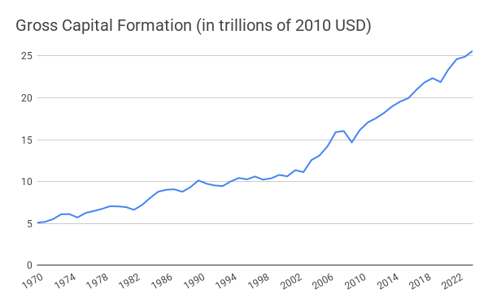
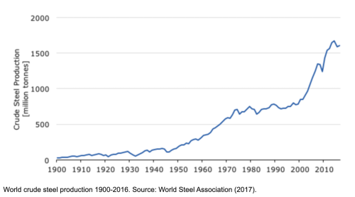
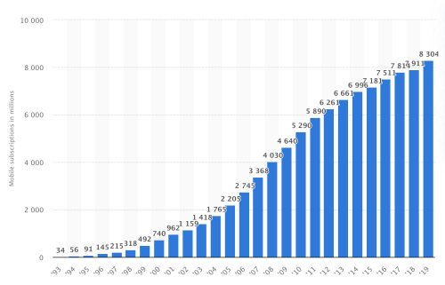
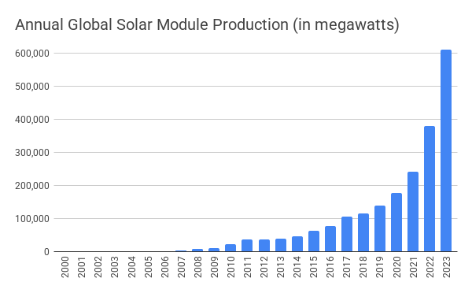

# Appendix

The goal of this appendix is to provide additional data and arguments for why capital is sufficient, i.e. there is enough capital to meet everyone’s needs. Again, capital here specifically refers to physical capital, such as machines and infrastructure. It is physical capital, which produces the solutions to our needs, such as clothes and buildings.

There are three sections. The first section presents some general data on the development of global capital, showing the tremendous growth that has been accomplished over the last one hundred years. The second section uses data from World War II to show what can be accomplished when there is enough political will to redirect capital towards specific goals. Put differently, the bulk of capital available today is used in the service of wants, giving us a lot of room to meet needs. Finally, the third section dives deeper into each of the needs.
 
## The Growth of Capital

It turns out to be surprisingly difficult to find global data on physical capital. The best source I have been able to locate is the World Bank, which publishes a data series on gross capital formation (World Bank, 2020). Unfortunately the data here reaches back only to 1970 but it still shows an increase from roughly $5 trillion to $22 trillion in 2019 (this is measured on constant 2010 dollars, i.e. adjusted for inflation).

Source: World Bank, 2020

For triangulation it is worth considering the growth in output of some things that require productive capacity. We can infer the availability of physical capital through outputs. To that end, I was able to find the following chart of global crude steel production over time (Morfeldt, 2017).

Source: International Iron and Steel Institute 1991, 2001; Worldsteel Committee on Economic Studies, 2011; World Steel Association, 2021

Compared to gross capital there is only about a twofold growth here from 1970 to today, but it is important to keep in mind that during that time period we have come up with many materials other than steel from which to make things, such as aluminum and of course plastics. Importantly though this graph lets us compare steel output today with output at the time of World War II and we can see that there has been more than an order of magnitude growth (roughly 15x).

What about finished goods production? This too is a good proxy for the amount of total available physical capital. A great example is the global production of cars. Here is a chart that shows it over time going back to the earliest days of the industry.

Source: Chamber of Commerce of the United States, 1973; Bureau of Transportation Statistics, 2017

Again we can see a roughly twofold increase relative to the 1970s and a greater than 10x increase if we go back further. This chart has an important feature worth pointing out now: there is a dip to near zero production in the mid 1940s corresponding to World War II.

Here is a dramatic example of what all this productive capacity makes possible. The first commercially available handheld mobile phone was the Motorola DynaTAC 8000x which became available in 1984 (“Motorola DynaTAC,” 2021). Here is the growth of mobile phones since then, measured in active subscriptions (Statista, 2020).

Source: Statista, 2020

Over the course of three decades we basically went from not having mobile phones to having more than the global population (this of course brings to mind William Gibson’s great quote that “[t]he future is already here – it’s just not evenly distributed” – with many people having two mobile phones, one for work and oner personal for example, while others have none).

And here is one more example that’s highly relevant to the climate crisis: the rate at which we have produced solar panels (Statista, 2021). 

Source: Statista, 2021

Over a decade and a half we went from basically making no panels, to making 150 Gigawatts in new panels on what looks like an exponential growth trajectory. Now crucially we are currently using a small part of our productive capital to make solar panels. How do we know this? Because we have not yet taken the drastic steps necessary for fighting the climate crisis, which will eventually have to reach levels similar to the capital deployment in World War II.
 

## Capital Deployment in World War II

The prior section provided some data on how much physical capital has grown in the last one hundred years. When measured by certain proxies, such as the production of steel, it looks like about a 30x growth in capital over the last 100 years and a nearly 100x growth if one goes back just two decades further to 1900. We also saw that significant growth has occurred since World War II, which--as a first approximation--is at least an order of magnitude growth (10x).

Now someone might suggest that this growth could all be due to the population explosion, but that’s not the case. Over the same timeframe the global population has grown a lot less: from 1900 to today a bit less than 5x and from the end of World War II to today only by a bit more than 3x. Put differently, the increase in physical capital has far outstripped population growth (Our World in Data, 2019).

Now one might still question whether this capital is sufficient to meet everyone’s needs, as I have asserted. Some of the strongest evidence for my claim comes from considering what happened during World War II. Here is a chart that shows the government share of GDP in the US during the war years (Casais, 2010).

Let’s dive a bit deeper and look at the manufacturing efforts. The US ramped production of tanks, airplanes, battleships and guns at an extraordinary clip in the war years. Here is a table that tabulates this for different weapons systems (Harrison, 1998).

The numbers here are staggering. For example, in 1943 the US built 2654 major naval vessels. That’s more than 7 every day, or roughly one every three and half hours! In 1944 the US built over 74 thousand combat aircraft, that’s about 8.5 combat aircraft *every hour*.

We are not talking about simple devices here. These are complex high-performance systems with many components (think of the aircraft engines alone!). And that’s just the US production. There were similar scale efforts in Germany, Japan, the UK, and Russia. For example, adding up all the combat aircraft production in 1944 is 185 thousand units, which is 21 aircraft every hour.

Now in the US while all of this production was happening, people were not starving, there was enough clothing, and were doing surprisingly well overall (Henderson, 2015). But as we saw earlier, the production of cars dropped dramatically — so how were people’s transportation needs met during this time? Through a massive increase in public transportation (Fetherston et al., n.d.). The connection was made quite explicitly with the government running ads “When you ride alone, you ride with Hitler.”(The U.S. National Archives and Records Administration, n.d.). This is a perfect illustration of separating a need, transportation, from its solutions, in this case individual versus shared mobility.

The continued ability to meet needs while at the same time repurposing half or more of physical capital strongly supports the claim of sufficient capital. As a first approximation much of that capital was previously used to meet wants. And it went back to meeting wants after World War II which partially explains the tremendous economic boom of the post war years.

All of this is to say that today’s economy with at least an order of magnitude more capital than during World War II can easily meet our needs. Importantly it also means that we have plenty of additional capacity that could be allocated to solving the climate crisis. For example, we could dramatically ramp the production of everything from solar panels to nuclear reactors to heat pumps.

But there is more to be gleaned from what happened during World War II production. It isn’t just that we collectively made a lot of complicated stuff rapidly. We also innovated on extremely compressed time scales. The Manhattan project is the most obvious example of that which in a span of three years developed the nuclear bomb. It is hard to exaggerate how extensive this effort was, including for example uranium mining, as well as the exploration of several different bomb designs.

Important technologies were either invented or significantly advanced during World War II (Dickson, 2016). For example, at the beginning of the war, radar was a nascent technology. Towards the end of World War II through the invention of the cavity magnetron, the Allies managed to build radars small and lightweight enough to put on planes (“Cavity Magnetron,” 2021). Penicillin, which had been discovered in 1928, was not widely used until mass production was unlocked as part of a secretive World War II effort (“Penicillin,” 2021).

Production and deployment at high volume also drove important improvements. Take fighter planes as an example. Early fighters had limited range which meant that bombers had to fly into enemy territory without escorts. Their only defense against local fighters were plane mounted machine guns. It was only as the war went on that escort fighters of sufficient range were developed to accompany bombers (“Escort Fighter,” 2021). This was made possible by a combination of technological advances, such as more powerful engines, and the insights gained from battle.

So what are the key takeaways? First, during peacetime mode much of the capital is used to meet wants not needs (the third installment in this post will look at this with regard to all the needs identified). Second, when switched into wartime mode, much of the productive capital can be redirected quickly towards accomplishing specific goals that are different from needs. This was already true at a much lower amount of physical capital per capita than is available today. Third, innovation can in fact be accelerated dramatically by focusing resources on critical problems.

The obvious threat we are facing today that requires a massive reallocation of, and improvement in, capital is the climate crisis. Whether this can be accomplished is determined entirely by what we choose to pay attention to. Hence, the defining scarcity of our age is attention, not capital.

 
## Meeting Humanity’s Needs
 
The overall physical capital statistics provided earlier abstract away any regional differences. The examination of World War II showed that the US was able to meet people’s needs with a fraction of the available capital but obviously that wasn’t true elsewhere. In particular of course in the actual war zones much physical capital was destroyed, resulting in needs going unmet. In the following discussion too we will see that capital is not yet sufficient everywhere. Given the total amount of aggregate physical capital available now that is a distribution problem (which is really an attention scarcity problem). Paraphrasing a famous William Gibson quote: capital is already sufficient, it is just not yet evenly distributed.

Furthermore I should caveat that I am providing a mix of statistics, anecdotes and arguments. My goal is not to make an incontrovertible case that capital is sufficient. I doubt this would be possible even with a lot more time, given the limited state of measurement of much of the world’s capital. Incidentally, I believe that eventually this paucity of data will be something humanity will look back in surprise, much as we sometimes wonder how things worked before we had mobile phones. Thankfully Max Roser, Hannah Ritchie, and the rest of the team at Our World in Data are starting to make a dent here. Instead, I am simply aiming to make a case that’s compelling enough to bolster the overall argument that attention has now become humanity’s critical scarcity.

In the following the passage from the needs section is in italics, followed by an examination of the sufficiency of capital. I cover both individual and collective needs, as well as what I call enablers (e.g., energy). Along the way, I will also often point out how our lack of attention to the climate crisis and other problems may result in capital becoming scarce again in the future.
 
**Oxygen.** *On average, humans need about 550 liters of oxygen every day (“How Much Oxygen Does a Person Consume in a Day?,” 2000), depending on the size of our body and physical exertion. Our most common way of meeting this need is breathing air. Although that may sound obvious, we have developed other solutions through technology – for example, the blood of patients struggling to breathe can be oxygenated externally.*

There is no shortage of oxygen in the Earth’s atmosphere. Throughout industrialization the issue has been air pollution. For example, in London the air was so bad that the Great Smog of 1952 killed four thousand people in the span of less than a week (Smog Kills Thousands in England, 2020). More recently it has been Indian and Chinese cities that are experiencing similar levels of air pollution. This can definitely be seen as an example of a local insufficiency of capital. In the more developed countries the passage of clean air acts forced the installation of catalytic converters, a switch from coal to gas heat, etc. and largely resolved this deficiency. These same and even more advanced technologies (e.g. electric vehicles) can be deployed globally. China has already taken crucial steps in this direction, with the province of Hainan setting a 2030 deadline for all new and replacement vehicles to be emission free (Xue, 2019).

We should, however, not take the earth’s atmosphere for granted. Many different phenomena resulted in the existence of and maintenance of today’s breathable atmosphere. For example, the Earth’s magnetic field protects it from the solar winds which would otherwise tear off large parts of the atmosphere (“Solar Wind,” 2021). A reduction in or even loss of the magnetic field is exactly the kind of long tail “Black Swan” type of event that we do not pay nearly enough attention to as humanity.
 

**Water.** *We need to ingest two or three liters of water per day to stay hydrated, depending on factors such as body size, exertion and temperature. In addition to drinking water and fluids that contain it, we have other solutions for this, such as the water contained in the foods that we eat.*

As with oxygen, there is no shortage of water on Earth. The challenge is access to drinkable water which means sufficiently clean and desalinated water. Here too we can see how at an earlier point in development capital was insufficient. Again London serves as a great example: frequent Cholera outbreaks were the result of water wells that were not separated from sewage. John Snow famously documented the connection by establishing a detailed map in the 1854 outbreak which helped to overcome the prior “Miasma” theory of Cholera and ultimately resulted in London building out an elaborate water infrastructure (“1854 Broad Street Cholera Outbreak,” 2021). 

A more recent example is the water crisis in Flint, Michigan where lead from old pipes resulted in toxic drinking water (“Flint Water Crisis,” 2021). So we can see how capital has been insufficient here and is still insufficient in some parts of the world but not because of some fundamental lack of technology or capital but rather because of a failure of attention to clean water access. The World Bank has come up with an estimate of only about $28 billion annually to provide everyone in the world with basic water, sanitation and hygiene, and about $114 billion to make these services available continuously (Hutton, 2016). These surprisingly low numbers show how little physical capital would need to be deployed. Clean drinking water is a great example of the type of problem where markets tend to fail and hence attention allocation needs to happen through other processes (e.g. by electing a capable city government).

 
**Calories.** *To power our bodies, adults need between 1,500 and 3,200 calories per day (U.S. Department of Agriculture and U.S. Department of Health and Human Services, 2015), a need we mainly meet by eating and drinking. The best way to obtain calories, however, is surprisingly poorly understood – the mix between proteins, lipids and carbohydrates is subject to debate.*

Eating food is the primary solution to our need for calories. This is where Malthus expected the big shortfall to come from. Agriculture simply wouldn’t be able to keep up with the growth in population. The big breakthrough that he didn’t anticipate was the Haber Bosch process of nitrogen fixation, which powered the so-called green revolution. Equipped with artificial nitrogen fertilizer, agricultural output soared. 

The other big win in agriculture was the use of machinery. Today in the US only 1.3% of the employed population works in agriculture and the entire food supply system at $1.1 trillion represents only 5% of total GDP (Lepley, 2019; USDA, n.d.). Even in countries that are further back in development such as India, the percentage of the population engaged in farming has been shrinking, a decline made possible by the availability of sufficient physical capital (Shrinivasan, 2013).

Now clearly not everyone has access to enough calories to meet their needs. For example, starvation is ravaging Yemen right now as a result of the ongoing war there. Overall, however, since the 1970s the incidence of death from famine has been at historic lows (Hasell, 2013). And even before that as Amartya Sen and others have documented many famines resulted from a failure to distribute food, not an absolute lack of it (with examples of rotting supplies in harbors while people starve nearby).

Here too though we cannot rest on our accomplishments. The biggest risk to humanity’s ability to meet everyone’s need for calories is the climate crisis which is disrupting the relatively stable weather patterns required by agriculture. So far we have been experiencing crop failures only locally and sometimes regionally. A global large scale crop failure would result in starvation as we have very limited stockpiles.

 
**Nutrients.** *The body cannot synthesize all the materials it requires, including a couple of certain fatty acids, some amino acids, as well as a few vitamins and minerals – these are called “essential” and must be obtained as part of our nutrition. This is another area that is surprisingly poorly understood, meaning that the actual mix and amount of required nutrients we need to take in seems unsettled.*

Nutrients, while important, are needed in relatively small amounts. For example, the daily recommended amount for alpha-linolenic acid (ALA) is between 0.5g and 1.6g (National Institutes of Health, 2021). The biggest intake requirements are the essential amino acids, with adults probably needing about 7g daily of Leucine as one example (Appleby, 2018). For minerals and vitamins we are talking about even smaller amounts. These are mostly in the milligram and microgram range with the exception of Calcium, Chloride and Sodium, which are needed in a few grams each (Romine, 2019).

The cost and capital required to produce all of these essential nutrients has been declining substantially over time as a result of scientific and engineering progress. For example, we have recently figured out how to grow rice that has more Vitamin A in it, called Golden Rice (Dubock, 2019). More than half the global population eats rice daily and so having it deliver enough Vitamin A is a major way of ensuring sufficient amounts of that essential nutrient are available.

Here too, capital is not the binding constraint today. But as the example of Golden Rice shows, it will continue to be important to innovate so as to better meet nutrient needs for everyone and not just those who can currently afford to buy every possible supplement by walking into the nearest drug store. Further research is also required to understand which nutrients we really need and in what dosage for humans to thrive and live long, healthy lives.
 

**Discharge.** *We also need to get things out of our bodies by expelling processed food, radiating heat and exhaling carbon dioxide. Humans have made a great deal of progress around meeting our discharge needs, such as toilets and public sanitation.*

Building public sanitation systems is one of the major contributors to improvements in life expectancy. As Steven Johnson documents in his books “The Ghost Map” (2007) and “Extra Life” (2021) the city of London was hit by repeated Cholera outbreaks until it separated sewage from fresh water delivery. Even back in the mid 1800s London had sufficient capital to build out a large scale sewer system (“London Sewerage System,” 2021).

In many countries we take this for granted today but there are still places in the world that have insufficient sewage treatment capacity. Globally the number of people without access to proper sanitation has been declining albeit slowly (Ritchie & Roser, 2021). That’s largely due to the fact that a lack of sanitation exists predominantly in the places with the highest population growth. Still at this point about two thirds of the global population has access to sanitation and the total number of people who do has grown by several billion in the last couple of decades. This has been possible as the overall capital required for achieving sufficient sanitation is relatively low and again has been declining with technological progress (García , 2009).
 
Sanitation provides another example of how a lack of attention to the right problems puts our ability to meet our needs at risk. Right here in New York City for example during heavy downpours raw sewage spills into the East and Hudson Rivers because of insufficient capacity in the rainwater runoff systems (Chaisson, 2017). With the climate crisis accelerating, the frequency of that kind of heavy rainfall is increasing rapidly (Climate Central, 2019).
 

**Temperature.** *Our bodies can self-regulate their temperature, but only within a limited range of environmental temperature and humidity. Humans can easily freeze to death or die of overheating (we cool our bodies through sweating, also known as ‘evaporative cooling’, which stops working when the air gets too hot and humid). We therefore often need to help our bodies with temperature regulation by controlling our environment. Common strategies to meet our temperature needs include clothing, shelter, heating and air conditioning.*

We have long had enough capital to provide everyone in the world with clothing. We are strictly faced with a distribution problem here. Some people don’t have the financial resources or live in circumstances, such as homelessness, that make it difficult for them to acquire and maintain sufficient clothing. Conversely in many advanced economies people have piles of unused clothes and the so-called fast fashion industry promotes rapid changes in style that result in massive additional consumption. 

But what about shelter? This is a more difficult problem that requires significantly more capital. Here too the evidence suggests that we have sufficient physical capital. For example it is estimated that in 2015 we already had over 220 billion square meters of buildings globally (UNEP & GABC, 2017). This amounts to 30 square meters per person. Now of course some part of that is commercial and industrial space, still this shows that as a first approximation we can house everyone. Even more impressive is the rate at which we are adding space. The same report estimates that by 2030 we will be at over 300 billion square meters of buildings. We also have a lot of circumstantial evidence that supports this conclusion. In particular building booms in various parts of the world, including China, the US and the Middle East, created vast local oversupplies of housing. For instance at the height of the China boom enough housing was added annually for the equivalent of two new ten million resident cities (Slotta, 2020).

And yet again we encounter the climate crisis as the biggest threat to our ability to provide adequate shelter to everyone. In the US alone, nearly 15 million housing units are threatened by floods as found by a recently updated federal mapping exercise (Kaufman et al., 2020). That doesn’t count homes threatened by forest fires. Over longer time horizons sea level rise will make large coastal areas around the world uninhabitable. We are already experiencing significant climate refugee movements today. In 2020 alone it is estimated that 30 million people were displaced globally due to storms and floods (Global Migration Data Portal, 2021). The forecasts are that by 2050 as many as 1 billion people may need shelter in a new location (Kamal, 2017).

Can we heat and cool all this space as needed? The capital requirements here are accelerating rapidly at the moment due to the unfolding climate crisis which is increasing cooling requirements globally. This is not just a question of convenience. In hot and humid conditions evaporative cooling via sweat stops working and when that happens people die from overheating. This is now a routine occurrence in many parts of the world and even a relatively northern region such as Europe is affected, with the 2019 heat wave causing over two thousand deaths (Borunda, 2021; “2019 European Heat Waves,” 2021). 

As of 2020 there are an estimated 1.9 billion AC units in the world, adding about 110 million units annually at an accelerating pace (Armstrong, 2020; Holst, 2020). The key constraint here is not capital but electricity to run all of these new units, which will be further exacerbated by the need to switch heating from fossil fuels to electricity. This constraint will be looked at in the energy section further down.
 

**Pressure.** *Anybody who has gone diving will be aware that our bodies do not handle increased pressure very well. The same goes for decreased pressure, which is one of the reasons why we find air travel exhausting (airplane cabins maintain pressure similar to being at the top of an eight-thousand-foot mountain).*

Thankfully we need minimal capital to meet our pressure needs. One might at first assume that we do not need any capital, but that’s not correct. For example, pretty much all commercial flights are in altitudes that require pressurized cabins and hence extra capital above and beyond what would be required for an unpressurized plane. For instance, at just 12 km of altitude pressure falls to 0.2 bar (“Cabin Pressurization,” 2021). At such a low pressure it is not just a lack of oxygen that would be fatal, but also decompression sickness may occur where gases that have been dissolved in the bloodstream may gas out resulting in sickness and even death.  As noted earlier, we cannot take the existence of the Earth’s atmosphere for granted. So in addition to giving thought on how to create a livable atmosphere on planets such as Mars that we may eventually want to settle, we need to pay attention to the various forces that could damage or even destroy the Earth’s atmosphere.
 

 
**Light.** *Most humans would be hard-pressed to achieve much in complete darkness. For a long time, our need for light was met mainly by sunlight, but much human ingenuity has gone into the creation of artificial light sources.*

Our ability to make artificial light is one of the great human achievements and also a story of ongoing progress. We are the only species that has the knowledge to make fire, a capability attributed in Greek mythology to Prometheus who stole fire from the gods. Capital is essential to making light, from the earliest time of gathering wood to the modern creation of light emitting diodes (LEDs). This progress has meant that light has become incredibly affordable in most parts of the world and consumption has gone up accordingly (for example, in the UK by four orders of magnitude over the last two hundred years) (Roser, 2013). Even in extremely poor countries that lack electrical infrastructure, so-called “offgrid solar” is revolutionizing the availability of light, replacing the burning of kerosene and other dangerous fuels. In summary we are definitely not constrained by capital when it comes to our need for light.
 

**Healing.** *Whenever we damage our body, it needs to heal. The human body comes equipped with extensive systems for self-healing, but beyond a certain range it needs external assistance. We have developed many solutions, which are often grouped under the term ‘healthcare’.*

The primary constraint on healing has been knowledge, rather than capital. As documented in Steven Johnson’s book Extra Life, for the longest time medical interventions tended to result in worse outcomes as doctors had no idea what they were doing (Johnson, 2021). Conversely, today it has become possible to create new life saving medicines virtually overnight, as was the case with the COVID-19 mRNA vaccines. These are super cheap to manufacture and supply has been held back by artificial limitations based primarily on intellectual property protection rather than a scarcity of capital.

It is als crucial to understand that much of our current need for healing could be avoided in the first place by leading healthier lives. As noted earlier we do not know as much about nutrition as we should, but we do know that obesity contributes significantly to medical problems and yet the rate of obesity has increased dramatically, especially in the United States. Similarly we do know that stress is negatively associated with health and yet the stress level for many people has gone up for a range of reasons from economic insecurity to proliferation of stress inducing online content. Overall, the bulk of medical expenses today is accounted for by chronic conditions, such as diabetes (CDC, n.d.).
 
Despite all of this we can measure our tremendous progress on healing by considering the increase in life expectancy (Roser, 2019). Based on historical data, life expectancy in 1800 was well below 40 years across the entire world. By 2015 it had risen to well over 70 years in many places and to over 80 in some. Even in Africa, which is the furthest behind, life expectancy in many countries in the 60s.

That of course doesn’t mean we can’t face a great reversal. Covid provided a glimpse of what that might look like. As does the decrease in life expectancy in the United States due to what has been termed “deaths of despair” by Anne Case and Angus Deaton, which have impacted many groups, but particularly white middle-aged males (Case & Deaton, 2021). Finally again the climate crisis looms large here with deaths from heat waves, crop failure, etc. having the potential to undo much of the progress we have made.
 

**Learning.** *When we are born, we are quite incompetent – we have to learn basic skills, such as walking and how to use even the simplest tools. When we encounter a new situation, we have to learn how to deal with it. We group many of the strategies for meeting the need for learning under the heading ‘education’, but other solutions include experimenting to gain experience, self-study and parenting.*

There has been tremendous progress in making learning available to everyone around the world. A crucial enabler of learning is literacy and that has grown tremendously over the last two hundred years. In the early 1800s fewer than 20% of people globally were literate (Our World in Data, n.d.). Today global literacy is approaching 90%.

It is crucial to recognize that traditional schools are only one solution to the need for learning. It is a capital intensive one as it requires the construction of buildings. There are many alternative solutions such as unschooling, homeschooling, and neighborhood schools. 

Increasingly pretty much all the world’s knowledge can be delivered via a smartphone.  Global smartphone penetration is approaching 80% (O’Dea, 2021). Even in relatively poor countries smartphones are becoming much more widespread. For example a new Android phone can be purchased in India for 7,000 Rupees (~$100) and smartphone penetration there has reached 42% in 2020 (91 (Mobile Price List In India, n.d.; Statista, 2021).
 
Now the assertion that anything can be learned via a smartphone may seem preposterous. But research on so-called “minimally invasive education” and “unschooling” has shown that children want to learn and are capable of learning largely independently when given the right opportunity (“Minimally Invasive Education,” 2021; “Unschooling,” 2021). Even some famous scientists, including notably Einstein and Faraday, did a great deal of independent studying early on, with the latter having virtually no formal education (“Albert Einstein,” 2021; “Michael Faraday,” 2021).
 

**Meaning.** *As humans, we have a profound psychological need for meaning in our lives. One solution is to have a purpose. Religious belief and belonging to a community have long been a source of purpose for humans. Another key strategy comes from our interactions with other humans, including having other people acknowledge our contributions to a project, or even merely recognize our existence.*

As stated in the main text, the need for meaning can be met more or less without capital. Meaning comes from stories, beliefs, recognition and many other sources, none of which have any substantial capital requirements. These have existed in oral form long before humans developed written language.
 

**Reproduction.** *Individuals can survive without sex, but reproduction is a need for societies as a whole. We have learned how to reproduce without sex; in the future, there may be different solutions for the continuation of a human society – whether here on Earth or elsewhere.*

Historically we have needed no capital for reproduction. Ironically that is changing as sperm count and motility are dropping in many places around the world (likely due to many products containing hormone disrupting chemicals) (Chiu, 2021). So eventually we may need to use technological means for reproduction. These could over the long term also involve the creation of artificial wombs, something that’s already possible for animals (Becker, 2017).

 
**Allocation.** *Access to physical resources has to be allocated. Take a chair as an example. Only one person can comfortably sit in it at a time – when there are multiple people, we need a way of allocating the chair between them. If you are by yourself, you can sit on a chair whenever you want to – allocation is a collective need.*

The need for allocation is more severe the less of something there is. For example, in the early days of producing the COVID vaccine, when there were few doses, there were intense debates about how to allocate the available doses. With enough progress we can envision a world with dramatically reduced allocation needs, where we can always make more of something on the spot whenever we need it. I believe we are a long way out from abundance in the physical realm. Even in Star Trek, which is often seen as a fictional model of abundance with technology such as the replicator, there are often allocation needs, such as the captain having to decide whether to route power to the shields or the weapons or the engines. It is easy to think of other examples where we will still have an allocation mechanism, such as going to see the original Mona Lisa at the Louvre -- only so many people can fit in the room at any one time. In the extreme of course some will argue that it might become possible to give you a Matrix style experience where you think you are in the room at the Louvre with the Mona Lisa but in fact have never left your home. While possible in principle I again believe this is a long way off. 

At first blush it might not seem that capital has much to do with addressing the allocation need, but historically we have definitely been capital constrained here. Two crucial parts of allocation solutions are communication and transportation. Sticking with the COVID vaccination example, in order to allocate a limited number of vaccines one needs to know where the people who should get the early doses are and how to get the doses to them (or them to the doses). Both of these sub problems require capital. In particular because the COVID vaccines need to be kept at low temperatures, it requires a so-called “cold chain” -- a logistics solution that can keep the vaccine cooled. Our progress in communication will be discussed more in the sections on motivation, coordination, and knowledge below. For transportation we know we are not really constrained given the massive amount of stuff (most of which is serving wants rather than needs) being delivered every day.
 

**Motivation.** *This may seem like an individual need, but it acts as a collective one in the sense that societies must motivate their members to carry out important tasks and follow rules. Even the smallest and least technologically advanced societies have some solutions for this problem, often in the form of rewards and punishments.*

Motivation is another need where at first it might appear as if capital never really played a role. Yet on further examination, communication infrastructure is crucial for maintaining motivation across distance. This in no small part explains why the structures of motivation were for the most part extremely local prior to the industrial age and the deployment of communication networks. Successful larger motivation efforts earlier on, such as the Roman Empire, invested heavily in roads and/or currier networks. With communication networks operating at zero marginal cost today, we are no longer capital constrained with regard to motivation even at global scale.

Now to this day it might be argued that financial capital, e.g. in the form of bonus payments, is key to motivation. We are certainly not constrained by a lack of financial capital and we can even create new financial capital essentially ex nihilo via crypto currencies. Still it is worth pointing out that so-called “high powered” incentives are a very narrow form of motivation and require precise measurement to avoid substituting quantity for quality. This can easily be seen from the many failed attempts to incentivize the creation of content via payments in the absence of systems to rate content quality.

Unlocking intrinsic motivation and complementing it with “low powered” incentives such as recognition and reputation is a far better approach most of the time. In science, for example, much progress comes from people’s genuine interest in solving a specific problem. Wikipedia is a great example of how much high quality content creation can happen in a system built solely on recognition and reputation (this is not to say that there aren’t bias issues worth addressing but commercial publishers time and again have argued that Wikipedia would run out of steam and it hasn’t).

 
**Coordination.** *Whenever more than a single human is involved in any activity, coordination is needed. Take a simple meeting between two people as an example. In order for it to take place, the two need to show up at the same place at the same time. We have developed many communication and governance mechanisms to address this need.*

Coordination may seem like such an abstract need that it can be difficult to see at first that it was at one point capital constrained. One of our primary solutions to the need for coordination is communication. Considering the simple example again of two people meeting, this requires agreeing on a place and time. When communication was really difficult (because of insufficient capital), a lot of meetings, such as religious ceremonies, happened on pre-ordained schedules. Another common solution was simply waiting. People would show up somewhere and wait until it was their turn.

This latter solution shows a great example of how we have achieved sufficient capital for coordination only relatively recently. Waiting as a solution to coordination has been decreasing rapidly in places with high internet penetration. For example, we now routinely book appointments for a haircut or make restaurant reservations online. At this point our ability to coordinate even at the scale of all of humanity is no longer capital constrained. Instead, most of our coordination problems now result from disagreements about priorities. That has been true most recently for fighting the COVID pandemic and is also true with what to do about the climate crisis.
 

**Knowledge.** *As I argued in earlier sections on optimism and humanism, knowledge is the central collective human need: without it, a society will encounter problems that it cannot solve. History is full of examples of societies that lacked sufficient knowledge to sustain themselves, such as the Easter Islanders and the Mayans. This is not about what any one individual has learned, but about the body of knowledge that is accessible to society as a whole. Later in this book we will examine solutions for generating more knowledge, faster.*

The accumulation of knowledge was significantly constrained by capital early on. That’s largely because humans didn’t know how to make easily writable and transportable materials. Many ancient cultures engraved writing in stone, which was both a slow process and made it difficult to transport the results. There was a series of innovations in recording materials such as parchment (animal skins), papyrus and eventually paper. To get a sense of just how scarce the more advanced materials were early on, one only needs to consider the so-called palimpsest, a manuscript that was written over a prior one, sometimes repeatedly, in the re-use of the underlying parchment (“Palimpsest,” 2021). With today’s digital technology for recording and transmitting knowledge we are no longer capital constrained with respect to those crucial aspects of the knowledge loop. 

That is not to say that there aren’t some pockets of knowledge left where our ability to push forward is constrained by capital but these are few and far between. One example is high energy physics. The Large Hadron Collider (LHC) is the biggest device humanity has built to explore what happens when particles collide at very high energies to reveal what they are made of (“Large Hadron Collider,” 2021). It is unclear that we have accumulated enough physical capital to date (or have the capacity right now to build enough) for significantly higher energy levels that would potentially let us see even deeper into the fabric of reality.

In the meantime though it is important to point out that conversely a lot of research that used to be capital constrained is no longer so through breakthroughs in both computation (allowing the simulation of much bigger systems) and laboratory equipment, especially for the sequencing and assembly of genomic information. This has resulted in an explosion in knowledge about cellular processes which among other benefits gave us the powerful new mRNA vaccines against COVID.
 
 

**Energy.** *For a long time, humans relied on direct sunlight as their primary energy source. Since then we have developed many ways of generating energy, including better ways of capturing sunlight. Capturing more energy and making it available in concentrated and highly regulated form via electricity has enabled new solutions to human needs.*

Energy turns out to be the crucial enabler of progres. The other enablers identified below, such as resources, are directly impacted by how much energy we have available. As David Deutsch has pointed out in “The Beginning of Infinity” a sufficiently advanced civilization, with enough energy at their disposal, could assemble entire worlds in seemingly empty space.

We are a long way from such a civilization but we have plenty of energy, and more importantly, the ability to rapidly build out our energy supply if we pay enough attention to it. Today energy production and consumption varies significantly across nations, with developed countries having enough energy far beyond what is required to meet needs. But even in the US we occasionally run into energy distribution problems as seen this year in Texas.

More importantly globally our energy production is heavily dependent on fossil fuels. This of course is the cause of the climate crisis and something that requires our urgent attention. So isn’t this an example of capital scarcity? No. We have the capital necessary to dramatically ramp our clean energy supply, we simply lack the political will to go into wartime production mode. We should be building out wind, solar, geothermal, and nuclear energy (as well as storage) with a large percentage of our existing physical capital.

To illustrate what is possible, consider France’s deployment of nuclear energy in the 1970s and 80s. France went from virtually no nuclear power to about 40% in the space of less than two decades (Mearns, 2013). Keep in mind this was during a peacetime approach to energy. Now imagine what could be done with a wartime approach. I believe it would be possible in most countries to get to 100% clean energy in 10 years or possibly even faster if we really tried.

Finally, there seems to be no particular reason why we cannot make even more advanced forms of energy work, starting with nuclear fusion. There’s now at least a dozen well funded commercial fusion startups pursuing a variety of approaches from the longstanding magnetic confinement to more recent inertial confinement (using laser). Research has even continued on the much derided notion of “cold” fusion. Following the reproducibility crisis of the original 1989 paper by Fleischmann and Pons, research has been continued albeit under the different headline of “condensed matter physics.” (Krivit & Ravnitzky, 2016). That research has continued to provide interesting observations that could eventually unlock a massive energy source for humanity.
 

**Resources.** *In early human history, all resources were drawn from our natural surroundings. Later, we started growing and extracting resources in our own right. Many modern solutions have been made possible by access to new kinds of resources. For instance, mobile phones, which provide new solutions to individual and collective needs, are made possible by some esoteric raw materials, including the so-called rare-earth elements.*

One of the consistent worries cited for why we will not be able to meet our needs are resources, by which I mean raw and intermediate materials. For example, there is a concern now about running out of phosphorus (Alewell et al., 2020). Historically, this has not turned out to be the case for several reasons. First, when a resource becomes more expensive, we often start to discover new places where we can find it. For instance, there were repeated concerns that we might run out of oil, but each time we discovered more. Second, an increase in the price of a resource tends to lead to product and process designs that make less use of the resource, either by becoming more efficient or by substituting another resource. Third, when a resource is sufficiently expensive it makes sense to recycle it. For example, in the US about half of all aluminum beer cans are recycled (EPA, 2021).

Ultimately though there are far more resources in the universe than we might ever need. In the relatively near future we will be able to catch meteorites, which contain massive amounts of metals. There are several venture backed startups pursuing this and companies such as SpaceX are driving down the cost of launching such missions. Longer term though we will likely be able to transmute materials. Our techniques for doing this at the moment are somewhat primitive but famously Gleen Seaborg and others turned bismuth into gold in 1981 (Aleklett et al., 1981).
 

**Transformation.** *Energy and resources alone are not enough. To enable most solutions, we need to figure out (and remember!) how to use the former to transform the latter. This involves chemical and physical processes. Physical capital, in the shape of machines, has been a crucial enabler of many new solutions to human needs. For instance, a knitting machine can quickly transform yarn into clothing, one of our key solutions for maintaining the human operating environment.*
 
Some of the earliest human transformation processes were to make weapons for hunting, such as arrows and knives, by sharpening wood or stone. Eventually we figured out how to make metals and developed lots of chemical processes that combine and transform resources into the materials we use every day. Many of these processes are capital intensive.

Yet here too it is unlikely that we are meaningfully constrained by capital in many parts of the world. One example to consider here is how much larger cars have become in recent years in advanced economies. This has been driven by the trend towards Sports Utility Vehicles (SUV) and so-called Crossovers which have been dramatically outselling traditional sedans since 2015 (Motorlease, n.d.). These vehicles require significantly more material due to their size. One can give similar examples from other areas, such as the trend of much larger houses. In the US in 2014 the average new home had ballooned to 2,675 square feet from below 1,000 square feet in the 1950s (while at the same time average family size shrunk considerably). Put differently we may have distribution issues but we do not have aggregate capital constraint issues in making materials.

It is also worth noting that much of our manufacturing is still applying highly wasteful processes where one starts with a big piece of material and then cuts or mills portions away. In contrast to this we are now beginning to see additive manufacturing, sometimes referred to as 3D printing, growing in capabilities. In this approach material is deposited to take on the desired shapes which allows for a dramatic reduction in waste.

 
**Transportation.** *The final foundational enabler is the ability to move stuff, including people. This is another area in which we have made great progress, going from human-powered to animal-powered to machine-powered transportation.*

Humanity was capital constrained on transportation for a long time and still is in some parts of the world today. Without some kind of assistance we are quite slow (certainly compared to many other species) and cannot cross sizable bodies of water. Not surprisingly then much of early human technology was aimed at improving transportation, from domesticating animals such as horses to inventing the boats and carriages.

The longstanding dream of course was to fly like birds with myths of human flight, such as Daedalus and Icarus, dating back thousands of years. It wound up taking until the early 1900s to figure it out though. From there progress was rapid and by 1969 a human had landed on the moon. Following the COVID pandemic, we are finding ourselves with an excess of equipment with more planes than ever before parked in the desert, maybe never to be reactivated.

Today we face two overlapping challenges. Some parts of the world still need to catch up on transportation, in particular India and China with their billions of people hankering for increased mobility. At the same time we need to rapidly decarbonize transportation all over the world in order to combat the climate crisis. Achieving both will require massive investments in electric mobility. Ideally new vehicles in India and China will be predominantly EVs, including electric scooters and trikes. We are not really constrained by capital in accomplishing this but only if we make the choice to redeploy a lot of productive capital.

