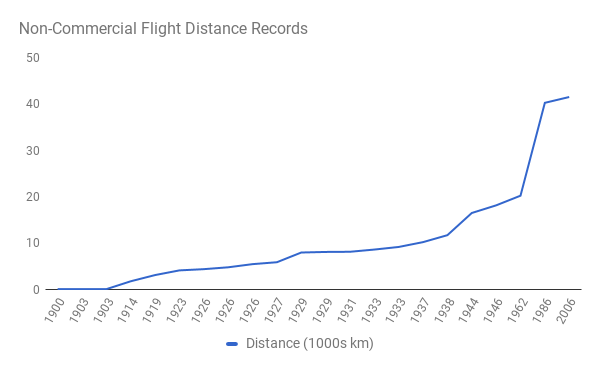

# Digital Technology

The invention of agriculture inflated the space of the possible by dramatically increasing the food density of land. This, in turn, led to increased population density and allowed humanity to have surplus food, which provided the basis for hierarchical societies that would develop standing armies, specialization of labor and writing {{"WIKIAS" | cite}}.

The Enlightenment and subsequent Industrial Revolution further inflated the space of the possible by substituting human power for machine power and increasing our understanding of, and control over, chemical and physical transformations of matter. This allowed humanity to make extraordinary material progress with innovative leaps in energy, manufacturing, transportation and communication {{"THGHTCO" | cite}}.

Digital technologies provide the third inflation of the space of the possible. This seems like a bold claim, and many have derided digital technologies such as Twitter, arguing that they are inconsequential compared to, say, the invention of vaccines.  

Yet at the same time we can already see the disruptiveness of digital technologies.  For instance, many previously well established businesses, such as newspapers, are struggling, while companies that only deal in information, such as Google and Facebook, are among the world&apos;s most highly valued {{"FORT" | cite}}.

There are two reasons why digital technology inflates the space of the possible, and both are important: the first is zero marginal cost and the second is the universality of digital computation.

## Zero Marginal Cost

Once a piece of information is on the Internet, it can be accessed from anywhere else in the world for zero additional cost. The servers are already running. The connections are already there. Making a copy and sending it to you is essentially free&mdash;the marginal cost is zero. That doesn&apos;t mean there aren&apos;t people trying to charge you for making a copy, in many cases there are. Yet the making of a digital copy itself does not entail any additional cost.

Zero marginal cost is radically different from anything that has come before it, and it makes possible some pretty amazing things. To illustrate, imagine you own a pizzeria. You pay rent for your store every month, you pay for the oven that you have leased, and you pay yourself a monthly salary. All of these are so-called &ldquo;fixed costs.&rdquo; They don&apos;t change at all with the number of pizzas you bake. &ldquo;Variable costs,&rdquo; however, fluctuate depending on the number of pizzas you make. For a pizzeria, these include the cost of the water, flour, and other ingredients used in making pizzas. They also include the cost of the wood you use to fire your oven (if you make no pizzas you won&apos;t fire the oven at all, and if you make many, you have to pay to keep the oven on longer). As you sell more pizzas, you&apos;ll need more helpers whom you pay by the hour &mdash; more &ldquo;variable costs.&rdquo;

So what is marginal cost? Well, let&apos;s say you are up and running making 100 pizzas every day. The marginal cost is that little additional expense it will cost you to make the 101st pizza (and the 102nd, the 103rd, and so on). If there is extra space in your oven and it is already hot and your hourly workers&apos; shifts haven&apos;t finished yet, then the additional cost for that next pizza is just the cost of the ingredients, so a relatively low marginal cost. However, if the oven is full and your hourly workers need to stay and work overtime to make that 101st pizza in a new batch, now you&apos;re paying additional costs for labor and to heat the oven so the marginal cost of that 101st pizza is quite high. From a business perspective, you would want to make that 101st pizza so long as you can sell it for more than its marginal cost. If you do, you&apos;ll help pay for the hourly workers, the oven, the store rent, your salary, and so on. If you should be so lucky that all your fixed and variable cost are already covered, then additional revenues you take in from that 101st pizza above the marginal cost will be pure profit.

Marginal cost matters from a social perspective. As long as a customer is willing to pay more than the marginal cost for that pizza, then everyone is better off. You&apos;re better off because you get extra revenue to either cover your variable costs or to add to your profits. Your customer is better off because, well, they just had a pizza they wanted! In fact, even if the customer paid exactly the marginal cost you wouldn&apos;t be any worse off and the customer would be better off.

Now consider what happens as marginal cost falls. Imagine for a moment that your key ingredient is an exceedingly rare and expensive truffle and therefore the marginal cost of your pizzas is $10,000 per pizza. Clearly you won&apos;t be selling a lot of pizzas. You decide to go for cheaper ingredients and start to bring down your marginal cost to where at least some customers find it attractive to pay more than your marginal cost. In Chelsea where I live, that seems to start at $30 per pizza (yes, New York City can be expensive). So you start selling some pizzas.

As you bring down the marginal cost of your pizza even further through additional process and product improvements (e.g., a thinner crust, economies of scale, etc), you can start selling even more pizzas. Now imagine that through a magical new invention you can make additional pizzas at close to zero marginal cost (say one cent), including nearly instantaneous (say one second) shipment to anywhere in the world. What would happen then? Well, for starters you would be able to sell an exceedingly large number of pizzas. In fact, if you charged only two cents you would be making one cent of incremental profit for every additional pizza you sell. 

At such low marginal cost you would probably be the only pizza seller in the world (a monopoly&mdash;more on that later). From a social welfare standpoint, anyone in the world who was hungry and who wanted pizza and could afford at least one cent would ideally be getting one of your pizzas. This means that the best price of your pizza from a social point of view would be one cent (your marginal cost). Why not two cents? Because if someone was hungry but could only afford one cent and you sold him a pizza at that price, then the world as a whole would still be better off. The hungry person was fed and you covered the marginal cost of making the pizza.

Let&apos;s recap: When your marginal cost was extremely high, you had no customers. As your marginal cost dropped you started to be able to sell. And as your marginal cost approached zero, you eventually started to feed the world! This is exactly where we are with digital technology. We can now feed the world with information. That additional YouTube video view? Marginal cost of zero. Additional access to Wikipedia? Marginal cost of zero. Additional traffic report delivered by Waze? Marginal cost of zero. 

This means we should expect certain digital &ldquo;pizza-making operations&rdquo; to be huge and span the globe in near monopoly positions (i.e., they are much larger than anyone else, having nearly the entire market to themselves). But&mdash;and this is critical to the idea of a knowledge society&mdash;it also means from a social perspective that everyone in the world should have access to these systems.

Why prevent someone from accessing YouTube, Wikipedia or Waze, either by cutting them off from the system altogether or charging a price they can&apos;t afford? This would always constitute a loss to society. With the marginal cost at or near zero, any given individual might receive some benefit, which would be a benefit greater than the marginal cost. And best of all, they might use what they learn to create something that they share and that in turn winds up delivering extraordinary enjoyment or a scientific breakthrough to the world.

We are not used to zero marginal cost. Most of economics assumes non-zero marginal cost. You can think of zero marginal cost as a mathematical singularity: dividing by zero is undefined, and as you approach zero asymptotically, strange things happen. In the real world, these strange things manifest in ways like having a single global &ldquo;pizza&rdquo; supplier. We are now approaching this zero marginal cost singularity in many industries.

The space of the possible has inflated to include access for all of humanity to all the world&apos;s information and knowledge (a term I will define more precisely later).

## Universality of Computation

Zero marginal cost is only the first half of why digital technology is inflating the space of the possible. The second half is in some ways even more amazing. 

Computers are universal machines. I mean this in a rather precise sense: anything that can be computed in the universe at all can be computed by the kind of machine that we already have, given enough memory and enough time. We have known this since the groundbreaking work by Alan Turing on computation. Turing invented an abstract computer, which we now call a Turing machine {{"CAMB" | cite}}. He then came up with an ingenious proof to show that this machine, which turns out to be extremely simple, can compute anything {{"WIKICTT" | cite}}. Exactly because even such a simple machine can already compute anything, what you gain by making the machine more complicated is only higher speed and lower cost.

What do I mean here by computation? I mean any process that takes some information inputs, executes a series of processing steps and produces an information output. That is&mdash;for better or worse&mdash;all that a human brain does either. In fact we already know exactly how we would simulate an entire human brain in a computer. We can&apos;t do it (yet) as our hardware is too slow. But unless you want to believe in something beyond what physics has determined to date, there is nothing that a brain can do that a machine cannot in principle do also.

Now there may be some wiggle room in the future. We may discover something new about physical reality that we don&apos;t yet know, and that changes our view of what is computable. But not so far.

You may have heard of quantum computers. And while they are a potentially exciting development in terms of the speed of computation, they are a let down with regard to what they can compute. They do not let us compute anything beyond a Turing machine {{"TIMP" | cite}}. In fact, we can use regular computers today to perfectly simulate the results from quantum computers (although doing so is painfully slow&mdash;which is, of course, why we would like to figure out how to build quantum computers).

For a long time this universality property didn&apos;t seem to matter all that much. Computers were pretty dumb compared to humans. This was frustrating to computer scientists who, going back as far as Turing himself, had the belief that it should be possible to build a machine that does, well, smart things. They didn&apos;t think that the brain had access to some undiscovered laws of physics which it was using for human computation that was not available to a machine. But they couldn&apos;t get it to work. Until now that is, when we suddenly find ourselves with computers that can do all sorts of smart things.

An analogy here is heavier than air flight. We knew for a long time that it must be possible&mdash;we knew that birds were heavier than air and yet they could fly. But it took until 1903, when the Wright Brothers built the first successful airplane, for us to figure out how to do it {{"WIKIWB" | cite}}. Once they and several others around the same time had figured it out, though, progress was rapid. We went from not flying for thousands of years to passenger jet planes crossing the Atlantic in 55 years (BOAC&apos;s first transatlantic jet passenger flight was in 1958 {{"BOAC" | cite}}). If you graph this, you see a perfect example of a non-linearity. We didn&apos;t get gradually better at flying. We couldn&apos;t do it at all and then suddenly we did, and quickly did it very well.

We have made a series of breakthroughs and went from essentially no machine intelligence to machines outperforming humans on many different tasks, including recognizing handwriting and faces {{"MITTMUU" | cite}}. More impressive, maybe, is that machines have learned how to drive cars. The rate of progress in driving is a great example of the non-linearity of improvement. DARPA, the Defense Advanced Research Projects Agency, held its first so-called Grand Challenge for self driving cars in 2004. At the time they picked a 150 mile closed course in the Mojave Desert region, and yet no car got further than 7 miles before getting stuck (less than 5% of the course). By 2012, less than a decade later, Google&apos;s self-driving cars had successfully driven over 300,000 miles on public roads with traffic {{ "GOOG" | cite}}.

Some people will object that driving a car is not what we mean by intelligence. This just points out, though, that we don&apos;t really have a good definition of "intelligence." Other people will say that humans still have creativity and these machines, even if we grant them some form of intelligence, won&apos;t ever be creative. This too, however, makes the mistake of attributing something magical to creativity. It suggests that there is a physical process in our brains that allows for creativity, and that this constitutes something other than computation and can never be implemented inside of a machine.

Recently, Google managed another breakthrough in machine intelligence. The AlphaGo program beat Korean Go grandmaster Lee Sedol 4-1 {{ "GUAR" | cite}}. Previously, progress with software that could play Go had been comparatively slow and even the best programs could not beat strong club players, let alone masters. The search space in Go is extremely large, which means a search approach, which works for Chess, cannot be used to find moves. Instead, candidate moves need to be conjectured. Put differently, playing Go involves creativity. The approach used to train the AlphaGo program, so-called adversarial training of neural networks, can also be applied to other domains that require creativity. There is already progress in applying this technique to composing music and creating designs. 

With digital technologies, the space of the possible has inflated to include machines that can most likely do anything that a human can do.   

## Universality at Zero Marginal Cost

Now, impressive as these two properties of zero marginal cost and universality are on their own, their combination is truly magical. I will just give one example: we are well on our way to a computer program that will be able to diagnose any disease from a patient&apos;s symptoms in a series of steps, including ordering new tests and interpreting their results {{"MITAIDOC" | cite}}. We have expected this based on universality, but now we are making real tangible progress and accomplishing this is a matter of decades at best. Once we can do it, then thanks to zero marginal cost we can, and should, provide free diagnosis to anyone, anywhere in the world. (Okay&mdash;the actual lab tests, to the extent they are required, will still cost something). Still, one needs to let that sink in slowly to really grasp its extent. The realm of possibility for mankind will soon include free medical diagnosis for all humans.

Universality of computation at zero marginal cost is unlike anything we have had with prior technologies. Being able to give all of humanity access to all the world&apos;s information and knowledge was never before possible. Intelligent machines were not previously possible. Now we have both. This is as profound an increase in what is possible for humanity as agriculture and industry were before. Each of those ushered in an entirely different age.

To help us think better about the next age made possible by digital technologies, we now need to put some foundations in place.

