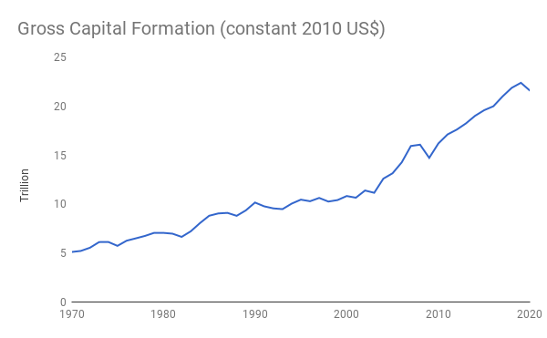
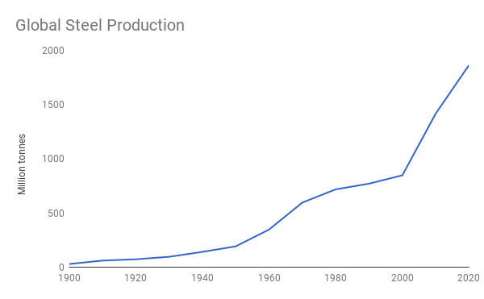
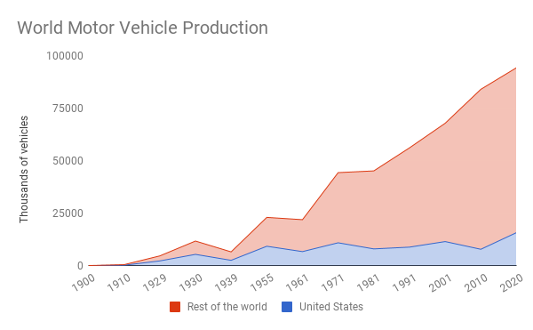
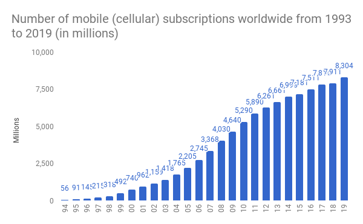
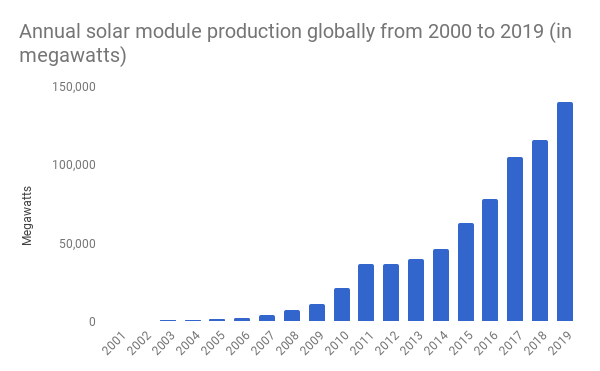

# Appendix
# 附录

The goal of this appendix is to provide additional data and arguments for why capital is sufficient, i.e. there is enough capital to meet everyone’s needs. Again, capital here specifically refers to physical capital, such as machines and infrastructure. It is physical capital, which produces the solutions to our needs, such as clothes and buildings.

本附录的目的是提供额外的数据和论据，说明为什么资本是充足的，即有足够的资本来满足每个人的需求。同样，这里的资本具体指的是物质资本，如机器和基础设施。正是物质资本，产生了满足我们需求的解决方案，如衣服和建筑。

There are three sections. The first section presents some general data on the development of global capital, showing the tremendous growth that has been accomplished over the last one hundred years. The second section uses data from World War II to show what can be accomplished when there is enough political will to redirect capital towards specific goals. Put differently, the bulk of capital available today is used in the service of wants, giving us a lot of room to meet needs. Finally, the third section dives deeper into each of the needs.

共分三节。第一部分介绍了一些关于全球资本发展的一般数据，显示了过去一百年来所完成的巨大增长。第二部分使用第二次世界大战的数据，显示当有足够的政治意愿将资本转向特定目标时，可以取得什么样的成就。换句话说，今天大部分可用的资本被用于服务于需求，为我们提供了很大的空间来满足需求。最后，第三部分深入探讨了每一项需求。
 
## The Growth of Capital
## 资本的增长#

It turns out to be surprisingly difficult to find global data on physical capital. The best source I have been able to locate is the World Bank, which publishes a data series on gross capital formation (World Bank, 2020). Unfortunately the data here reaches back only to 1970 but it still shows an increase from roughly $5 trillion to $22 trillion in 2019 (this is measured on constant 2010 dollars, i.e. adjusted for inflation).

事实证明，要找到关于实物资本的全球数据竟然出乎意料地困难。我能够找到的最佳来源是世界银行，它发布了一个关于总资本形成的数据系列（World Bank，2020）。不幸的是，这里的数据只能追溯到 1970 年，但它仍然显示从大约 5 万亿美元增加到 2019 年的 22 万亿美元（这是以 2010 年的不变美元衡量的，即根据通货膨胀调整）。

来源： World Bank, 2020

For triangulation it is worth considering the growth in output of some things that require productive capacity. We can infer the availability of physical capital through outputs. To that end, I was able to find the following chart of global crude steel production over time (Morfeldt, 2017).

为了进行三角测量，应该考虑一些需要生产能力的事物的产出增长。我们可以通过产出来推断实物资本的可用性。为此，我能够找到以下全球粗钢产量随时间变化的图表（Morfeldt, 2017）。

来源： International Iron and Steel Institute 1991, 2001; Worldsteel Committee on Economic Studies, 2011; World Steel Association, 2021

Compared to gross capital there is only about a twofold growth here from 1970 to today, but it is important to keep in mind that during that time period we have come up with many materials other than steel from which to make things, such as aluminum and of course plastics. Importantly though this graph lets us compare steel output today with output at the time of World War II and we can see that there has been more than an order of magnitude growth (roughly 15x).

与总资本相比，从 1970 年到今天，这里只有大约 2 倍的增长，但重要的是要记住，在这段时间里，我们已经想出了许多钢铁以外的材料来制造东西，如铝，当然还有塑料。重要的是，这张图让我们将今天的钢铁产量与二战时期的产量进行比较，我们可以看到，钢铁产量已经有了超过一个数量级的增长（大约 15 倍）。

What about finished goods production? This too is a good proxy for the amount of total available physical capital. A great example is the global production of cars. Here is a chart that shows it over time going back to the earliest days of the industry.

成品的生产情况如何？这也是可用实物资本总量的一个良好代表。一个很好的例子是汽车的全球生产。这里有一张图表，显示了它随着时间的推移，可以追溯到该行业最早的时期。

来源： Chamber of Commerce of the United States, 1973; Bureau of Transportation Statistics, 2017

Again we can see a roughly twofold increase relative to the 1970s and a greater than 10x increase if we go back further. This chart has an important feature worth pointing out now: there is a dip to near zero production in the mid 1940s corresponding to World War II.

我们可以再次看到相对于 20 世纪 70 年代有大约 2 倍的增长，如果我们再往前追溯，则有超过 10 倍的增长。这个图表有一个值得指出的重要特征：在 1940 年代中期，与第二次世界大战相对应的产量下降到接近零。

Here is a dramatic example of what all this productive capacity makes possible. The first commercially available handheld mobile phone was the Motorola DynaTAC 8000x which became available in 1984 (“Motorola DynaTAC,” 2021). Here is the growth of mobile phones since then, measured in active subscriptions (Statista, 2020).

这里有一个戏剧性的例子，说明所有这些生产能力使之成为可能。第一款商业化的手持移动电话是摩托罗拉 DynaTAC 8000x，于 1984 年上市（"“Motorola DynaTAC"，2021）。以下是自那时以来移动电话的增长情况，以活跃用户数衡量（Statista，2020）。

来源： Statista, 2020

Over the course of three decades we basically went from not having mobile phones to having more than the global population (this of course brings to mind William Gibson’s great quote that “[t]he future is already here – it’s just not evenly distributed” – with many people having two mobile phones, one for work and oner personal for example, while others have none).

在三十年的时间里，我们基本上从没有手机到拥有超过全球人口的手机（这当然让人想起威廉·吉布森的名言：『未来已经到来 —— 只是分布不均』—— 许多人拥有两部手机，例如一部用于工作，一部用于个人，而其他人则没有）。

And here is one more example that’s highly relevant to the climate crisis: the rate at which we have produced solar panels (Statista, 2021). 

这里还有一个与气候危机高度相关的例子：我们生产太阳能板的速度（Statista, 2021）。

来源： Statista, 2021

Over a decade and a half we went from basically making no panels, to making 150 Gigawatts in new panels on what looks like an exponential growth trajectory. Now crucially we are currently using a small part of our productive capital to make solar panels. How do we know this? Because we have not yet taken the drastic steps necessary for fighting the climate crisis, which will eventually have to reach levels similar to the capital deployment in World War II.
 
在过去的十五年里，我们从基本上不生产电池板，到生产 150 吉瓦的新电池板，看起来是一个指数级的增长轨迹。现在至关重要的是，我们目前正在使用我们生产资本的一小部分来制造太阳能电池板。我们怎么知道的呢？因为我们还没有采取应对气候危机所需的严厉措施，这最终将不得不达到类似于第二次世界大战中资本部署的水平。

## Capital Deployment in World War II
## 第二次世界大战中的资本部署

The prior section provided some data on how much physical capital has grown in the last one hundred years. When measured by certain proxies, such as the production of steel, it looks like about a 30x growth in capital over the last 100 years and a nearly 100x growth if one goes back just two decades further to 1900. We also saw that significant growth has occurred since World War II, which--as a first approximation--is at least an order of magnitude growth (10x).

前面的部分提供了一些数据，说明在过去的一百年里，物质资本增长了多少。如果用某些代用指标来衡量，如钢铁生产，在过去的 100 年里，资本似乎增长了 30 倍，如果再往前推 20 年，即 1900 年，增长了近 100 倍。我们还看到，自第二次世界大战以来，出现了显著的增长，这 —— 作为一个第一近似值 —— 至少是一个数量级的增长（10 倍）。

Now someone might suggest that this growth could all be due to the population explosion, but that’s not the case. Over the same timeframe the global population has grown a lot less: from 1900 to today a bit less than 5x and from the end of World War II to today only by a bit more than 3x. Put differently, the increase in physical capital has far outstripped population growth (Our World in Data, 2019).

现在有人可能会提出，这种增长可能都是由于人口爆炸造成的，但事实并非如此。在相同的时间范围内，全球人口的增长要少得多：从 1900 年到今天不到 5 倍，从二战结束到今天只增加了 3 倍多一点。换句话说，物质资本的增长已经远远超过了人口的增长（《我们的数据世界》，2019 年）。

Now one might still question whether this capital is sufficient to meet everyone’s needs, as I have asserted. Some of the strongest evidence for my claim comes from considering what happened during World War II. Here is a chart that shows the government share of GDP in the US during the war years (Casais, 2010).

现在，人们可能仍然质疑这种资本是否足以满足每个人的需求，正如我所断言的那样。我的主张的一些最有力的证据来自于考虑二战期间发生的事情。下面是一张图表，显示了战争年代美国政府在 GDP 中的份额（Casais，2010）。

Let’s dive a bit deeper and look at the manufacturing efforts. The US ramped production of tanks, airplanes, battleships and guns at an extraordinary clip in the war years. Here is a table that tabulates this for different weapons systems (Harrison, 1998).

让我们再深入一点，看看制造方面的努力。在战争年代，美国以惊人的速度提高了坦克、飞机、战舰和枪支的生产。这里有一个表格，列出了不同武器系统的生产情况（Harrison，1998）。

The numbers here are staggering. For example, in 1943 the US built 2654 major naval vessels. That’s more than 7 every day, or roughly one every three and half hours! In 1944 the US built over 74 thousand combat aircraft, that’s about 8.5 combat aircraft *every hour*.

这里的数字是惊人的。例如，在 1943 年，美国建造了 2654 艘主要海军舰艇。这意味着每天超过 7 艘，或者大约每三个半小时就有一艘! 在 1944 年，美国建造了超过 7.4 万架作战飞机，这大约是**每小时** 8.5 架作战飞机。

We are not talking about simple devices here. These are complex high-performance systems with many components (think of the aircraft engines alone!). And that’s just the US production. There were similar scale efforts in Germany, Japan, the UK, and Russia. For example, adding up all the combat aircraft production in 1944 is 185 thousand units, which is 21 aircraft every hour.

我们在这里谈论的不是简单的设备。这些是复杂的高性能系统，有许多部件（想想飞机发动机就知道了！）。而这仅仅是美国的生产。在德国、日本、英国和俄罗斯也有类似规模的努力。例如，把 1944 年所有的作战飞机产量加起来是 18.5 万架，也就是每小时 21 架。

Now in the US while all of this production was happening, people were not starving, there was enough clothing, and were doing surprisingly well overall (Henderson, 2015). But as we saw earlier, the production of cars dropped dramatically — so how were people’s transportation needs met during this time? Through a massive increase in public transportation (Fetherston et al., n.d.). The connection was made quite explicitly with the government running ads “When you ride alone, you ride with Hitler.”(The U.S. National Archives and Records Administration, n.d.). This is a perfect illustration of separating a need, transportation, from its solutions, in this case individual versus shared mobility.

现在在美国，当所有这些生产发生时，人们没有挨饿，有足够的衣服，并且总体上做得出奇地好（Henderson，2015）。但正如我们前面所看到的，汽车的生产急剧下降 —— 那么在这段时间里，人们的交通需求是如何得到满足的呢？通过大规模增加公共交通（Fetherston et al）。政府的广告『当你独自驾驶时，希特勒与你同行』（美国国家档案和记录管理局），使这种联系变得相当明确。这是一个完美的例子，说明了将一个需求，即交通，与它的解决方案分开，在这种情况下，个人与共享流动性。

The continued ability to meet needs while at the same time repurposing half or more of physical capital strongly supports the claim of sufficient capital. As a first approximation much of that capital was previously used to meet wants. And it went back to meeting wants after World War II which partially explains the tremendous economic boom of the post war years.

继续满足需求的能力，同时重新利用一半或更多的实物资本，有力地支持了充足资本的说法。初步估计，这些资本中的大部分以前是用来满足需求的。二战后，这些资本又被用于满足需求，这部分地解释了战后经济的巨大繁荣。

All of this is to say that today’s economy with at least an order of magnitude more capital than during World War II can easily meet our needs. Importantly it also means that we have plenty of additional capacity that could be allocated to solving the climate crisis. For example, we could dramatically ramp the production of everything from solar panels to nuclear reactors to heat pumps.

所有这些都是说，今天的经济拥有比二战时期至少多一个数量级的资本，可以轻松满足我们的需求。重要的是，这也意味着我们有大量的额外能力，可以分配给解决气候危机。例如，我们可以极大地提高从太阳能电池板到核反应堆到热泵的生产。

But there is more to be gleaned from what happened during World War II production. It isn’t just that we collectively made a lot of complicated stuff rapidly. We also innovated on extremely compressed time scales. The Manhattan project is the most obvious example of that which in a span of three years developed the nuclear bomb. It is hard to exaggerate how extensive this effort was, including for example uranium mining, as well as the exploration of several different bomb designs.

但从二战期间的生产情况中可以得到更多启示。这不仅仅是我们集体快速制造了许多复杂的东西。我们还在极度压缩的时间范围内进行了创新。曼哈顿项目是最明显的例子，它在三年的时间里开发了核弹。很难夸大这项工程（的影响）有多广泛，包括例如铀矿开采，以及对几种不同的炸弹设计的探索。

Important technologies were either invented or significantly advanced during World War II (Dickson, 2016). For example, at the beginning of the war, radar was a nascent technology. Towards the end of World War II through the invention of the cavity magnetron, the Allies managed to build radars small and lightweight enough to put on planes (“Cavity Magnetron,” 2021). Penicillin, which had been discovered in 1928, was not widely used until mass production was unlocked as part of a secretive World War II effort (“Penicillin,” 2021).

重要的技术要么是在二战期间发明的，要么是在二战期间取得了重大进展（Dickson，2016）。例如，在战争开始时，雷达是一项新生的技术。在二战接近尾声时，通过发明空腔磁控管，盟军成功地制造了小而轻的雷达，足以放在飞机上（《空腔磁控管》，2021）。1928 年发现的青霉素，直到作为第二次世界大战的秘密任务的一部分，大规模生产被解锁，才被广泛使用（《青霉素》，2021）。

Production and deployment at high volume also drove important improvements. Take fighter planes as an example. Early fighters had limited range which meant that bombers had to fly into enemy territory without escorts. Their only defense against local fighters were plane mounted machine guns. It was only as the war went on that escort fighters of sufficient range were developed to accompany bombers (“Escort Fighter,” 2021). This was made possible by a combination of technological advances, such as more powerful engines, and the insights gained from battle.

大批量的生产和部署也推动了重要的改进。以战斗机为例。早期战斗机的航程有限，这意味着轰炸机必须在没有护卫的情况下飞入敌方领土。他们对当地战斗机的唯一防御是飞机上的机枪。只是随着战争的进行，才开发出有足够航程的护航战斗机来陪伴轰炸机（《护航战斗机》，2021）。这是由技术进步，如更强大的发动机，以及从战斗中获得的洞察力共同促成的。

So what are the key takeaways? First, during peacetime mode much of the capital is used to meet wants not needs (the third installment in this post will look at this with regard to all the needs identified). Second, when switched into wartime mode, much of the productive capital can be redirected quickly towards accomplishing specific goals that are different from needs. This was already true at a much lower amount of physical capital per capita than is available today. Third, innovation can in fact be accelerated dramatically by focusing resources on critical problems.

那么，关键的启示是什么？首先，在和平时期，许多资本更多用来满足『需求』，而不是用来满足『需要』（本篇文章的第三部分将针对所有确定的需求来探讨这个问题）。第二，当切换到战时模式时，许多生产性资本可以迅速被重新定向到完成不同于需求的特定目标上。在人均物质资本量远低于今天的情况下，这已经是事实。第三，通过将资源集中在关键问题上，事实上可以大大加速创新。

The obvious threat we are facing today that requires a massive reallocation of, and improvement in, capital is the climate crisis. Whether this can be accomplished is determined entirely by what we choose to pay attention to. Hence, the defining scarcity of our age is attention, not capital.

我们今天面临的明显的威胁，就是气候危机，它需要大规模重新分配和改善资本。这是否能够实现，完全取决于我们选择关注什么。因此，我们这个时代的决定性匮乏是注意力，而不是资本。
 
## Meeting Humanity’s Needs
##满足人类的需求

The overall physical capital statistics provided earlier abstract away any regional differences. The examination of World War II showed that the US was able to meet people’s needs with a fraction of the available capital but obviously that wasn’t true elsewhere. In particular of course in the actual war zones much physical capital was destroyed, resulting in needs going unmet. In the following discussion too we will see that capital is not yet sufficient everywhere. Given the total amount of aggregate physical capital available now that is a distribution problem (which is really an attention scarcity problem). Paraphrasing a famous William Gibson quote: capital is already sufficient, it is just not yet evenly distributed.

先前提供的总体物质资本统计数字抽象了任何区域差异。对第二次世界大战的研究表明，美国能够用一小部分可用的资本来满足人们的需求，但显然其他地方不是这样的。当然，特别是在实际的战区，许多物质资本被摧毁，导致需求得不到满足。在下面的讨论中，我们也将看到，资本还不是到处都充足。鉴于现在可用的物质资本总量，这是一个分配问题（这实际上是一个注意力稀缺的问题）。套用威廉·吉布森的一句名言：『资本已经足够了，只是还没有平均分配。』

Furthermore I should caveat that I am providing a mix of statistics, anecdotes and arguments. My goal is not to make an incontrovertible case that capital is sufficient. I doubt this would be possible even with a lot more time, given the limited state of measurement of much of the world’s capital. Incidentally, I believe that eventually this paucity of data will be something humanity will look back in surprise, much as we sometimes wonder how things worked before we had mobile phones. Thankfully Max Roser, Hannah Ritchie, and the rest of the team at Our World in Data are starting to make a dent here. Instead, I am simply aiming to make a case that’s compelling enough to bolster the overall argument that attention has now become humanity’s critical scarcity.

此外，我应该警告，我提供的是统计数据、轶事和论据的组合。我的目标不是要提出一个无可争议的案例，说明资本是充足的。我怀疑即使有更多的时间也不可能做到这一点，因为世界上许多资本的测量状况是有限的。顺便说一句，我相信最终这种数据的匮乏将成为人类回首往事时感到惊讶的事情，就像我们有时想知道在我们拥有手机之前事情是如何运作的一样。值得庆幸的是，马克斯·罗瑟、汉娜·里奇和《我们的数据世界》团队的其他成员正开始在这方面做出努力。相反，我只是想提出一个足够有说服力的案例，以支持整个论点，即注意力现在已经成为人类的关键稀缺物。

In the following the passage from the needs section is in italics, followed by an examination of the sufficiency of capital. I cover both individual and collective needs, as well as what I call enablers (e.g., energy). Along the way, I will also often point out how our lack of attention to the climate crisis and other problems may result in capital becoming scarce again in the future.

在下文中，需求部分的段落以斜体字显示，随后是对资本充足性的考察。我涵盖了个人和集体的需求，以及我所说的助推器（如能源）。一路上，我还会经常指出，我们对气候危机和其他问题的不重视可能会导致资本在未来再次变得稀缺。
 
**Oxygen.** *On average, humans need about 550 liters of oxygen every day (“How Much Oxygen Does a Person Consume in a Day?,” 2000), depending on the size of our body and physical exertion. Our most common way of meeting this need is breathing air. Although that may sound obvious, we have developed other solutions through technology – for example, the blood of patients struggling to breathe can be oxygenated externally.*

**氧气**。平均而言，人类每天需要大约 550 升的氧气（《一个人一天要消耗多少氧气？》，2000），这取决于我们的身体大小和体力消耗。我们满足这一需求的最常见方式是呼吸空气。虽然这听起来很明显，但我们已经通过技术开发了其他解决方案 —— 例如，挣扎着呼吸的病人的血液可以从外部获得氧气。

There is no shortage of oxygen in the Earth’s atmosphere. Throughout industrialization the issue has been air pollution. For example, in London the air was so bad that the Great Smog of 1952 killed four thousand people in the span of less than a week (Smog Kills Thousands in England, 2020). More recently it has been Indian and Chinese cities that are experiencing similar levels of air pollution. This can definitely be seen as an example of a local insufficiency of capital. In the more developed countries the passage of clean air acts forced the installation of catalytic converters, a switch from coal to gas heat, etc. and largely resolved this deficiency. These same and even more advanced technologies (e.g. electric vehicles) can be deployed globally. China has already taken crucial steps in this direction, with the province of Hainan setting a 2030 deadline for all new and replacement vehicles to be emission free (Xue, 2019).

地球的大气层中并不缺乏氧气。在整个工业化过程中，问题是空气污染。例如，在伦敦，空气是如此糟糕，以至于 1952 年的大烟雾在不到一周的时间内杀死了四千人（《烟雾在英国杀死了数千人》，2020）。最近，是印度和中国的城市正在经历类似的空气污染水平。这绝对可以被看作是当地资本不足的一个例子。在较发达的国家，清洁空气法案的通过迫使人们安装催化转换器，从煤炭转向天然气加热等，并在很大程度上解决了这一不足。这些相同甚至更先进的技术（如电动汽车）可以在全球范围内部署。中国已经在这个方向上采取了关键步骤，海南省设定了 2030 年所有新的和替换的车辆都不排放的最后期限（Xue，2019）。

We should, however, not take the earth’s atmosphere for granted. Many different phenomena resulted in the existence of and maintenance of today’s breathable atmosphere. For example, the Earth’s magnetic field protects it from the solar winds which would otherwise tear off large parts of the atmosphere (“Solar Wind,” 2021). A reduction in or even loss of the magnetic field is exactly the kind of long tail “Black Swan” type of event that we do not pay nearly enough attention to as humanity.
 
然而，我们不应认为地球的大气层是理所当然的。许多不同的现象导致了今天可呼吸大气层的存在和维持。例如，地球的磁场保护它不受太阳风的影响，否则太阳风会撕掉大气层的大部分（《太阳风》，2021 年）。磁场的减少甚至消失，正是我们人类几乎没有足够重视的那种长尾《黑天鹅》式的事件。

**Water.** We need to ingest two or three liters of water per day to stay hydrated, depending on factors such as body size, exertion and temperature. In addition to drinking water and fluids that contain it, we have other solutions for this, such as the water contained in the foods that we eat.

**水**。我们每天需要摄入两到三升的水来保持水分，这取决于身体大小、体力消耗和温度等因素。除了喝水和含有水的液体外，我们还有其他解决办法，如我们吃的食物中含有的水。

As with oxygen, there is no shortage of water on Earth. The challenge is access to drinkable water which means sufficiently clean and desalinated water. Here too we can see how at an earlier point in development capital was insufficient. Again London serves as a great example: frequent Cholera outbreaks were the result of water wells that were not separated from sewage. John Snow famously documented the connection by establishing a detailed map in the 1854 outbreak which helped to overcome the prior “Miasma” theory of Cholera and ultimately resulted in London building out an elaborate water infrastructure (“1854 Broad Street Cholera Outbreak,” 2021). 

与氧气一样，地球上并不缺乏水。面临的挑战是获得可饮用的水，也就是足够清洁和淡化的水。在这里我们也可以看到在发展的早期，资本是如何不足的。伦敦再次成为一个很好的例子：霍乱的频繁爆发是由于水井没有与污水分开。约翰·斯诺在 1854 年爆发的霍乱中通过建立详细的地图记录了这种联系，这有助于克服之前关于霍乱的『瘴气理论』，并最终导致伦敦建立了精心设计的水务基础设施（《1854 年布罗德街霍乱爆发》，2021 年）。

A more recent example is the water crisis in Flint, Michigan where lead from old pipes resulted in toxic drinking water (“Flint Water Crisis,” 2021). So we can see how capital has been insufficient here and is still insufficient in some parts of the world but not because of some fundamental lack of technology or capital but rather because of a failure of attention to clean water access. The World Bank has come up with an estimate of only about $28 billion annually to provide everyone in the world with basic water, sanitation and hygiene, and about $114 billion to make these services available continuously (Hutton, 2016). These surprisingly low numbers show how little physical capital would need to be deployed. Clean drinking water is a great example of the type of problem where markets tend to fail and hence attention allocation needs to happen through other processes (e.g. by electing a capable city government).

最近的一个例子是密歇根州弗林特的水危机，旧管道的铅导致了有毒的饮用水（《弗林特水危机》，2021）。因此，我们可以看到资本在这里是如何不足的，而且在世界的一些地方仍然不足；但这不是因为一些根本性的技术或资本的缺乏，而是因为没有注意到清洁水的获取。世界银行得出的估计是，每年只有大约 280 亿美元可以为世界上的每个人提供基本的水、环境卫生和个人卫生，大约 1140 亿美元可以使这些服务持续提供（Hutton，2016）。这些令人惊讶的低数字表明需要部署的物质资本是多么的少。清洁饮用水是一个很好的例子，说明市场往往会失败，因此需要通过其他过程（例如，通过选举一个有能力的城市政府）来分配注意力的问题。
 
**Calories.** *To power our bodies, adults need between 1,500 and 3,200 calories per day (U.S. Department of Agriculture and U.S. Department of Health and Human Services, 2015), a need we mainly meet by eating and drinking. The best way to obtain calories, however, is surprisingly poorly understood – the mix between proteins, lipids and carbohydrates is subject to debate.*

**卡路里**。为了给我们的身体提供动力，成年人每天需要 1500 至 3200 卡路里（美国农业部和美国卫生与公众服务部，2015 年），我们主要通过吃喝来满足这一需求。然而，获得卡路里的最佳方式令人惊讶地不太了解 —— 蛋白质、脂类和碳水化合物之间的混合是有争议的。

Eating food is the primary solution to our need for calories. This is where Malthus expected the big shortfall to come from. Agriculture simply wouldn’t be able to keep up with the growth in population. The big breakthrough that he didn’t anticipate was the Haber Bosch process of nitrogen fixation, which powered the so-called green revolution. Equipped with artificial nitrogen fertilizer, agricultural output soared. 

吃食物是解决我们对卡路里需求的主要办法。这就是马尔萨斯预期的巨大缺口的来源。农业根本无法跟上人口增长的步伐。他没有预料到的重大突破是哈伯博世的固氮过程（Haber Bosch process of nitrogen fixation），它为所谓的绿色革命提供了动力。有了人工氮肥的装备，农业产量猛增。

The other big win in agriculture was the use of machinery. Today in the US only 1.3% of the employed population works in agriculture and the entire food supply system at $1.1 trillion represents only 5% of total GDP (Lepley, 2019; USDA, n.d.). Even in countries that are further back in development such as India, the percentage of the population engaged in farming has been shrinking, a decline made possible by the availability of sufficient physical capital (Shrinivasan, 2013).

农业的另一个大赢家是机械的使用。今天在美国，只有 1.3% 的就业人口从事农业，整个食品供应系统的 1.1 万亿美元只占 GDP 总量的 5%（Lepley，2019；USDA）。即使在发展较落后的国家，如印度，从事农业的人口比例也一直在萎缩，这种下降是由于有足够的物质资本（Shrinivasan，2013）。

Now clearly not everyone has access to enough calories to meet their needs. For example, starvation is ravaging Yemen right now as a result of the ongoing war there. Overall, however, since the 1970s the incidence of death from famine has been at historic lows (Hasell, 2013). And even before that as Amartya Sen and others have documented many famines resulted from a failure to distribute food, not an absolute lack of it (with examples of rotting supplies in harbors while people starve nearby).

现在，显然不是每个人都能获得足够的卡路里来满足他们的需求。例如，由于也门正在发生的战争，饥饿正在肆虐。然而，总体而言，自二十世纪七十年代以来，饥荒死亡的发生率一直处于历史低位（Hasell，2013）。甚至在此之前，正如阿玛蒂亚·森和其他人所记录的那样，许多饥荒是由于未能分配食物，而不是绝对缺乏食物（有例子表明，港口的物资腐烂，而附近的人挨饿）。

Here too though we cannot rest on our accomplishments. The biggest risk to humanity’s ability to meet everyone’s need for calories is the climate crisis which is disrupting the relatively stable weather patterns required by agriculture. So far we have been experiencing crop failures only locally and sometimes regionally. A global large scale crop failure would result in starvation as we have very limited stockpiles.

但在这方面我们也不能满足于我们的成就。人类满足每个人的热量需求的能力所面临的最大风险是气候危机，它正在破坏农业所需的相对稳定的天气模式。到目前为止，我们只是在局部地区，有时是区域性地经历了作物歉收。全球大规模的作物歉收将导致饥饿，因为我们的库存非常有限。
 
**Nutrients.** *The body cannot synthesize all the materials it requires, including a couple of certain fatty acids, some amino acids, as well as a few vitamins and minerals – these are called “essential” and must be obtained as part of our nutrition. This is another area that is surprisingly poorly understood, meaning that the actual mix and amount of required nutrients we need to take in seems unsettled.*

**营养素**。身体无法合成它所需要的所有材料，包括一些特定的脂肪酸、一些氨基酸以及一些维生素和矿物质 —— 这些被称为『必需品』，必须作为我们营养的一部分获得。这是另一个令人惊讶的理解不足的领域，这意味着我们需要摄入的所需营养物质的实际组合和数量似乎尚未确定。

Nutrients, while important, are needed in relatively small amounts. For example, the daily recommended amount for alpha-linolenic acid (ALA) is between 0.5g and 1.6g (National Institutes of Health, 2021). The biggest intake requirements are the essential amino acids, with adults probably needing about 7g daily of Leucine as one example (Appleby, 2018). For minerals and vitamins we are talking about even smaller amounts. These are mostly in the milligram and microgram range with the exception of Calcium, Chloride and Sodium, which are needed in a few grams each (Romine, 2019).

营养物质虽然重要，但需要的量相对较少。例如，α-亚麻酸（ALA）的每日推荐量在 0.5 克至 1.6 克之间（National Institutes of Health, 2021）。摄入量要求最大的是必需氨基酸，以成年人为例，每天可能需要约 7 克亮氨酸（Appleby, 2018）。对于矿物质和维生素，我们谈论的是更小的数量。这些大多是毫克和微克的范围，但钙、氯化物和钠除外，它们各需要几克（Romine，2019）。

The cost and capital required to produce all of these essential nutrients has been declining substantially over time as a result of scientific and engineering progress. For example, we have recently figured out how to grow rice that has more Vitamin A in it, called Golden Rice (Dubock, 2019). More than half the global population eats rice daily and so having it deliver enough Vitamin A is a major way of ensuring sufficient amounts of that essential nutrient are available.

由于科学和工程的进步，生产所有这些基本营养物质所需的成本和资本随着时间的推移而大幅下降。例如，我们最近想出了如何种植含有更多维生素 A 的大米，称为黄金大米（Dubock, 2019）。全球一半以上的人口每天都要吃大米，因此让大米提供足够的维生素 A 是确保提供足够数量的这种基本营养素的一个主要途径。

Here too, capital is not the binding constraint today. But as the example of Golden Rice shows, it will continue to be important to innovate so as to better meet nutrient needs for everyone and not just those who can currently afford to buy every possible supplement by walking into the nearest drug store. Further research is also required to understand which nutrients we really need and in what dosage for humans to thrive and live long, healthy lives.
 
在这里，资本也不是今天的约束性制约因素。但是，正如黄金大米的例子所示，创新将继续是重要的，以便更好地满足每个人的营养需求，而不仅仅是那些目前有能力通过走进最近的药店购买各种可能的补充剂的人。还需要进一步研究，以了解我们真正需要哪些营养物质，以及人类需要多少剂量才能茁壮成长和健康生活。

**Discharge.** *We also need to get things out of our bodies by expelling processed food, radiating heat and exhaling carbon dioxide. Humans have made a great deal of progress around meeting our discharge needs, such as toilets and public sanitation.*

**排泄**。我们还需要通过排出加工过的食物、散发热量和呼出二氧化碳来把东西排出体外。人类已经在满足我们的排放需求方面取得了很大的进展，如厕所和公共卫生设施。

Building public sanitation systems is one of the major contributors to improvements in life expectancy. As Steven Johnson documents in his books “The Ghost Map” (2007) and “Extra Life” (2021) the city of London was hit by repeated Cholera outbreaks until it separated sewage from fresh water delivery. Even back in the mid 1800s London had sufficient capital to build out a large scale sewer system (“London Sewerage System,” 2021).

建设公共卫生系统是改善预期寿命的主要贡献者之一。正如史蒂文·约翰逊在他的书《幽灵地图》（2007 年）和《额外的生命》（2021 年）中所记录的那样，伦敦市被霍乱反复袭击，直到它将污水与淡水输送分开。甚至早在十九世纪中期，伦敦就有足够的资金来建立一个大规模的下水道系统（《伦敦下水道系统》，2021 年）。

In many countries we take this for granted today but there are still places in the world that have insufficient sewage treatment capacity. Globally the number of people without access to proper sanitation has been declining albeit slowly (Ritchie & Roser, 2021). That’s largely due to the fact that a lack of sanitation exists predominantly in the places with the highest population growth. Still at this point about two thirds of the global population has access to sanitation and the total number of people who do has grown by several billion in the last couple of decades. This has been possible as the overall capital required for achieving sufficient sanitation is relatively low and again has been declining with technological progress (García , 2009).

在许多国家，我们今天认为这是理所当然的，但世界上仍有一些地方的污水处理能力不足。在全球范围内，无法获得适当卫生设施的人数一直在下降，尽管速度很慢（Ritchie & Roser, 2021）。这主要是由于缺乏卫生设施的情况主要存在于人口增长最快的地方。目前，全球有约三分之二的人口可以使用卫生设施，在过去几十年里，使用卫生设施的总人数增加了几十亿。这是有可能的，因为实现足够的卫生设施所需的总体资本相对较低，而且随着技术的进步而不断下降（García，2009）。

Sanitation provides another example of how a lack of attention to the right problems puts our ability to meet our needs at risk. Right here in New York City for example during heavy downpours raw sewage spills into the East and Hudson Rivers because of insufficient capacity in the rainwater runoff systems (Chaisson, 2017). With the climate crisis accelerating, the frequency of that kind of heavy rainfall is increasing rapidly (Climate Central, 2019).
 
卫生设施提供了另一个例子，说明缺乏对正确问题的关注会使我们满足需求的能力受到威胁。以纽约市为例，在大雨期间，由于雨水径流系统的容量不足，原污水溢出到东河和哈德逊河（Chaisson，2017）。随着气候危机的加速，这种强降雨的频率正在迅速增加（气候中心，2019）。

**Temperature.** *Our bodies can self-regulate their temperature, but only within a limited range of environmental temperature and humidity. Humans can easily freeze to death or die of overheating (we cool our bodies through sweating, also known as ‘evaporative cooling’, which stops working when the air gets too hot and humid). We therefore often need to help our bodies with temperature regulation by controlling our environment. Common strategies to meet our temperature needs include clothing, shelter, heating and air conditioning.*

**温度**。我们的身体可以自我调节温度，但只能在有限的环境温度和湿度范围内进行调节。人类很容易被冻死或死于过热（我们通过出汗来冷却身体，也称为『蒸发冷却』，当空气变得太热和太潮湿时，蒸发冷却就会停止工作）。因此，我们经常需要通过控制环境来帮助我们的身体进行温度调节。满足我们温度需求的常见策略包括衣服、住所、暖气和空调。

We have long had enough capital to provide everyone in the world with clothing. We are strictly faced with a distribution problem here. Some people don’t have the financial resources or live in circumstances, such as homelessness, that make it difficult for them to acquire and maintain sufficient clothing. Conversely in many advanced economies people have piles of unused clothes and the so-called fast fashion industry promotes rapid changes in style that result in massive additional consumption. 

我们早就有足够的资本为世界上的每个人提供衣服。我们在这里严格面临着一个分配问题。有些人没有经济来源，或生活在无家可归等环境中，使他们难以获得和维持足够的衣服。相反，在许多发达经济体中，人们有成堆的闲置衣服，而所谓的快速时尚产业促进了风格的快速变化，导致大量的额外消费。

But what about shelter? This is a more difficult problem that requires significantly more capital. Here too the evidence suggests that we have sufficient physical capital. For example it is estimated that in 2015 we already had over 220 billion square meters of buildings globally (UNEP & GABC, 2017). This amounts to 30 square meters per person. Now of course some part of that is commercial and industrial space, still this shows that as a first approximation we can house everyone. Even more impressive is the rate at which we are adding space. The same report estimates that by 2030 we will be at over 300 billion square meters of buildings. We also have a lot of circumstantial evidence that supports this conclusion. In particular building booms in various parts of the world, including China, the US and the Middle East, created vast local oversupplies of housing. For instance at the height of the China boom enough housing was added annually for the equivalent of two new ten million resident cities (Slotta, 2020).

但是避难所呢？这是一个更困难的问题，需要更多的资本。这里也有证据表明，我们有足够的物质资本。例如，据估计，在 2015 年，我们已经拥有超过 2200 亿平方米的全球建筑（UNEP 和 GABC，2017）。这相当于每个人有 30 平方米。当然，其中有一部分是商业和工业空间，但这仍然表明，作为一个初步的近似值，我们可以容纳所有人。更令人印象深刻的是，我们正在增加空间的速度。同一报告估计，到 2030 年，我们的建筑将超过 3000 亿平方米。我们也有很多间接的证据支持这一结论。特别是世界各地的建筑热潮，包括中国、美国和中东地区，造成了当地大量的住房供应过剩。例如，在中国的繁荣时期，每年增加的住房相当于两个新的 1000 万居民的城市（Slotta, 2020）。

And yet again we encounter the climate crisis as the biggest threat to our ability to provide adequate shelter to everyone. In the US alone, nearly 15 million housing units are threatened by floods as found by a recently updated federal mapping exercise (Kaufman et al., 2020). That doesn’t count homes threatened by forest fires. Over longer time horizons sea level rise will make large coastal areas around the world uninhabitable. We are already experiencing significant climate refugee movements today. In 2020 alone it is estimated that 30 million people were displaced globally due to storms and floods (Global Migration Data Portal, 2021). The forecasts are that by 2050 as many as 1 billion people may need shelter in a new location (Kamal, 2017).

而我们又一次遇到了气候危机，它是对我们为每个人提供适当住房能力的最大威胁。仅在美国，就有近 1500 万套住房受到洪水的威胁，这是最近更新的联邦测绘工作发现的（Kaufman et al.，2020）。这还不包括受到森林火灾威胁的房屋。在更长的时间范围内，海平面上升将使世界各地的大型沿海地区无法居住。我们今天已经在经历重大的气候难民流动。仅在 2020 年，估计全球就有 3000 万人因风暴和洪水而流离失所（全球移民数据门户，2021）。预测到 2050 年，可能有多达 10 亿人需要在新的地方避难（Kamal, 2017）。

Can we heat and cool all this space as needed? The capital requirements here are accelerating rapidly at the moment due to the unfolding climate crisis which is increasing cooling requirements globally. This is not just a question of convenience. In hot and humid conditions evaporative cooling via sweat stops working and when that happens people die from overheating. This is now a routine occurrence in many parts of the world and even a relatively northern region such as Europe is affected, with the 2019 heat wave causing over two thousand deaths (Borunda, 2021; “2019 European Heat Waves,” 2021). 

我们能否根据需要对所有这些空间进行加热和冷却？由于正在展开的气候危机在全球范围内增加了冷却要求，这里的资本要求目前正在迅速加快。这不仅仅是一个方便的问题。在炎热和潮湿的条件下，通过汗水的蒸发冷却停止工作，当这种情况发生时，人们会因过热而死亡。这在世界许多地方现在是家常便饭，甚至像欧洲这样相对较北的地区也受到影响，2019 年的热浪导致超过两千人死亡（Borunda，2021；《2019 年欧洲热浪》，2021）。

As of 2020 there are an estimated 1.9 billion AC units in the world, adding about 110 million units annually at an accelerating pace (Armstrong, 2020; Holst, 2020). The key constraint here is not capital but electricity to run all of these new units, which will be further exacerbated by the need to switch heating from fossil fuels to electricity. This constraint will be looked at in the energy section further down.

截至 2020 年，世界上估计有 19 亿台空调，每年约增加 1.1 亿台，而且速度加快（Armstrong，2020；Holst，2020）。这里的关键制约因素不是资本，而是运行所有这些新设备的电力，这将因需要将加热从化石燃料转向电力而进一步加剧。这一制约因素将在下面的能源章节中进行探讨。

**Pressure.** *Anybody who has gone diving will be aware that our bodies do not handle increased pressure very well. The same goes for decreased pressure, which is one of the reasons why we find air travel exhausting (airplane cabins maintain pressure similar to being at the top of an eight-thousand-foot mountain).*

**压力**。任何去过潜水的人都会知道，我们的身体不能很好地处理增加的压力。压力降低也是如此，这也是我们发现航空旅行令人疲惫的原因之一（飞机舱内的压力类似于在八千英尺的山顶）。

Thankfully we need minimal capital to meet our pressure needs. One might at first assume that we do not need any capital, but that’s not correct. For example, pretty much all commercial flights are in altitudes that require pressurized cabins and hence extra capital above and beyond what would be required for an unpressurized plane. For instance, at just 12 km of altitude pressure falls to 0.2 bar (“Cabin Pressurization,” 2021). At such a low pressure it is not just a lack of oxygen that would be fatal, but also decompression sickness may occur where gases that have been dissolved in the bloodstream may gas out resulting in sickness and even death. As noted earlier, we cannot take the existence of the Earth’s atmosphere for granted. So in addition to giving thought on how to create a livable atmosphere on planets such as Mars that we may eventually want to settle, we need to pay attention to the various forces that could damage or even destroy the Earth’s atmosphere.
 
值得庆幸的是，我们需要最少的资本来满足我们的压力需求。人们可能一开始就认为我们不需要任何资本，但这是不正确的。例如，几乎所有的商业飞行都在需要加压舱的高度，因此需要超出非加压飞机所需的额外资本。例如，在仅仅 12 公里的高度，压力下降到 0.2 巴（《机舱增压》，2021）。在如此低的压力下，不仅仅是缺氧会致命，而且还可能发生减压病，溶解在血液中的气体可能会排出，导致生病甚至死亡。如前所述，我们不能把地球大气层的存在视为理所当然。因此，除了考虑如何在我们最终可能想要定居的火星等星球上创造一个宜居的大气层之外，我们还需要注意可能损害甚至破坏地球大气层的各种力量。
 
**Light.** *Most humans would be hard-pressed to achieve much in complete darkness. For a long time, our need for light was met mainly by sunlight, but much human ingenuity has gone into the creation of artificial light sources.*

**光**。大多数人在完全黑暗的环境中很难取得什么成就。长期以来，我们对光的需求主要是通过阳光来满足的，但人类在创造人工光源方面付出了很多智慧。

Our ability to make artificial light is one of the great human achievements and also a story of ongoing progress. We are the only species that has the knowledge to make fire, a capability attributed in Greek mythology to Prometheus who stole fire from the gods. Capital is essential to making light, from the earliest time of gathering wood to the modern creation of light emitting diodes (LEDs). This progress has meant that light has become incredibly affordable in most parts of the world and consumption has gone up accordingly (for example, in the UK by four orders of magnitude over the last two hundred years) (Roser, 2013). Even in extremely poor countries that lack electrical infrastructure, so-called “offgrid solar” is revolutionizing the availability of light, replacing the burning of kerosene and other dangerous fuels. In summary we are definitely not constrained by capital when it comes to our need for light.
 
我们制造人造光的能力是人类的伟大成就之一，也是一个不断进步的故事。我们是唯一拥有制造火的知识的物种，这种能力在希腊神话中被认为是普罗米修斯从众神那里偷来的火。资本对于制造光是必不可少的，从最早的收集木材到现代的发光二极管（LED）的创造。这种进步意味着，在世界大多数地区，光已经变得令人难以置信地负担得起，消费也相应地上升（例如，在英国，在过去的两百年里，消费上升了四个数量级）（Roser，2013）。即使在缺乏电力基础设施的极端贫困国家，所谓的『离网太阳能』正在彻底改变照明的可用性，取代了煤油和其他危险燃料的燃烧。总之，在我们对光的需求方面，我们绝对不会受到资本的限制。

**Healing.** *Whenever we damage our body, it needs to heal. The human body comes equipped with extensive systems for self-healing, but beyond a certain range it needs external assistance. We have developed many solutions, which are often grouped under the term ‘healthcare’.*

**康复**。当我们损害身体时，它需要康复。人体配备了大量的自我修复系统，但超过一定范围就需要外部援助。我们已经开发了许多解决方案，这些解决方案通常被归入『保健』一词。

The primary constraint on healing has been knowledge, rather than capital. As documented in Steven Johnson’s book Extra Life, for the longest time medical interventions tended to result in worse outcomes as doctors had no idea what they were doing (Johnson, 2021). Conversely, today it has become possible to create new life saving medicines virtually overnight, as was the case with the COVID-19 mRNA vaccines. These are super cheap to manufacture and supply has been held back by artificial limitations based primarily on intellectual property protection rather than a scarcity of capital.

医治的主要制约因素是知识，而不是资本。正如史蒂文·约翰逊的《额外的生命》一书中所记载的那样，在很长一段时间里，医疗干预往往会导致更糟糕的结果，因为医生不知道他们在做什么（Johnson，2021 年）。相反，今天已经有可能几乎在一夜之间创造出新的救命药物，就像 COVID-19 mRNA 疫苗一样。这些药物的制造成本超低，而供应却被主要基于知识产权保护而非资本稀缺的人为限制所制约。

It is als crucial to understand that much of our current need for healing could be avoided in the first place by leading healthier lives. As noted earlier we do not know as much about nutrition as we should, but we do know that obesity contributes significantly to medical problems and yet the rate of obesity has increased dramatically, especially in the United States. Similarly we do know that stress is negatively associated with health and yet the stress level for many people has gone up for a range of reasons from economic insecurity to proliferation of stress inducing online content. Overall, the bulk of medical expenses today is accounted for by chronic conditions, such as diabetes (CDC, n.d.).
 
了解我们目前对治疗的大部分需求首先可以通过更健康的生活来避免，这也是至关重要的。如前所述，我们对营养的了解并不像我们应该了解的那样多，但我们确实知道肥胖对医疗问题的贡献很大，但肥胖率却急剧上升，特别是在美国。同样，我们知道压力与健康有负面关系，但许多人的压力水平由于一系列原因而上升，从经济不安全到诱发压力的在线内容的扩散。总的来说，今天医疗费用的大部分是由慢性病引起的，如糖尿病（CDC，n.d.）。

Despite all of this we can measure our tremendous progress on healing by considering the increase in life expectancy (Roser, 2019). Based on historical data, life expectancy in 1800 was well below 40 years across the entire world. By 2015 it had risen to well over 70 years in many places and to over 80 in some. Even in Africa, which is the furthest behind, life expectancy in many countries in the 60s.

尽管这样，我们可以通过考虑预期寿命的增加来衡量我们在治疗方面的巨大进步（Roser，2019）。根据历史数据，1800 年整个世界的预期寿命远低于 40 岁。到 2015 年，它在许多地方已经上升到远远超过 70 岁，在一些地方超过 80 岁。即使在落后最远的非洲，许多国家的预期寿命也在 60 岁以上。

That of course doesn’t mean we can’t face a great reversal. Covid provided a glimpse of what that might look like. As does the decrease in life expectancy in the United States due to what has been termed “deaths of despair” by Anne Case and Angus Deaton, which have impacted many groups, but particularly white middle-aged males (Case & Deaton, 2021). Finally again the climate crisis looms large here with deaths from heat waves, crop failure, etc. having the potential to undo much of the progress we have made.
 
当然，这并不意味着我们不能面临大逆转。科维德提供了一个可能是这样的一瞥。正如安妮·凯斯和安格斯·迪顿所说的由于『绝望的死亡』而导致的美国预期寿命的减少，这影响了许多群体，但特别是白人中年男性（Case & Deaton，2021）。最后，气候危机在这里再次出现，热浪、农作物歉收等造成的死亡有可能使我们已经取得的大部分进展付诸东流。

**Learning.** *When we are born, we are quite incompetent – we have to learn basic skills, such as walking and how to use even the simplest tools. When we encounter a new situation, we have to learn how to deal with it. We group many of the strategies for meeting the need for learning under the heading ‘education’, but other solutions include experimenting to gain experience, self-study and parenting.*

**学习**。当我们出生时，我们是相当无能的 —— 我们必须学习基本技能，如走路和如何使用甚至最简单的工具。当我们遇到一个新情况时，我们必须学习如何处理它。我们将许多满足学习需求的策略归入『教育』标题下，但其他解决方案包括通过实验来获得经验、自学和教养。

There has been tremendous progress in making learning available to everyone around the world. A crucial enabler of learning is literacy and that has grown tremendously over the last two hundred years. In the early 1800s fewer than 20% of people globally were literate (Our World in Data, n.d.). Today global literacy is approaching 90%.

在使世界各地的人都能获得学习机会方面，已经取得了巨大的进展。学习的一个关键因素是识字，在过去的两百年里，识字率有了极大的提高。在十九世纪初，全球只有不到 20% 的人识字（《我们的数据世界》）。今天，全球识字率已接近 90%。

It is crucial to recognize that traditional schools are only one solution to the need for learning. It is a capital intensive one as it requires the construction of buildings. There are many alternative solutions such as unschooling, homeschooling, and neighborhood schools. 

关键是要认识到，传统学校只是解决学习需求的一个办法。它是一个资本密集型的解决方案，因为它需要建造建筑物。有许多替代解决方案，如非学校教育、家庭教育和社区学校。

Increasingly pretty much all the world’s knowledge can be delivered via a smartphone. Global smartphone penetration is approaching 80% (O’Dea, 2021). Even in relatively poor countries smartphones are becoming much more widespread. For example a new Android phone can be purchased in India for 7,000 Rupees (~$100) and smartphone penetration there has reached 42% in 2020 (91 (Mobile Price List In India, n.d.; Statista, 2021).

越来越多的世界上的几乎所有知识都可以通过智能手机来传递。全球智能手机的渗透率已接近 80%（O'Dea，2021）。即使在相对贫穷的国家，智能手机也变得更加普遍。例如，在印度，一部新的安卓手机只需 7000 卢比（约 100 美元）就可以买到，2020 年那里的智能手机普及率已经达到 42%（Mobile Price List In India, n.d.; Statista, 2021）。

Now the assertion that anything can be learned via a smartphone may seem preposterous. But research on so-called “minimally invasive education” and “unschooling” has shown that children want to learn and are capable of learning largely independently when given the right opportunity (“Minimally Invasive Education,” 2021; “Unschooling,” 2021). Even some famous scientists, including notably Einstein and Faraday, did a great deal of independent studying early on, with the latter having virtually no formal education (“Albert Einstein,” 2021; “Michael Faraday,” 2021).
 
现在，通过智能手机就能学到任何东西的断言可能看起来很荒谬。但关于所谓的『微创教育』和『非学校教育』的研究表明，如果有合适的机会，孩子们想要学习，并且能够在很大程度上独立学习（《微创教育》，2021；《非学校教育》，2021）。甚至一些著名的科学家，主要包括爱因斯坦和法拉第，也在早期做了大量的独立学习，后者几乎没有接受过正规教育（《阿尔伯特·爱因斯坦》，2021；《迈克尔·法拉第》，2021）。

**Meaning.** *As humans, we have a profound psychological need for meaning in our lives. One solution is to have a purpose. Religious belief and belonging to a community have long been a source of purpose for humans. Another key strategy comes from our interactions with other humans, including having other people acknowledge our contributions to a project, or even merely recognize our existence.*

**意义**。作为人类，我们对生活的意义有着深刻的心理需求。一个解决方案就是要有一个目的。宗教信仰和对社区的归属长期以来一直是人类目的的来源。另一个关键的策略来自于我们与其他人类的互动，包括让其他人承认我们对某个项目的贡献，甚至只是承认我们的存在。

As stated in the main text, the need for meaning can be met more or less without capital. Meaning comes from stories, beliefs, recognition and many other sources, none of which have any substantial capital requirements. These have existed in oral form long before humans developed written language.
 
正如正文中所说，对意义的需求或多或少可以在没有资本的情况下得到满足。意义来自于故事、信仰、认可和许多其他来源，这些都没有任何实质性的资本要求。早在人类发展出书面语言之前，这些就已经以口头形式存在了。

**Reproduction.** *Individuals can survive without sex, but reproduction is a need for societies as a whole. We have learned how to reproduce without sex; in the future, there may be different solutions for the continuation of a human society – whether here on Earth or elsewhere.*

**生育**。个人可以在没有性的情况下生存，但生育是整个社会的需要。我们已经学会了如何在没有性的情况下进行繁殖；在未来，可能会有不同的解决方案来延续一个人类社会 —— 无论是在地球上还是在其他地方。

Historically we have needed no capital for reproduction. Ironically that is changing as sperm count and motility are dropping in many places around the world (likely due to many products containing hormone disrupting chemicals) (Chiu, 2021). So eventually we may need to use technological means for reproduction. These could over the long term also involve the creation of artificial wombs, something that’s already possible for animals (Becker, 2017).

历史上，我们不需要资本来进行繁殖。具有讽刺意味的是，这种情况正在发生变化，因为世界上许多地方的精子数量和活力正在下降（可能是由于许多产品含有干扰荷尔蒙的化学物质）（Chiu，2021）。因此，最终我们可能需要使用技术手段进行繁殖。从长远来看，这些也可能涉及到人造子宫的创造，这对动物来说已经是可能的了（Becker, 2017）。
 
**Allocation.** *Access to physical resources has to be allocated. Take a chair as an example. Only one person can comfortably sit in it at a time – when there are multiple people, we need a way of allocating the chair between them. If you are by yourself, you can sit on a chair whenever you want to – allocation is a collective need.*

**分配**。对物理资源的访问必须进行分配。以一把椅子为例。一次只能有一个人舒服地坐在上面 —— 当有多个人的时候，我们需要一种在他们之间分配椅子的方法。如果你是一个人，你可以随时坐在椅子上 —— 分配是一种集体需求。

The need for allocation is more severe the less of something there is. For example, in the early days of producing the COVID vaccine, when there were few doses, there were intense debates about how to allocate the available doses. With enough progress we can envision a world with dramatically reduced allocation needs, where we can always make more of something on the spot whenever we need it. I believe we are a long way out from abundance in the physical realm. Even in Star Trek, which is often seen as a fictional model of abundance with technology such as the replicator, there are often allocation needs, such as the captain having to decide whether to route power to the shields or the weapons or the engines. It is easy to think of other examples where we will still have an allocation mechanism, such as going to see the original Mona Lisa at the Louvre -- only so many people can fit in the room at any one time. In the extreme of course some will argue that it might become possible to give you a Matrix style experience where you think you are in the room at the Louvre with the Mona Lisa but in fact have never left your home. While possible in principle I again believe this is a long way off. 

东西越是稀缺，对分配的需求就越严重。例如，在生产 COVID 疫苗的早期，当剂量很少时，人们对如何分配现有的剂量进行了激烈的辩论。如果有足够的进展，我们可以设想一个大幅减少分配需求的世界，在那里我们总是可以在需要的时候当场制造更多的东西。我相信我们离物质领域的丰富性还有很远的距离。即使是在《星际迷航》中，它也经常被看作是一个拥有复制器等技术的富足模型，也经常有分配需求，例如船长必须决定是否将能量输送到防护罩、武器或引擎。我们很容易想到其他的例子，在这些例子中，我们仍然会有一个分配机制，比如去卢浮宫看蒙娜丽莎的原作 —— 在任何时候，房间里只能容纳这么多的人。当然，在极端的情况下，有人会争论说，可能会给你一个矩阵式的体验，你认为你在卢浮宫的房间里看到了蒙娜丽莎，但事实上你从未离开过你的家。虽然在原则上是可能的，但我还是认为这还很遥远。

At first blush it might not seem that capital has much to do with addressing the allocation need, but historically we have definitely been capital constrained here. Two crucial parts of allocation solutions are communication and transportation. Sticking with the COVID vaccination example, in order to allocate a limited number of vaccines one needs to know where the people who should get the early doses are and how to get the doses to them (or them to the doses). Both of these sub problems require capital. In particular because the COVID vaccines need to be kept at low temperatures, it requires a so-called “cold chain” -- a logistics solution that can keep the vaccine cooled. Our progress in communication will be discussed more in the sections on motivation, coordination, and knowledge below. For transportation we know we are not really constrained given the massive amount of stuff (most of which is serving wants rather than needs) being delivered every day.
 
乍一看，似乎资本与解决分配需求没有太大关系，但从历史上看，我们在这里肯定受到了资本的制约。分配方案的两个关键部分是通信和运输。以 COVID 疫苗接种为例，为了分配数量有限的疫苗，我们需要知道应该获得早期剂量的人在哪里，以及如何将剂量送到他们手中（或他们拿到剂量）。这两个子问题都需要资本。特别是由于 COVID 疫苗需要在低温下保存，它需要一个所谓的『冷链』—— 一个能够保持疫苗冷却的物流解决方案。我们在沟通方面的进展将在下面关于动机、协调和知识的章节中进一步讨论。对于运输，我们知道，鉴于每天都有大量的东西（其中大部分是为需求而服务的）被运送，我们并没有真正受到限制。

**Motivation.** *This may seem like an individual need, but it acts as a collective one in the sense that societies must motivate their members to carry out important tasks and follow rules. Even the smallest and least technologically advanced societies have some solutions for this problem, often in the form of rewards and punishments.*

**激励**。这似乎是一种个人需求，但它作为一种集体需求，社会必须激励其成员执行重要任务和遵守规则。即使是最小的、技术最不发达的社会也有一些解决这个问题的办法，通常是以奖惩的形式。

Motivation is another need where at first it might appear as if capital never really played a role. Yet on further examination, communication infrastructure is crucial for maintaining motivation across distance. This in no small part explains why the structures of motivation were for the most part extremely local prior to the industrial age and the deployment of communication networks. Successful larger motivation efforts earlier on, such as the Roman Empire, invested heavily in roads and/or currier networks. With communication networks operating at zero marginal cost today, we are no longer capital constrained with regard to motivation even at global scale.

激励是另一种需求，在这种需求中，起初看起来似乎资本从未真正发挥过作用。然而，在进一步的研究中，通信基础设施对于保持跨距离的动机是至关重要的。这在很大程度上解释了为什么在工业时代和通信网络的部署之前，激励的结构大部分都是极其地方性的。早期成功的大型激励努力，如罗马帝国，在道路和（或）快递网络上进行了大量的投资。今天，随着通信网络以零边际成本运行，即使在全球范围内，我们在激励方面也不再受到资本的限制。

Now to this day it might be argued that financial capital, e.g. in the form of bonus payments, is key to motivation. We are certainly not constrained by a lack of financial capital and we can even create new financial capital essentially ex nihilo via crypto currencies. Still it is worth pointing out that so-called “high powered” incentives are a very narrow form of motivation and require precise measurement to avoid substituting quantity for quality. This can easily be seen from the many failed attempts to incentivize the creation of content via payments in the absence of systems to rate content quality.

时至今日，人们可能会认为，金融资本，例如以奖金的形式，是激励的关键。我们当然不会受制于金融资本的缺乏，我们甚至可以通过加密货币创造新的金融资本，基本上是凭空而来。但仍然值得指出的是，所谓的『高能』激励是一种非常狭隘的激励形式，需要精确的衡量，以避免用数量代替质量。这一点可以从许多在缺乏内容质量评级系统的情况下，通过支付来激励内容创作的失败尝试中轻易看出。

Unlocking intrinsic motivation and complementing it with “low powered” incentives such as recognition and reputation is a far better approach most of the time. In science, for example, much progress comes from people’s genuine interest in solving a specific problem. Wikipedia is a great example of how much high quality content creation can happen in a system built solely on recognition and reputation (this is not to say that there aren’t bias issues worth addressing but commercial publishers time and again have argued that Wikipedia would run out of steam and it hasn’t).

在大多数情况下，释放内在动机并辅以『低动力』激励，如认可和声誉，是一种更好的方法。例如，在科学领域，许多进展来自于人们对解决特定问题的真正兴趣。维基百科是一个很好的例子，说明在一个完全建立在认可和声誉基础上的系统中，可以发生多少高质量的内容创作（这并不是说没有值得解决的偏见问题，但商业出版商一次又一次地认为维基百科会耗尽动力，而它并没有）。
 
**Coordination.** *Whenever more than a single human is involved in any activity, coordination is needed. Take a simple meeting between two people as an example. In order for it to take place, the two need to show up at the same place at the same time. We have developed many communication and governance mechanisms to address this need.*

**协调**。只要有超过一个人参与任何活动，就需要协调。以两个人之间的简单会议为例。为了使会议顺利进行，两人需要在同一时间出现在同一地点。我们已经开发了许多沟通和管理机制来满足这一需求。

Coordination may seem like such an abstract need that it can be difficult to see at first that it was at one point capital constrained. One of our primary solutions to the need for coordination is communication. Considering the simple example again of two people meeting, this requires agreeing on a place and time. When communication was really difficult (because of insufficient capital), a lot of meetings, such as religious ceremonies, happened on pre-ordained schedules. Another common solution was simply waiting. People would show up somewhere and wait until it was their turn.

协调可能看起来是如此抽象的需求，以至于一开始很难看到它曾一度受到资本的制约。我们对协调需求的主要解决方案之一是沟通。再考虑一下两个人见面这个简单的例子，这需要商定一个地点和时间。当沟通真的很困难的时候（因为资本不足），很多会议，比如宗教仪式，都是按照预先设定的时间表进行的。另一个常见的解决方案是简单的等待。人们会出现在某个地方，然后等待，直到轮到他们。

This latter solution shows a great example of how we have achieved sufficient capital for coordination only relatively recently. Waiting as a solution to coordination has been decreasing rapidly in places with high internet penetration. For example, we now routinely book appointments for a haircut or make restaurant reservations online. At this point our ability to coordinate even at the scale of all of humanity is no longer capital constrained. Instead, most of our coordination problems now result from disagreements about priorities. That has been true most recently for fighting the COVID pandemic and is also true with what to do about the climate crisis.
 
后一种解决方案显示了一个很好的例子，说明我们只是在相对较近的时间内实现了足够的资本来协调。在互联网普及率高的地方，等待作为一种协调的解决方案已经迅速减少了。例如，我们现在经常在网上预约理发或预订餐厅。在这一点上，我们的协调能力即使在全人类的规模上也不再受到资本的限制。相反，我们的大多数协调问题现在是由关于优先事项的分歧造成的。最近，在防治 COVID 大流行病方面就是如此，在如何应对气候危机方面也是如此。

**Knowledge.** *As I argued in earlier sections on optimism and humanism, knowledge is the central collective human need: without it, a society will encounter problems that it cannot solve. History is full of examples of societies that lacked sufficient knowledge to sustain themselves, such as the Easter Islanders and the Mayans. This is not about what any one individual has learned, but about the body of knowledge that is accessible to society as a whole. Later in this book we will examine solutions for generating more knowledge, faster.*

**知识**。正如我在前面关于乐观主义和人文主义的章节中所论述的，知识是人类的核心集体需求：没有知识，一个社会将遇到它无法解决的问题。历史上有很多社会缺乏足够的知识来维持自己的例子，如复活节岛民和玛雅人。这并不是说任何一个人学到了什么，而是说整个社会可以获得的知识体系。在本书的后面，我们将研究如何更快地产生更多的知识。

The accumulation of knowledge was significantly constrained by capital early on. That’s largely because humans didn’t know how to make easily writable and transportable materials. Many ancient cultures engraved writing in stone, which was both a slow process and made it difficult to transport the results. There was a series of innovations in recording materials such as parchment (animal skins), papyrus and eventually paper. To get a sense of just how scarce the more advanced materials were early on, one only needs to consider the so-called palimpsest, a manuscript that was written over a prior one, sometimes repeatedly, in the re-use of the underlying parchment (“Palimpsest,” 2021). With today’s digital technology for recording and transmitting knowledge we are no longer capital constrained with respect to those crucial aspects of the knowledge loop. 

知识的积累在早期明显受到资本的制约。这主要是因为人类不知道如何制造容易书写和运输的材料。许多古代文化将文字刻在石头上，这既是一个缓慢的过程，也使其结果难以运输。在记录材料方面有一系列的创新，如羊皮纸（动物皮）、纸莎草，最后是纸。为了了解更先进的材料在早期是多么稀缺，我们只需要考虑所谓的『帛书』，即在之前的手稿上书写的手稿，有时会重复使用下面的羊皮纸（《帛书》，2021）。有了今天记录和传播知识的数字技术，我们在知识循环的这些关键方面不再受到资本的限制。

That is not to say that there aren’t some pockets of knowledge left where our ability to push forward is constrained by capital but these are few and far between. One example is high energy physics. The Large Hadron Collider (LHC) is the biggest device humanity has built to explore what happens when particles collide at very high energies to reveal what they are made of (“Large Hadron Collider,” 2021). It is unclear that we have accumulated enough physical capital to date (or have the capacity right now to build enough) for significantly higher energy levels that would potentially let us see even deeper into the fabric of reality.

这并不是说没有一些知识的小块区域，我们推进的能力受到资本的限制，但这些小块区域很少，也很遥远。一个例子是高能物理学。大型强子对撞机（LHC）是人类建造的最大设备，用于探索粒子在非常高的能量下碰撞时会发生什么，以揭示它们是由什么组成的（《大型强子对撞机》，2021）。目前还不清楚我们迄今为止是否已经积累了足够的物理资本（或现在有能力建造足够的物理资本），以达到明显更高的能量水平，这将有可能让我们更深入地看到现实的结构。

In the meantime though it is important to point out that conversely a lot of research that used to be capital constrained is no longer so through breakthroughs in both computation (allowing the simulation of much bigger systems) and laboratory equipment, especially for the sequencing and assembly of genomic information. This has resulted in an explosion in knowledge about cellular processes which among other benefits gave us the powerful new mRNA vaccines against COVID.
 
但与此同时，必须指出的是，通过计算（允许模拟更大的系统）和实验室设备的突破，特别是基因组信息的测序和组装，许多过去受资本限制的研究已不再如此。这导致了关于细胞过程的知识的爆炸性增长，除其他好处外，还为我们提供了强大的新 mRNA 疫苗来对抗 COVID。

**Energy.** *For a long time, humans relied on direct sunlight as their primary energy source. Since then we have developed many ways of generating energy, including better ways of capturing sunlight. Capturing more energy and making it available in concentrated and highly regulated form via electricity has enabled new solutions to human needs.*

**能源**。在很长一段时间里，人类依靠阳光直接照射作为主要能源。从那时起，我们已经开发了许多产生能源的方法，包括更好的捕捉阳光的方法。捕捉更多的能量，并通过电力以集中和高度调节的形式提供，使人类需求得到了新的解决。

Energy turns out to be the crucial enabler of progres. The other enablers identified below, such as resources, are directly impacted by how much energy we have available. As David Deutsch has pointed out in “The Beginning of Infinity” a sufficiently advanced civilization, with enough energy at their disposal, could assemble entire worlds in seemingly empty space.

能源被证明是进步的关键因素。下面确定的其他推动因素，如资源，都直接受到我们有多少能源的影响。正如大卫·多伊奇在《无限的开端》中指出的那样，一个足够先进的文明，如果有足够的能源可供支配，就可以在看似空旷的空间中组装出整个世界。

We are a long way from such a civilization but we have plenty of energy, and more importantly, the ability to rapidly build out our energy supply if we pay enough attention to it. Today energy production and consumption varies significantly across nations, with developed countries having enough energy far beyond what is required to meet needs. But even in the US we occasionally run into energy distribution problems as seen this year in Texas.

我们离这样的文明还有很长的路要走，但我们有充足的能源，更重要的是，如果我们足够重视，我们有能力迅速建立我们的能源供应。今天，各国的能源生产和消费差异很大，发达国家拥有的能源远远超过了满足需要的程度。但即使在美国，我们偶尔也会遇到能源分配问题，就像今年在德克萨斯州看到的那样。

More importantly globally our energy production is heavily dependent on fossil fuels. This of course is the cause of the climate crisis and something that requires our urgent attention. So isn’t this an example of capital scarcity? No. We have the capital necessary to dramatically ramp our clean energy supply, we simply lack the political will to go into wartime production mode. We should be building out wind, solar, geothermal, and nuclear energy (as well as storage) with a large percentage of our existing physical capital.

更重要的是，在全球范围内，我们的能源生产严重依赖化石燃料。这当然是气候危机的原因，也是需要我们迫切关注的事情。那么，这不是资本稀缺的一个例子吗？不，我们有必要的资本来大幅提高我们的清洁能源供应，我们只是缺乏政治意愿来进入战时生产模式。我们应该用我们现有的大部分物质资本来建设风能、太阳能、地热能和核能（以及储存）。

To illustrate what is possible, consider France’s deployment of nuclear energy in the 1970s and 80s. France went from virtually no nuclear power to about 40% in the space of less than two decades (Mearns, 2013). Keep in mind this was during a peacetime approach to energy. Now imagine what could be done with a wartime approach. I believe it would be possible in most countries to get to 100% clean energy in 10 years or possibly even faster if we really tried.

为了说明什么是可能的，考虑法国在二十世纪七十年代和八十年代的核能部署。在不到二十年的时间里，法国从几乎没有核电到约 40%（Mearns，2013）。请记住这是在和平时期的能源方法。现在想象一下，战时的方法可以做什么。我相信在大多数国家，如果我们真的努力，有可能在 10 年内达到 100% 的清洁能源，甚至可能更快。

Finally, there seems to be no particular reason why we cannot make even more advanced forms of energy work, starting with nuclear fusion. There’s now at least a dozen well funded commercial fusion startups pursuing a variety of approaches from the longstanding magnetic confinement to more recent inertial confinement (using laser). Research has even continued on the much derided notion of “cold” fusion. Following the reproducibility crisis of the original 1989 paper by Fleischmann and Pons, research has been continued albeit under the different headline of “condensed matter physics.” (Krivit & Ravnitzky, 2016). That research has continued to provide interesting observations that could eventually unlock a massive energy source for humanity.
 
最后，我们似乎没有特别的理由不能使更先进的能源形式发挥作用，首先是核聚变。现在至少有十几家资金充足的商业核聚变初创公司在追求各种方法，从长期的磁约束到最近的惯性约束（使用激光）。甚至还在继续研究备受嘲笑的『冷核聚变』概念。在弗莱施曼和庞斯 1989 年发表的原始论文的可重复性危机之后，研究一直在继续，尽管是在『凝聚态物理学』的不同标题下。(Krivit & Ravnitzky, 2016)。这项研究继续提供有趣的观察，最终可能为人类打开一个巨大的能源。

**Resources.** *In early human history, all resources were drawn from our natural surroundings. Later, we started growing and extracting resources in our own right. Many modern solutions have been made possible by access to new kinds of resources. For instance, mobile phones, which provide new solutions to individual and collective needs, are made possible by some esoteric raw materials, including the so-called rare-earth elements.*

**资源**。在早期的人类历史上，所有的资源都是从我们的自然环境中提取。后来，我们开始以自己的方式种植和提取资源。许多现代解决方案都是通过获取新型资源而实现的。例如，为个人和集体需求提供新的解决方案的移动电话，是由一些神秘的原材料，包括所谓的稀土元素实现的。

One of the consistent worries cited for why we will not be able to meet our needs are resources, by which I mean raw and intermediate materials. For example, there is a concern now about running out of phosphorus (Alewell et al., 2020). Historically, this has not turned out to be the case for several reasons. First, when a resource becomes more expensive, we often start to discover new places where we can find it. For instance, there were repeated concerns that we might run out of oil, but each time we discovered more. Second, an increase in the price of a resource tends to lead to product and process designs that make less use of the resource, either by becoming more efficient or by substituting another resource. Third, when a resource is sufficiently expensive it makes sense to recycle it. For example, in the US about half of all aluminum beer cans are recycled (EPA, 2021).

人们一直引用的担忧之一是担心资源无法满足我们的需求，我指的是原材料和中间材料。例如，现在人们担心磷会耗尽（Alewell et al.，2020）。从历史上看，这并不是事实，有几个原因。首先，当一种资源变得更加昂贵时，我们往往开始发现可以找到它的新地方。例如，人们曾多次担心我们可能会耗尽石油，但每次我们都会发现更多。第二，一种资源价格的提高往往会导致产品和工艺设计减少对该资源的使用，要么变得更有效率，要么用另一种资源来替代。第三，当一种资源足够昂贵时，对其进行回收利用是有意义的。例如，在美国，大约一半的铝制啤酒罐被回收利用（EPA，2021）。

Ultimately though there are far more resources in the universe than we might ever need. In the relatively near future we will be able to catch meteorites, which contain massive amounts of metals. There are several venture backed startups pursuing this and companies such as SpaceX are driving down the cost of launching such missions. Longer term though we will likely be able to transmute materials. Our techniques for doing this at the moment are somewhat primitive but famously Gleen Seaborg and others turned bismuth into gold in 1981 (Aleklett et al., 1981).

虽然最终宇宙中的资源远远超过我们可能需要的数量。在相对较近的将来，我们将能够捕捉陨石，其中包含大量的金属。有几家由风险投资支持的初创公司在追求这个目标，像 SpaceX 这样的公司正在降低发射此类任务的成本。但从长远来看，我们将可能能够对材料进行转化。目前，我们的技术有点原始，但著名的 Gleen Seaborg 和其他人在 1981 年将铋变成了金（Aleklett et al.，1981）。

**Transformation.** *Energy and resources alone are not enough. To enable most solutions, we need to figure out (and remember!) how to use the former to transform the latter. This involves chemical and physical processes. Physical capital, in the shape of machines, has been a crucial enabler of many new solutions to human needs. For instance, a knitting machine can quickly transform yarn into clothing, one of our key solutions for maintaining the human operating environment.*

**转化**。仅有能源和资源是不够的。为了实现大多数解决方案，我们需要弄清楚（并记住！）如何使用前者来转化后者。这涉及到化学和物理过程。物理资本，以机器的形式出现，一直是许多满足人类需求的新解决方案的重要推动者。例如，一台针织机可以迅速将纱线转化为衣服，这是我们维护人类操作环境的关键解决方案之一。

Some of the earliest human transformation processes were to make weapons for hunting, such as arrows and knives, by sharpening wood or stone. Eventually we figured out how to make metals and developed lots of chemical processes that combine and transform resources into the materials we use every day. Many of these processes are capital intensive.

人类最早的一些改造过程是通过磨木头或石头来制造狩猎用的武器，如箭和刀。最终，我们想出了如何制造金属，并开发了许多化学工艺，将资源组合和转化为我们每天使用的材料。这些过程中有许多是资本密集型的。

Yet here too it is unlikely that we are meaningfully constrained by capital in many parts of the world. One example to consider here is how much larger cars have become in recent years in advanced economies. This has been driven by the trend towards Sports Utility Vehicles (SUV) and so-called Crossovers which have been dramatically outselling traditional sedans since 2015 (Motorlease, n.d.). These vehicles require significantly more material due to their size. One can give similar examples from other areas, such as the trend of much larger houses. In the US in 2014 the average new home had ballooned to 2,675 square feet from below 1,000 square feet in the 1950s (while at the same time average family size shrunk considerably). Put differently we may have distribution issues but we do not have aggregate capital constraint issues in making materials.

然而，在这里，我们也不太可能在世界许多地方受到资本的有意义的限制。这里要考虑的一个例子是，近年来在发达经济体中，汽车变得越来越大了。这是由运动型多功能车（SUV）和所谓的跨界车的趋势所推动的，自 2015 年以来，这些车的销量已经大大超过了传统轿车（Motorlease，n.d.）。这些车辆由于其尺寸而需要更多的材料。我们可以从其他领域举出类似的例子，如更大的房子的趋势。在美国，2014 年，平均新房面积从二十世纪五十年代的 1000 平方英尺以下膨胀到 2675 平方英尺（与此同时，平均家庭规模大幅缩减）。换句话说，我们可能有分销问题，但我们没有制造材料的总资本约束问题。

It is also worth noting that much of our manufacturing is still applying highly wasteful processes where one starts with a big piece of material and then cuts or mills portions away. In contrast to this we are now beginning to see additive manufacturing, sometimes referred to as 3D printing, growing in capabilities. In this approach material is deposited to take on the desired shapes which allows for a dramatic reduction in waste.

同样值得注意的是，我们的许多制造业仍然在应用高度浪费的工艺，即从一大块材料开始，然后切割或铣削部分。与此相反，我们现在开始看到增材制造，有时被称为 3D 打印，其能力在不断增长。在这种方法中，材料被沉积成所需的形状，从而大大减少了浪费。
 
**Transportation.** *The final foundational enabler is the ability to move stuff, including people. This is another area in which we have made great progress, going from human-powered to animal-powered to machine-powered transportation.*

**交通**。最后一个基础性的推动因素是移动东西的能力，包括人。这是我们取得巨大进展的另一个领域，从人力驱动到动物驱动再到机器驱动的运输。

Humanity was capital constrained on transportation for a long time and still is in some parts of the world today. Without some kind of assistance we are quite slow (certainly compared to many other species) and cannot cross sizable bodies of water. Not surprisingly then much of early human technology was aimed at improving transportation, from domesticating animals such as horses to inventing the boats and carriages.

在很长一段时间里，人类在运输方面受到资本的限制，今天在世界的某些地方仍然如此。如果没有某种援助，我们的速度相当慢（当然与许多其他物种相比），而且不能跨越相当大的水体。因此，从驯化马匹等动物到发明船只和马车，早期人类的大部分技术都是为了改善交通，这并不奇怪。

The longstanding dream of course was to fly like birds with myths of human flight, such as Daedalus and Icarus, dating back thousands of years. It wound up taking until the early 1900s to figure it out though. From there progress was rapid and by 1969 a human had landed on the moon. Following the COVID pandemic, we are finding ourselves with an excess of equipment with more planes than ever before parked in the desert, maybe never to be reactivated.

长期以来的梦想当然是像鸟儿一样飞翔，人类飞行的神话，如代达罗斯和伊卡洛斯，可以追溯到数千年前。然而，直到二十世纪初，人们才想出这个办法。从那时起，进展迅速，到 1969 年，人类已经在月球上着陆。在 COVID 大流行之后，我们发现自己的设备过剩，比以往任何时候都多的飞机停在沙漠中，也许永远不会被重新启用。

Today we face two overlapping challenges. Some parts of the world still need to catch up on transportation, in particular India and China with their billions of people hankering for increased mobility. At the same time we need to rapidly decarbonize transportation all over the world in order to combat the climate crisis. Achieving both will require massive investments in electric mobility. Ideally new vehicles in India and China will be predominantly EVs, including electric scooters and trikes. We are not really constrained by capital in accomplishing this but only if we make the choice to redeploy a lot of productive capital.

今天，我们面临着两个重叠的挑战。世界上的一些地区仍然需要在交通方面迎头赶上，特别是印度和中国，他们有数十亿人口渴望增加流动性。同时，为了应对气候危机，我们需要在全世界范围内迅速实现交通脱碳。要实现这两个目标，需要对电动汽车进行大规模投资。理想情况下，印度和中国的新车将以电动车为主，包括电动踏板车和三轮车。在完成这一目标时，我们其实不受资本的限制，但前提是我们要选择重新部署大量的生产性资本。