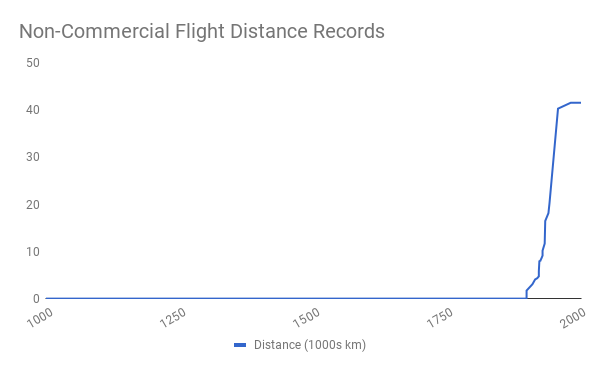

# Digital Technology
# 数字技术

Billions of people all over the world carry around smartphones, powerful computers that are connected to a global network (the Internet). We often spend many hours a day on these devices, whether playing games or carrying out work. And yet despite the growing ubiquity of digital technology, people often find it difficult to understand what exactly makes it so distinctively powerful. Some have even derided digital technology, pointing to services such as Twitter and arguing that they are inconsequential when compared to, say, the invention of vaccines. 

全世界有数十亿人随身携带智能手机，这些功能强大的电脑与全球网络（互联网）相连。我们每天花很多时间在这些设备上，无论是玩游戏还是为了工作。然而，尽管数字技术越来越普遍，人们往往发现很难理解到底是什么让它变得如此独特强大。有些人甚至嘲笑数字技术，指着诸如 Twitter 这样的服务，认为与疫苗的发明相比，它们是无足轻重的。

It is nonetheless becoming increasingly difficult to ignore digital technology’s disruptiveness. For example, while many previously long-established businesses are struggling, including newspapers and retailers, digital technology companies such Facebook, Apple, Amazon, Netflix and Google are now among the world’s most highly valued (“List of public corporations,” 2020). 

尽管如此，要想忽视数字技术的颠覆性却变得越来越困难。例如，当许多以前历史悠久的企业在挣扎时，包括报纸和零售商，数字技术公司如 Facebook、苹果、Amazon、Netflix 和 Google 现在是世界上估值最高的公司之一（参见《上市公司名单》，2020）。

Digital technology turns out to possess two unique characteristics that explain why it dramatically expands the ‘space of the possible’ for humanity, going far beyond anything that was previously possible. These are *zero marginal cost* and the *universality of computation*. 

数字技术拥有两个独特的特性，解释了为什么它极大地扩展了人类的『可能空间』，远远超出了以前的任何可能。这就是**零边际成本**和**计算的普遍性**。

## Zero Marginal Cost 
## 零边际成本

Once a piece of information exists on the Internet, it can be accessed from anywhere on the network for no additional cost. And as more and more people around the world are connected to the Internet, ‘anywhere on the network’ is increasingly coming to mean ‘anywhere in the world’. The servers are already running, as are the network connections and the end-user devices. Making one extra digital copy of the information and delivering it across the network therefore costs nothing. In the language of economics, the ‘marginal cost’ of a digital copy is zero. That does not mean that people won’t try to charge you for this information—in many cases they will. But that's a matter of price, not of cost.

一旦某条信息存在于互联网上，它就可以从网络上的任何地方被访问，而不需要额外的费用。随着世界上越来越多的人连接到互联网上，『网络上的任何地方』越来越意味着『世界上的任何地方』。服务器在运行，网络连接和终端用户设备也在运行。因此，为信息制作一个额外的数字拷贝并通过网络传递，不需要任何成本。用经济学的语言来说，一份数字拷贝的『边际成本』是零。这并不意味着人们不会试图向你收取这些信息的费用 —— 在许多情况下，他们会。但这是一个价格问题，而不是成本问题。
 
Zero marginal cost is radically different to anything that has come before it in the analog world, and it makes some pretty amazing things possible. To illustrate this, imagine that you own a pizzeria. You pay rent for your store and your equipment, and you pay salaries for your staff and yourself. These are so-called ‘fixed costs,’ and they don’t change with the number of pizzas you bake. ‘Variable costs,’ on the other hand, depend on the number of pizzas you make. For a pizzeria, these will include the cost of the water, the flour, any other ingredients you use, any additional workers you need to hire, and the energy you need to heat your oven. If you make more pizzas, your variable costs go up, and if you make fewer pizzas they go down. 

零边际成本与之前类似世界中的任何东西都完全不同，它使一些相当惊人的事情成为可能。为了说明这一点，想象一下，你拥有一家比萨饼店。你为你的商店和设备支付租金，你为你的员工和你自己支付工资。这些都是所谓的『固定成本』，它们不会随着你烤的比萨饼的数量而改变。另一方面，『可变成本』则取决于你制作的比萨饼的数量。对于一个比萨店来说，这些成本将包括水、面粉、你使用的任何其他成分、你需要雇用的任何额外工人，以及你需要加热烤箱的能源。如果你做更多的比萨饼，你的可变成本就会上升，如果你做更少的比萨饼，可变成本就会下降。

So what is marginal cost? Well, let’s say you are making one hundred pizzas every day: the marginal cost is the additional cost of making one more pizza. Assuming the oven is already hot and has space in it, and your employees aren’t fully occupied, it is the cost of the ingredients, which is likely relatively low. If the oven had already cooled, then the marginal cost of the additional pizza would include the energy cost required for reheating the oven and might be quite high. 

那么，什么是边际成本？好吧，假设你每天做一百个比萨饼：边际成本是多做一个比萨饼的额外成本。假设烤箱已经很热了，里面还有空间，而且你的员工也没有被完全占用，那就是原料的成本，这可能相对较低。如果烤箱已经冷却，那么额外的比萨饼的边际成本将包括重新加热烤箱所需的能源成本，可能相当高。

From a business perspective, you would want to make that additional pizza as long as you could sell it for more than its marginal cost. If you had already covered your fixed costs from the previous pizzas, every cent above marginal cost for the additional pizza would be profit. Marginal cost also matters from a social perspective. As long as a customer is willing to pay more than the marginal cost for that pizza, everyone is potentially better off—you get an extra contribution towards your fixed costs or your profits, and your customer gets to eat a pizza they wanted (important note: I am saying “potentially better off” for a reason because people sometimes want things that might not actually be good for them, such as someone suffering from obesity wanting to eat a pizza).

从商业角度来看，只要你能以高于边际成本的价格出售，你就想多做一个比萨饼。如果你已经支付了以前的比萨饼的固定成本，那么额外的比萨饼的每一分钱都会超过边际成本，这就是利润。从社会角度来看，边际成本也很重要。只要顾客愿意为比萨饼支付高于边际成本的价格，每个人都有可能得到好处--你得到了对你的固定成本或利润的额外贡献，而你的顾客可以吃到他们想要的比萨饼（重要提示：我说『有可能得到好处』是有原因的，因为人们有时想要的东西实际上可能对他们没有好处，比如患有肥胖症的人想要吃比萨饼）。

Now let’s consider what happens as marginal cost falls from a high level. Imagine that your key ingredient was an exceedingly expensive truffle which meant that the marginal cost of each of your pizzas is $1,000. You clearly wouldn’t sell many pizzas, so you might decide to switch to cheaper ingredients and reduce your marginal cost to a point where a larger number of customers are willing to pay more than your marginal cost, so your sales increase. And as you bring down the marginal cost further through additional process and product improvements, you would start to sell even more pizzas. 

现在让我们考虑一下，当边际成本从一个高位下降时会发生什么。想象一下，你的关键原料是一种极其昂贵的松露，这意味着你每块比萨饼的边际成本是 1000 美元。你显然不会卖出很多披萨，所以你可能会决定改用更便宜的原料，并将你的边际成本降低到更多的顾客愿意支付高于你的边际成本的程度，因此你的销售额增加了。当你通过额外的工艺和产品改进进一步降低边际成本时，你将开始销售更多的比萨饼。

Now imagine that through a magical new invention you could make additional tasty pizzas at close to zero marginal cost (say one cent per additional pizza) and ship them instantaneously to anywhere in the world. You would then be able to sell an exceedingly large number of pizzas. If you charged just two cents per pizza, you would be making one cent of profit for every additional pizza you sold. At such low marginal cost you would probably quickly gain a monopoly on the global pizza market (more on this later). Anyone in the world who was hungry and could afford at least one cent might buy one of your pizzas. The best price of your pizza from a societal point of view would be one cent (your marginal cost): the hungry would be fed, and you would cover your marginal cost. But as a monopolist that is unlikely what you would do. Instead, you would probably engage in all sorts of problematic behavior aimed at increased profits, such as charging more than marginal cost, trying to prevent competitors from entering the market, and even looking to get people addicted to pizza so they will consume ever more.

现在想象一下，通过一项神奇的新发明，你可以以接近零的边际成本（比如每个额外的比萨饼 1 美分）制作额外的美味比萨饼，并将它们即时运送到世界上任何地方。这样，你就能卖出大量的比萨饼。如果你对每个比萨饼只收取 2 美分，那么你每多卖出一个比萨饼就会有 1 分钱的利润。在如此低的边际成本下，你可能会很快获得全球比萨饼市场的垄断地位（后面会有更多的介绍）。世界上任何一个饥饿的人，只要能负担得起至少 1 美分，都可能买你的比萨饼。从社会的角度来看，你的比萨饼的最佳价格将是 1 美分（你的边际成本）：饥饿的人将得到食物，而你将支付你的边际成本。但作为一个垄断者，你不可能这么做。相反，你可能会从事各种旨在增加利润的有问题的行为，如收取高于边际成本的费用，试图阻止竞争对手进入市场，甚至希望让人们对比萨饼上瘾，以便他们消费更多。

This is exactly where we currently are with digital technology. We can “feed the world” with information: that additional YouTube video view, additional access to Wikipedia, or additional traffic report from Waze all have zero marginal cost. And just as in the case of the hypothetical zero marginal cost pizza we are seeing the emergence of digital monopolies, along with all the problems that entails (see Part Four on ‘Informational Freedom’ for a proposed remedy).

这正是我们目前在数字技术方面的情况。我们可以用信息『喂养世界』：额外的 YouTube 视频浏览、额外的维基百科访问或 Waze 的额外交通报告都是零边际成本。就像假设的零边际成本披萨一样，我们看到了数字垄断的出现，以及由此带来的所有问题（见第四部分『信息自由』的拟议补救措施）。

We are not used to zero marginal cost: most of our existing economics depends on the assumption that marginal costs are greater than zero. You can think of zero marginal cost as an economic singularity similar to dividing by zero in math—as you approach it, strange things begin to happen. In addition to digital near-monopolies we are already observing power-law distributions of income and wealth (see Part Three), where small variations result in hugely different outcomes. Furthermore, we are now rapidly approaching this zero marginal cost singularity in many other industries, which are primarily information based, including finance and education. In summary, the first characteristic of digital technology that dramatically expands the space of the possible is zero marginal cost. This can result in digital monopolies, but also has the potential to grant all of humanity access to the world’s knowledge. 

我们不习惯边际成本为零：我们现有的大多数经济学都依赖于边际成本大于零的假设。你可以把零边际成本看作是一个经济奇点，类似于数学中的除以零 —— 当你接近它时，奇怪的事情开始发生。除了数字近乎垄断，我们已经观察到收入和财富的幂律分布（见第三部分），其中微小的变化导致了巨大的不同结果。此外，在许多其他主要基于信息的行业，包括金融和教育，我们现在正迅速接近这个零边际成本的奇点。总而言之，数字技术的第一个特点是零边际成本，它极大地扩展了可能的空间。这可能导致数字垄断，但也有可能让全人类获得世界的知识。
 
## Universality of Computation 
## 计算的普遍性 
Zero marginal cost is only one property of digital technology that dramatically expands the space of the possible; the second is in some ways even more amazing.

零边际成本只是数字技术的一个属性，它极大地扩展了可能空间；第二个属性在某些方面甚至更令人吃惊。

Computers are universal machines. I use this term in a precise sense: anything that can be computed in the universe can in principle be computed by the kind of machine that we already have, given enough memory and time. We have known this since Alan Turing’s groundbreaking work on computation in the middle of the last century. He invented an abstract version of a computer that we now call a Turing machine, before coming up with a proof to show that this simple machine could compute anything (Mullins, 2012; “Church–Turing thesis,” 2020). 

计算机是通用机器。我在精确的意义上使用这个术语：只要有足够的内存和时间，宇宙中任何可以计算的东西原则上都可以由我们已有的那种机器计算出来。自从阿兰·图灵在上个世纪中叶对计算的开创性工作以来，我们就知道这一点。他发明了一个抽象版的计算机，我们现在称之为图灵机，然后提出了一个证明，表明这个简单的机器可以计算任何东西（Mullins, 2012; "Church-Turing thesis," 2020）。

By “computation,” I mean any process that takes information inputs, executes a series of processing steps, and produces information outputs. That is—for better or worse—also much of what a human brain does: it receives inputs via nerves, carries out some internal processing and produces outputs. In principle, a digital machine can accomplish every computation that a human brain can. Those brain computations include something as simple and everyday as recognizing someone’s face (inputs: image, output: name) to something as complicated as diagnosing disease (inputs: symptoms and test results, output: differential diagnosis).

我所说的『计算』（Computation）是指任何接受信息输入，执行一系列处理步骤，并产生信息输出的过程。无论好坏，这也是人脑所做的大部分工作：它通过神经接收输入，进行一些内部处理并产生输出。原则上，数字机器可以完成人脑所能完成的所有计算。这些大脑计算包括像识别某人的脸一样简单和日常的东西（输入：图像，输出：名字），以及像诊断疾病一样复杂的东西（输入：症状和测试结果，输出：鉴别诊断）。

This ‘in principle’ limitation will turn out to be significant only if quantum effects matter for the functioning of the brain, meaning effects that require quantum phenomena such as entanglement and the superposition of states. This is a hotly debated topic (Jedlicka, 2017). Quantum effects do not change what can be computed in principle, as even a Turing machine can theoretically simulate a quantum effect—but it would take an impractically long time, potentially millions of years, to do so (Timpson, 2004). If quantum effects are important in the brain, we may need further progress in quantum computing to replicate some of the brain’s computational capabilities. However, I believe that quantum effects are unlikely to matter for the bulk of computations carried out by the human brain—that is, if they matter at all. We may, of course, one day discover something new about physical reality that will change our view of what is computable, but so far this hasn’t happened. 

只有当量子效应（quantum effects）对大脑的运作很重要时，这种『原则上』的限制才会变得重要，这意味着需要量子现象的影响，如纠缠和状态的叠加。这是一个争论激烈的话题（Jedlicka，2017）。量子效应并没有改变原则上可以计算的东西，因为即使是图灵机在理论上也可以模拟量子效应 —— 但这需要不切实际的漫长时间，可能是数百万年才能做到（Timpson, 2004）。如果量子效应在大脑中很重要，我们可能需要在量子计算方面取得进一步的进展来复制大脑的一些计算能力。然而，我相信量子效应不太可能对人脑进行的大部分计算产生影响，也就是说，如果它们真的有影响的话。当然，我们可能有一天会发现一些关于物理现实的新东西，从而改变我们对什么是可计算的看法，但到目前为止这还没有发生。

For a long time, this property of universality didn’t matter much because computers were pretty dumb compared to humans. This was frustrating to computer scientists who since Turing had believed that it should be possible to build an intelligent machine, but for decades couldn’t get it to work. Even something that humans find really simple, such as recognizing faces, had computers stumped. Now, however, we have computers that can recognize faces, and their performance at doing so is improving rapidly. 

在很长一段时间里，这种普遍性的属性并不重要，因为与人类相比，计算机是非常愚蠢的。这让计算机科学家们感到沮丧，他们从图灵开始就相信应该有可能造出一台智能机器，但几十年来却无法让它发挥作用。即使是人类认为非常简单的事情，如识别人脸，也让计算机陷入了困境。然而，现在，我们有了能够识别人脸的计算机，而且它们在这方面的性能正在迅速提高。

An analogy here is the human discovery of heavier-than-air flight. We knew for a long time that it must be possible—after all, birds are heavier than air and they can fly—but it took until 1903, when the Wright brothers built the first successful airplane, for us to figure out how to do it (“Wright Brothers,” 2020). Once they and several other people had figured it out, progress was rapid—we went from not knowing how to fly to crossing the Atlantic in passenger jet planes in fifty-five years: the British Overseas Airways Corporation’s first transatlantic jet passenger flight was in 1958 (“British Overseas Airways Corporation,” 2020). If you plot this on a graph, you see a perfect example of a non-linearity. We didn’t get gradually better at flying—we couldn’t do it at all, and then suddenly we could do it very well.

这里的一个比喻是人类发现了比空气重的飞行。我们很早就知道这一定是可能的 —— 毕竟鸟类比空气重，它们可以飞行 —— 但直到 1903 年莱特兄弟制造出第一架成功的飞机，我们才知道如何做到这一点（《莱特兄弟》，2020）。一旦他们和其他几个人想通了，进展就很快了 —— 我们在 55 年内从不知道如何飞行到乘坐喷气式客机穿越大西洋：英国海外航空公司的第一次跨大西洋喷气式客机飞行是在 1958 年（《英国海外航空公司》，2020 年）。如果你在图表上绘制这个，你会看到一个完美的非线性例子。我们并没有在飞行方面逐渐变得更好 —— 我们根本无法做到这一点，然后突然我们可以做得很好。

Digital technology is similar. A series of breakthroughs have taken us from having essentially no machine intelligence to a situation where machines can outperform humans on many different tasks, including reading handwriting and recognizing faces (Neuroscience News, 2018; Phillips et al., 2018). The rate of machines’ progress in learning how to drive cars is another great example of the non-linearity of improvement. The Defense Advanced Research Projects Agency (DARPA) held its first so-called “Grand Challenge” for self-driving cars in 2004. At the time they picked a 150-mile-long closed course in the Mojave Desert, and no car got further than seven miles (less than 5 per cent of the course) before getting stuck. By 2012, less than a decade later, Google’s self-driving cars had driven over 300,000 miles on public roads, with traffic (Urmson, 2012). 

数字技术也是如此。一系列的突破使我们从基本上没有机器智能，到现在机器在许多不同的任务上可以胜过人类，包括阅读笔迹和识别人脸（Neuroscience News, 2018; Phillips et al., 2018）。机器在学习如何驾驶汽车方面的进展速度是改进的非线性的另一个好例子。国防高级研究计划局（DARPA）在 2004 年举行了第一次所谓的自动驾驶汽车的『大挑战』。当时，他们在莫哈韦沙漠挑选了一条 150 英里长的封闭赛道，没有一辆车能走超过 7 英里（不到赛道的 5％）就被卡住。到 2012 年，不到十年之后，Google 的自动驾驶汽车已经在公共道路上行驶了 30 多万英里，而且还出现了交通事故（Urmson，2012）。

Some people may object that reading handwriting, recognizing faces, or driving a car is not what we mean by ‘intelligence’, but this just points out that we don’t have a good definition of it. After all, if you had a pet dog that could perform any of these tasks, let alone all three, you would call it an ‘intelligent’ dog. 

有些人可能会反对说，阅读笔迹、识别人脸或驾驶汽车并不是我们所说的『智能』，但这只是指出我们没有一个好的定义。毕竟，如果你有一只宠物狗能完成这些任务中的任何一项，更不用说这三项了，你会称它为『智能狗』。

Other people point out that humans also have creativity and that these machines won’t be creative even if we grant them some form of intelligence. However, this amounts to arguing that creativity is something other than computation. The word implies ‘something from nothing’ and outputs without inputs, but that is not the nature of human creativity. After all, musicians create new music after hearing lots of music, engineers create new machines after seeing existing ones, and so on. 

其他人指出，人类也有创造力，即使我们赋予它们某种形式的智能，这些机器也不会有创造力。然而，这相当于争辩说，创造力是计算以外的东西。这个词意味着『无中生有』和没有输入的输出，但这并不是人类创造力的本质。毕竟，音乐家在听到大量的音乐之后创造出新的音乐，工程师在看到现有的机器之后创造出新的机器，等等。

There is now evidence that at least some types of creativity can be recreated simply through computation. In 2016, Google achieved a breakthrough in machine intelligence when their AlphaGo program beat the South Korean Go grandmaster Lee Sedol by four games to one (Borowiec, 2017). Until that point, progress with game-playing software had been comparatively slow and the best programs were unable to beat strong club players, let alone grandmasters. The number of possible plays in Go is extremely large, far exceeding chess. This means that searching through possible moves and counter-moves from a current position, which is the approach historically used by chess computers, cannot be used in Go—instead, candidate moves need to be conjectured. Put differently, playing Go involves creativity. 

现在有证据表明，至少某些类型的创造力可以简单地通过计算来重新创造。2016 年，Google 在机器智能方面取得了突破，他们的 AlphaGo 程序以四局一胜的成绩击败了韩国围棋大师李世石（Borowiec, 2017）。在这之前，对弈软件的进展相对缓慢，最好的程序都无法击败强大的俱乐部选手，更不用说大师了。围棋中可能的棋步数量非常多，远远超过国际象棋。这意味着在围棋中不能使用从当前位置搜索可能的棋步和反手棋，这是国际象棋计算机历来使用的方法，相反，需要猜测候选棋步。换句话说，下围棋需要创造性。

The approach used for the AlphaGo program started out by training a neural network on games previously played by humans. Once the network was good enough, it was improved further by playing against itself. There has already been progress in the application of these and related techniques, which are often referred to as ‘generative adversarial networks’ (GANs) to the composition of music and the creation of designs. Even more surprisingly, it has been shown that machines can learn to be creative not just by studying prior human games or designs, but by creating their own, based on rules. Each of AlphaGo’s two successors, AlphaGo Zero and AlphaZero, started out knowing only the rules and learned from playing games against itself (“AlphaZero,” 2020). This approach will allow machines to be creative in areas where there is limited or no prior human progress.

用于 AlphaGo 项目的方法，一开始是在人类之前的游戏中训练一个神经网络。一旦网络足够好，它就会通过与自己对弈来进一步改进。这些技术和相关技术的应用已经取得了进展，这些技术通常被称为『生成式对抗网络』（GANs），用于音乐创作和设计创作。更令人惊讶的是，事实证明，机器不仅可以通过研究先前的人类游戏或设计，而且可以根据规则创造自己的游戏或设计，从而学习到创造性 。AlphaGo 的两个继任者 ，AlphaGo Zero 和 AlphaZero，一开始都只知道规则，并从与自己对弈中学习（"AlphaZero"，2020）。这种方法将允许机器在人类之前进展有限或没有进展的领域发挥创造性。

While much of what the brain does is computation, including many tasks that we identify as creative, there is one function of the brain that may never be accessible to digital machines: having ‘qualia.’ This is a term from philosophy which refers to our subjective experience, such as what it “feels like” to be cold (or hot), to touch an object, be stressed or amazed. For example, when a digital thermostat displays the room temperature we do not assume that its internal state has anything remotely resembling our own subjective sensation. The lack of qualia is obvious in this example, but we assume that it extends to much more complex situations, such as a self-driving car taking a series of turns on a winding highway. We would expect a human driver to experience a sensation of thrill or elation, but not the car. This lack of qualia in machines may seem like an aside for the moment, but will turn out to be an important component of where humans might direct their attention in the Knowledge Age. 

虽然大脑所做的大部分工作都是计算，包括许多被我们认定为创造性的任务，但大脑的一个功能可能永远无法被数字机器所利用：拥有『质感』（qualia）。这是一个来自哲学的术语，指的是我们的主观体验，比如说冷（或热）的『感觉』，触摸一个物体的感觉，压力或惊奇的感觉。例如，当数字恒温器显示室温时，我们不会认为其内部状态与我们自己的主观感觉有任何相似之处。在这个例子中，缺乏质感是显而易见的，但我们假设它延伸到更复杂的情况，比如一辆自动驾驶汽车在蜿蜒的高速公路上进行一系列的转弯。我们希望人类司机能体验到刺激或兴奋的感觉，但汽车不会。机器中缺乏质感这一点目前看来似乎是个题外话，但在知识时代，它将成为人类可能将注意力引向何处的一个重要组成部分。

## Universality at Zero Marginal Cost 
## 零边际成本的普遍性 
As impressive as zero marginal cost and universality are on their own, in combination they are truly magical. To take one example, we are making good progress in the development of a computer program that will be able to diagnose disease from a patient’s symptoms in a series of steps, including ordering tests and interpreting their results (Parkin, 2020). Though we might have expected this to happen at some point based on the principle of universality, we are making tangible progress and should accomplish this in a matter of decades, if not sooner. At that point, thanks to zero marginal cost, we will be able to provide low-cost diagnosis to anyone in the world. Let that sink in slowly: free medical diagnosis for all humans will soon be in the space of the possible.

尽管零边际成本和普遍性本身给人留下了深刻印象，但它们结合在一起才是真正神奇的。举个例子，我们开发的一个计算机程序正在取得良好的进展，该程序将能够通过一系列步骤从病人的症状中诊断出疾病，包括订购测试和解释其结果（Parkin，2020）。尽管根据普遍性原则，我们可能已经预计到这一点会在某个时候发生，但我们正在取得切实的进展，如果不是更早，也应该在几十年内完成。到那时，由于边际成本为零，我们将能够向世界上的任何人提供低成本的诊断。让这句话慢慢沉淀下来：『所有人类的免费医疗诊断将很快进入可能空间。』
 
The universality of computation at zero marginal cost is unlike anything we have had with prior technologies. Being able to make all the world’s information and knowledge accessible to all of humanity was never before possible, nor were intelligent machines. Now we have both. This represents at least as dramatic and non-linear an increase the ‘space of the possible’ for humanity as agriculture and industry did before, and each of those developments ushered in an entirely different age. We will be able to think better about what this implies for the current transition and the next age if we first put some foundations in place.

以零边际成本进行计算的普遍性是我们以前的技术所不具备的。能够让全人类获得世界上所有的信息和知识在以前是不可能的，智能机器也是不可能的。现在我们两者都有了。这至少代表了人类『可能空间』的戏剧性和非线性增长，就像以前的农业和工业一样，而这些发展的每一个都迎来了一个完全不同的时代。如果我们首先建立一些基础，我们将能够更好地思考这对当前的过渡和下一个时代意味着什么。