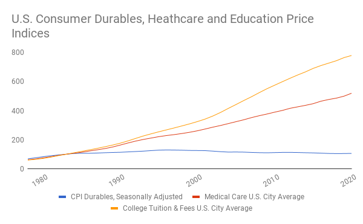
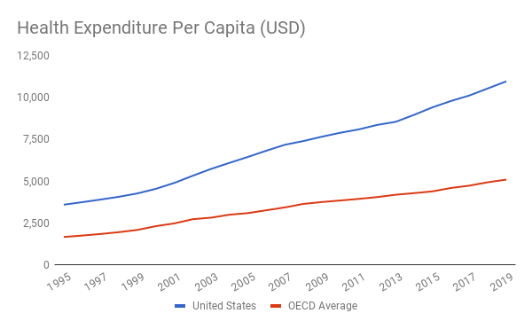

# Economic Freedom
# 经济自由

If you were to quit your job right now, could you afford to take care of your needs? And if you are retired, what would happen if you suddenly stopped receiving your pension? If you are supported by a spouse or partner, could you still afford food, shelter and clothing without them? If you could no longer meet your needs in any of these situations, you are not economically free. Your decisions on how much of your labor to sell and whom to sell it to, whether to stay with your partner and where to live, are not free decisions.

如果你现在辞去工作，你是否能负担得起你的需求？而如果你已经退休，如果你突然停止领取养老金，会发生什么？如果你有配偶或伴侣的支持，没有他们，你还能负担得起食物、住所和衣服吗？如果你在上述任何一种情况下都无法再满足你的需求，那么你在经济上就不自由。你决定出售多少劳动，卖给谁，是否与你的伴侣在一起，住在哪里，都不是自由决定。
 
Many people in the US are not free in this sense. A recent survey asked respondents if they had enough money to pay for a $1,000 emergency, and 60 percent said they did not (Leonhardt, 2020). Other studies have found that about 75 percent of Americans over the age of forty are behind on saving for retirement, and somewhere between a quarter and a third of all non-retired adults have no savings at all (Board of Governors of the Federal Reserve System, 2020; Backman, 2020). This data predates the COVID-19 pandemic which wreaked further havoc on the finances of many Americans.

在美国，许多人在这个意义上是不自由的。最近的一项调查问受访者他们是否有足够的钱来支付 1000 美元的紧急情况，60% 的人答案是否定的（Leonhardt, 2020）。其他研究发现，大约 75% 的 40 岁以上的美国人没有为退休储蓄，大约四分之一到三分之一的非退休成年人根本没有储蓄（联邦储备系统理事会，2020；Backman，2020）。这一数据早于 COVID-19 大流行，它对许多美国人的财务状况造成了进一步的破坏。

If you are not economically free, you are not able to participate freely in the knowledge loop, which is why economic freedom is a cornerstone of the Knowledge Age. We must make people economically free so that they have the time to learn new knowledge, from practical skills to the latest theoretical physics. We need them to create new knowledge using what they have learned. And finally, we need them to share this knowledge with others. 

如果你在经济上不自由，你就不能自由地参与知识圈，这就是为什么经济自由是知识时代的一个基石。我们必须让人们在经济上自由，这样他们才有时间学习新知识，从实用技能到最新的理论物理学。我们需要他们利用他们所学的知识创造新的知识。最后，我们需要他们与他人分享这些知识。

Participation in the knowledge loop has never been more important: we have massive problems to overcome, including the COVID-19 pandemic and, above all, the climate crisis. To do so, we must be able to embrace automation rather than feel threatened by it.

参与知识循环从未如此重要：我们有大量的问题需要克服，包括 COVID-19 大流行病，尤其是气候危机。要做到这一点，我们必须能够拥抱自动化，而不是感到受其威胁。

## Universal Basic Income
## 全民基本收入

Economic freedom is a reality for the wealthy, for tenured professors and retirees with pensions and savings, but how can we make it a reality for everyone? The answer is to provide everyone with a guaranteed income to cover solutions to their needs, including housing, clothing and food. This income wouldn’t depend on whether someone is married or single, employed or unemployed, rich or poor—it would be unconditional (also referred to as ‘universal’).

经济自由对于富人、终身教授和拥有退休金和储蓄的退休人员来说是一个现实，但我们如何才能使它成为每个人的现实？答案是为每个人提供有保障的收入，以满足他们的需求，包括住房、衣服和食物的解决方案。这种收入不会取决于某人是已婚还是单身，是就业还是失业，是富有还是贫穷 —— 它将是无条件的（也被称为『普遍』）。

At first glance, this idea of a ‘universal basic income’ (UBI) may seem outrageous. Getting paid simply for being alive—isn’t that akin to socialism? Where would this money come from? And won’t people simply descend into laziness and drug addiction? We will examine each of these objections to UBI in turn, but let’s first consider the arguments for UBI as a way of achieving economic freedom. 

乍一看，『全民基本收入』（UBI）的想法可能看起来很离谱。仅仅因为活着就能得到报酬，这不是类似于社会主义吗？这些钱从哪里来？人们不就会陷入懒惰和吸毒的境地吗？我们将依次研究这些对 UBI 的反对意见，但首先让我们考虑 UBI 作为实现经济自由的一种方式的论点。

Concerns about economic freedom are by no means new. When the American republic was in its infancy, economic freedom was within the reach of those involved in the colonial project. There was plenty of land available to settler colonialists, and they could hypothetically make ends meet through small-scale farming (also known as subsistence farming). Thomas Jefferson considered formalizing the idea of land grants as a way of ensuring a free citizenry. It is important to point out that this land was being taken away from Native Americans, who were losing both their land and their freedom, on the basis of the so-called Doctrine of Discovery (“Discovery Doctrine,” 2020). Even back then, observers such as the philosopher and political activist Thomas Paine (1797) understood that land that could be appropriated and allocated to settlers as property would run out at some point, raising the specter of a time when landless citizens might have to rent themselves out as laborers in order to provide for their needs, leading him to conclude that an alternative to land would be to give people money instead. The idea of increased freedom through direct cash transfers thus dates back to the earliest days of the American republic. 

对经济自由的关注绝非新鲜事。当美国共和国处于起步阶段时，经济自由对那些参与殖民计划的人来说是可以实现的。定居的殖民者有大量的土地，他们可以通过小规模的耕作（也称为自给自足的耕作）来满足假设的需求。托马斯·杰斐逊考虑将土地授予的想法正式化，作为确保自由公民的一种方式。需要指出的是，这些土地是从美洲原住民手中夺走的，他们既失去了土地，也失去了自由，其依据是所谓的发现论（『发现论』，2020 年）。即使在那时，哲学家和政治活动家托马斯-潘恩（Thomas Paine，1797）等观察家也明白，可以作为财产被征用并分配给定居者的土地会在某一时刻耗尽，这让人担心，为了满足自己的需求，没有土地的公民可能不得不把自己租出去当劳工，这让他得出结论，替代土地的办法是给人们钱。因此，通过直接的现金转移来增加自由的想法可以追溯到美国共和国的最早时期。

If you don’t find this argument for UBI compelling, consider the case of air. We can all afford to breathe air because it is free and distributed around the globe (important side note: regulation is required to keep it clean—there were many problems with air pollution during industrialization, and it is estimated that more than seven million people still die around the world every year from air pollution) (World Health Organization, n.d.). Our freedom is thus not restricted by having to find air, and the power of UBI would be to make us equally free when it comes to our other needs, by making food, housing and clothing affordable for everyone. 

如果你不觉得 UBI 的这个论点有说服力，可以考虑一下空气的情况。我们都能呼吸得起空气，因为它是免费的，而且分布在全球各地（重要的题外话：需要监管来保持空气的清洁 —— 在工业化时期有许多空气污染的问题，据估计，全世界每年仍有超过 700 万人死于空气污染）（世界卫生组织 ，n.d.）。因此，我们的自由并没有因为必须寻找空气而受到限制 ，UBI 的力量将是通过使每个人都能负担得起食物、住房和衣服，使我们在涉及其他需求时同样自由。

As I argued earlier, our technologies are sufficiently advanced that we are capable of meeting everyone’s needs. Farming can generate enough food for everyone. We can easily make enough clothing and provide everyone with shelter. It is the knowledge and capital that humanity has created that have made this possible. And our technological progress is accelerating while global population growth is slowing, so all this will get easier—that is, as long as we generate enough new knowledge to overcome the problems we are facing, starting with the climate crisis. 

正如我之前所说，我们的技术已经足够先进，能够满足所有人的需求。耕种可以为每个人产生足够的食物。我们可以很容易地制造足够的衣服，为每个人提供住所。正是人类所创造的知识和资本使之成为可能。而且我们的技术进步正在加速，而全球人口增长正在放缓，所以这一切都会变得更容易 —— 也就是说，只要我们产生足够的新知识来克服我们所面临的问题，首先是气候危机。

The question is not whether we have the ability to meet everyone’s needs, but whether our economy and society distribute the resources fairly, and that is where UBI comes in. A UBI enables markets to function without forcing people into the job loop. It lets everyone freely choose whether and how much to participate in these markets and how much to devote to personal relationships, the pursuit of meaning, curiosity and creativity, etc.—freeing up attention and enabling people to form new communities in more affordable geographies (e.g. smaller cities or the countryside). 

问题不是我们是否有能力满足每个人的需求，而是我们的经济和社会是否公平地分配资源，而这正是 UBI 的作用 。UBI 使市场能够运作，而不强迫人们进入工作圈。它让每个人都能自由选择是否参与这些市场，以及参与多少，并将多少投入到个人关系、对意义的追求、好奇心和创造力等方面--释放注意力，使人们能够在更可负担的地域（如小城市或乡村）形成新的社区。

Industrial society presents us with two different ways of allocating resources. In one, individuals participate in a market economy; in the other, governments provide for people’s needs. Those options form the extremes of a spectrum that has a variety of ‘hybrid’ arrangements in the middle, such as government-subsidized housing, for which people pay reduced rent. UBI broadens the scope for market-based allocation, thus reducing reliance on an ever-expanding government sector. In that regard it is the opposite of socialism and communism, which rely predominantly or even entirely on government allocation. 

工业社会为我们提供了两种不同的资源分配方式。一种是个人参与市场经济；另一种是政府满足人们的需求。这些选择构成了一个光谱的两端，中间有各种『混合』安排，如政府补贴的住房，人们支付的租金减少 。UBI 扩大了基于市场的分配范围，从而减少对不断扩大的政府部门的依赖。在这方面，它与社会主义和共产主义相反，后者主要甚至完全依赖政府分配。

Right after the Second World War, only about 5 percent of people in the US were employed by government, which comprised about 42 percent of the economy (U.S. Bureau of the Census, 1949; OECD 2021). In the Soviet Union, by contrast, most of the working population was employed by the state, which owned close to 100 percent of the economy, but that system turned out to be much less effective at allocating resources. Nevertheless, the size and scope of government spending has gradually expanded in the US and in Europe. In many European economies it now accounts for more than half of the economy. 

二战结束后，美国只有 5% 的人受雇于政府，而政府占经济总量的 42%（U.S. Bureau of the Census, 1949; OECD 2021）。相比之下，在苏联，大部分劳动人口受雇于国家，国家拥有接近 100% 的经济，但这种制度在分配资源方面的效果要差很多。然而，在美国和欧洲，政府支出的规模和范围已经逐渐扩大。在许多欧洲经济体中，政府支出现在占到经济总量的一半以上。

Food, clothing and shelter are obvious solutions to human needs that a UBI should make affordable, but a UBI could eventually also cover the cost of education and healthcare. That might seem ambitious, given how quickly education and healthcare costs have risen over the past decades, but technology can be expected to make both of these far more affordable in the near future. 

食物、衣服和住所是解决人类需求的明显办法 ，UBI 应该使人们能够负担得起，但 UBI 最终也可以覆盖教育和医疗保健的费用。考虑到教育和医疗费用在过去几十年中的快速增长，这可能看起来很雄心勃勃，但可以预计，在不久的将来，技术将使这两方面的费用更容易负担。

## Technological Deflation
## 技术性通货紧缩

If you’re struggling to take care of your needs, the world will seem like an expensive place. Yet the data show that a lot of things have been getting cheaper for some time. In the US, as the chart below shows, the price of consumer durables has been falling since the mid-1990s.

如果你正在为自己的生活必需而挣扎，那么这个世界将看起来是一个昂贵的地方。然而，数据显示，一段时间以来，很多东西都在变便宜。在美国，如下图所示，自 90 年代中期以来，耐用消费品的价格一直在下降。

来源： Federal Reserve Bank of St. Louis, 2021

The decline in the price of consumer durables has been made possible by technological progress. We are getting better at making stuff, and the automation of production and distribution is a big part of that. While this will hurt you if you lose your job as a result, if you have money to buy things it will help you. And with UBI everyone will have money, which as prices fall over time will buy more and more.

耐用消费品价格的下降是由技术进步促成的。我们在制造东西方面越来越好，而生产和销售的自动化是其中的一个重要部分。虽然如果你因此而失去工作，这将伤害你，但如果你有钱买东西，这将帮助你。而有了 UBI，每个人都会有钱，随着时间的推移，价格下降，会买到越来越多的东西。
 
The decline in the price of consumer durables has made adequate clothing easily affordable. Technology is also driving down the cost of smartphones, which will themselves be essential in making education and healthcare more affordable. This declining trend will only accelerate as we begin to use technology such as additive manufacturing (also known as ‘3D printing’), manufacturing products only when they are needed and close to where they are required (Crane & Marchese, 2015). Additive manufacturing technology is even making it much cheaper to put up a building, with various structures around the world produced in this way in recent years, and one California company now offering small houses 3D printed in 24 hours for sale (Orrall, 2020).

耐用消费品价格的下降使人们很容易买得起足够的衣服。技术也在推动智能手机的成本下降，而智能手机本身将是使教育和医疗更可负担的关键。随着我们开始使用增材制造（也被称为 3D 打印）等技术，这种下降趋势只会加速，只有在需要的时候和靠近需要的地方才能制造产品（Crane & Marchese, 2015）。增材制造技术甚至使建造建筑物的成本大大降低，近年来，世界各地的各种建筑都是以这种方式生产的，加利福尼亚的一家公司现在提供 24 小时内 3D 打印的小房子供销售（Orrall，2020）。

Another way housing can be made more affordable is through improved sharing of existing housing. Digital technology, including the services offered by companies such as Airbnb and Couchsurfing, make such sharing vastly easier (note: a degree of regulation is required to avoid detrimental impact on some local housing markets). Despite such progress, it still costs a fortune to live in places where demand for housing exceeds the available supply, such as New York and San Francisco. With UBI, people can choose to live where housing is more affordable.

另一种可以使住房更加负担得起的方式是通过改善现有住房的共享。数字技术，包括 Airbnb 和 Couchsurfing 等公司提供的服务，使这种共享变得非常容易（注意：需要一定程度的监管，以避免对一些地方住房市场造成不利影响）。尽管取得了这些进展，但在纽约和旧金山等住房需求超过现有供应的地方，居住仍然需要花费大量资金。有了 UBI，人们可以选择居住在住房更容易负担的地方。

In recent years, the city of Detroit gave away houses as an alternative to demolishing them, and in some rural areas of the US you can rent a home for as little as a few hundred dollars per month (Macguire, 2014). In fact, there are around 30 million units renting for less than $600 a month, accounting for 25 percent of the national rental stock (The Joint Center for Housing Studies of Harvard University, 2020). The most affordable way to do this is to share a place with friends. This could simply mean having roommates or go as far as purchasing and fixing up an abandoned village as friends of mine have done in Germany. Many people can’t currently take advantage of these opportunities, since they can’t find a job in these locations. By contrast, UBI provides geographic freedom. People who want to move would no longer be trapped in expensive cities just so they can meet their basic needs (often by holding down multiple jobs). 

近年来，底特律市赠送房屋，作为拆除房屋的替代方案，在美国的一些农村地区，你可以以每月仅几百美元的价格租到房子（Macguire，2014）。事实上，大约有 3000 万个单位的月租金低于 600 美元，占全国租赁存量的 25%（哈佛大学住房研究联合中心，2020）。最实惠的方式是与朋友合租。这可能只是意味着有室友，或者像我的朋友在德国做的那样，去购买和修复一个废弃的村庄。许多人目前无法利用这些机会，因为他们在这些地方找不到工作。相比之下 ，UBI 提供了地理上的自由。想搬家的人将不再被困于昂贵的城市，只是为了满足他们的基本需求（通常是通过保持多份工作）。

One large group of people is already free of the constraints of work: retirees. And sure enough, many people move away from expensive cities when they retire, to places where real estate is more affordable. When considering the cost of shelter, rather than analyzing how much people need to pay to live where they live today, we should therefore look at what the cost could be in a world that has UBI. Crucially UBI doesn’t prevent someone from applying their entire payment to whatever rent they are currently paying. That is the great power of providing cash which is completely fungible, meaning it can be used to purchase anything (unlike say a housing voucher which could be applied to housing only).

有一大群人已经摆脱了工作的约束：退休人员。而且可以肯定的是，许多人在退休后会搬离昂贵的城市，到房地产更实惠的地方去。在考虑住房成本时，与其分析人们需要支付多少钱才能住在今天的地方，不如看看在一个拥有 UBI 的世界里，成本会是多少。至关重要的是 ，UBI 并不妨碍人们将他们的全部付款用于他们目前正在支付的任何租金。这就是提供现金的巨大力量，它是完全可替换的，意味着它可以用来购买任何东西（不像住房券那样只能用于住房）。

Food is another area where technology stands to offer massive gains. While some argue that genetically modified foods hold the key to feeding the planet affordably, other near-term breakthroughs don’t carry the potential issues that GMOs pose. Indoor vertical farming, for instance, allows for a precise delivery of nutrients and light to plants, as well as enabling huge increases in future productivity through the use of robotics. It also allows food to be grown much nearer to where it is consumed, reducing the costs associated with transportation. In the extreme, using new hydroponic systems, lettuce, tomatoes and other vegetables can be grown right inside of apartments. Over time, as these innovations progress, they will add up to significant cost reductions and increases in availability of food. 

食品是另一个技术可以提供巨大收益的领域。虽然有些人认为，转基因食品是以可承受的价格养活地球的关键，但其他近期的突破并没有转基因生物带来的潜在问题。例如，室内垂直耕作允许向植物精确输送养分和光照，并通过使用机器人技术使未来的生产力大幅提高。它还允许在离食物消费地更近的地方种植食物，减少与运输有关的成本。在极端情况下，使用新的水培系统，生菜、西红柿和其他蔬菜可以在公寓内种植。随着时间的推移，随着这些创新的进展，它们将大大降低成本，增加食物的供应。

Technology also promises a dramatic decline in the cost of education. Over the last decade, the availability of online learning resources has grown rapidly, including many free platforms, such as the language learning app Duolingo. In addition to online courses such as edX and Khan Academy, there are millions of blog posts that explain specific topics. And of course, YouTube is bursting with educational videos on a near-infinite range of subjects, from sailing to quantum computing. 

技术也保证了教育成本的急剧下降。在过去十年中，在线学习资源的可用性迅速增长，包括许多免费平台，如语言学习应用程序 Duolingo。除了 edX 和可汗学院等在线课程外，还有数以百万计的博客文章解释特定的主题。当然 ，YouTube 上也充斥着从航海到量子计算等近乎无穷无尽的主题的教育视频。

There is evidence that the exorbitant rise in the cost of college tuition in the US is beginning to slow. When analyzing this data, we must remember that there is a huge amount of inertia in our educational system and job market. Many employers continue to believe they must hire graduates from the best universities, which drives up prices for higher education, with a ripple effect that extends all the way down to private nursery schools. This year, Google announced that they would be offering specialized six-month programs for fifty dollars a month, which they committed to treating as equivalent to four-year college degrees in their own hiring (Bariso, 2020). It will be some time before most students turn to free or affordable online resources for all their learning needs, but at least the possibility now exists. The COVID-19 crisis has shown the potential of online education, with schools all around the world switching from in-person instruction to prevent the pandemic from spreading faster.

有证据表明，美国大学学费的高涨速度开始放缓。在分析这些数据时，我们必须记住，在我们的教育系统和就业市场中存在着巨大的惯性。许多雇主仍然认为他们必须雇用最好的大学的毕业生，这推动了高等教育的价格上涨，其连锁反应一直延伸到私立幼儿园。今年，Google 宣布他们将提供每月 50 美元的六个月专业课程，他们承诺在自己的招聘中把这些课程视为等同于四年制大学学位（Bariso, 2020）。在大多数学生转向免费或负担得起的在线资源以满足其所有学习需求之前，还需要一段时间，但至少现在存在这种可能性 。COVID-19 危机显示了在线教育的潜力，世界各地的学校都改用现场教学，以防止该流行病更快蔓延。

Healthcare is a similar story. Per capita spending in the United States far exceeds that of other countries, having risen much more quickly than the rate of inflation for many years, but that hasn’t translated into better care. For instance, Cuba has for many years had an almost identical life expectancy to the US, despite spending less than a tenth of the amount on healthcare per capita (Hamblin, 2016). Debates have raged as to whether the Affordable Care Act or other legislative interventions will decrease healthcare costs or increase insurance premiums. Regardless of these issues, there are a number of reasons why we can count on progress in digital technology bringing down healthcare costs.

医疗保健也是一个类似的故事。美国的人均支出远远超过其他国家，多年来的增长速度远远超过了通货膨胀率，但这并没有转化为更好的护理。例如，古巴多年来的预期寿命几乎与美国相同，尽管人均医疗支出不到美国的十分之一（Hamblin, 2016）。关于《平价医疗法案》或其他立法干预措施是否会降低医疗成本或增加保险费的争论一直很激烈。不管这些问题如何，我们可以指望数字技术的进步能够降低医疗成本，原因有很多。

来源： OECD, 2021

First, digital technology can make prices on medical procedures more transparent, enabling more competition to push prices down (this could be assisted further by regulation). Second, with people using technology to track their own health data, we can live healthier lives and require less care, especially over the long term. And third, technology will lead to faster and better diagnosis and treatment. The online medical crowdsourcing platform CrowdMed has helped many people whose conditions previously went undiagnosed or misdiagnosed. The Human Diagnosis Project (Human Dx) is also working on a system to help improve the accuracy of diagnoses.

首先，数字技术可以使医疗程序的价格更加透明，使更多的竞争推动价格下降（这可以通过监管进一步协助）。第二，随着人们使用技术来跟踪自己的健康数据，我们可以生活得更健康，需要更少的护理，特别是长期的护理。第三，技术将导致更快和更好的诊断和治疗。在线医疗众包平台 CrowdMed 已经帮助了许多人，他们的病情以前没有得到诊断或被误诊。人类诊断项目（Human Dx）也正在开发一个系统，以帮助提高诊断的准确性。

Figure 1 is a platform that lets doctors exchange images and other observations relating to medical cases, and Flatiron Health pools data on oncology patients to enable targeted treatment. In addition, a number of companies are bringing telemedicine into the app era: HealthTap, Doctor On Demand, Teladoc Health and Nurx all promise to dramatically reduce the cost of delivering care.

图 1 是一个让医生交换与医疗案例有关的图像和其他观察结果的平台 ，Flatiron Health 汇集了肿瘤患者的数据，以实现有针对性的治疗。此外，一些公司正在将远程医疗带入应用时代 。HealthTap、Doctor On Demand、Teladoc Health 和 Nurx 都承诺将大幅降低提供医疗服务的成本。
 
You might think that a large proportion of healthcare cost results from pharmaceuticals rather than doctors’ visits, but in fact in the US they account for only a tenth of total health spending (The American Academy of Actuaries, 2018; OECD, 2019). However, technology will likely drive costs down here, too. One pharma entrepreneur told me about the potential for personalized drugs that could dramatically improve the effectiveness of treatments for a wide range of conditions that account for large expenses, including many cancers, motor neuron disease and Alzheimer’s. And in the longer term, technologies such as CRISPR gene editing will give us unprecedented abilities to fix genetic defects that currently result in large and ongoing expenses, such as cystic fibrosis (Mosse, 2015).

你可能认为医疗费用的很大一部分来自药品而不是医生的诊治，但事实上在美国，药品只占医疗总支出的十分之一（美国精算师协会，2018；经合组织，2019）。然而，技术可能也会推动这里的成本下降。一位制药企业家告诉我，个性化药物的潜力，可以极大地提高各种疾病的治疗效果，这些疾病占了大量的开支，包括许多癌症、运动神经元疾病和阿尔茨海默氏症。从长远来看 ，CRISPR 基因编辑等技术将赋予我们前所未有的能力来修复目前导致大量和持续支出的基因缺陷，如囊性纤维化（Mosse，2015）。

## But Isn&apos;t Deflation a Bad Thing?
## 但通货紧缩不是一件坏事吗？

You might be confused by my presentation of deflation as a positive thing. Economists, after all, tend to portray it as an evil that should be avoided at all costs. They are primarily concerned about growth as measured by GDP, which they argue makes us all better off. They assert that if people anticipate that prices will drop, they will be less likely to spend money, which will decrease output and lead owners of capital to make fewer investments, resulting in less innovation and lower employment. That, in turn, makes people spend even less, causing the economy to contract further. Economists point to Japan as a country that has been experiencing deflation and contracting output. To avoid this scenario, they argue for policies designed to achieve some amount of inflation, including the Federal Reserve’s so-called ‘quantitative easing’, which is intended to expand the supply of money and thus increase the nominal prices of things.

你可能对我把通货紧缩说成是一件好事感到困惑。毕竟，经济学家倾向于把它描绘成一种应该不惜一切代价避免的邪恶。他们主要关注的是以 GDP 衡量的增长，他们认为这能使我们所有人都过得更好。他们断言，如果人们预计价格会下降，他们就不太可能花钱，这将减少产出，导致资本所有者减少投资，导致创新减少，就业减少。这反过来又会使人们的消费更少，导致经济进一步收缩。经济学家指出，日本是一个一直在经历通货紧缩和产出收缩的国家。为了避免这种情况，他们主张采取旨在实现某种程度的通货膨胀的政策，包括美联储所谓的『量化宽松』，其目的是扩大货币供应，从而提高事物的名义价格。
 
However, in a world where digital technology drives technological deflation, this reasoning is flawed. GDP is an increasingly problematic measure of progress because it ignores both positive and negative externalities. For instance, on the side of positive externalities, making education and healthcare radically cheaper could lower GDP while clearly making people better off. A second flaw in economists’ reasoning is that it assumes technological progress requires growth in paid production. A great counterexample is open-source software, which has driven a lot of technological progress outside of the traditional economic model. Increases in economic, informational and psychological freedom will allow us to accelerate the knowledge loop, which is the foundation of the progress that enables technological deflation. 

然而，在一个数字技术推动技术通缩的世界里，这种推理是有缺陷的 。GDP 是一个越来越有问题的进步衡量标准，因为它忽略了积极和消极的外部因素。例如，在积极的外部因素方面，使教育和医疗保健从根本上变得更便宜可能会降低 GDP，但显然会使人们过得更好。经济学家推理中的第二个缺陷是，它假设技术进步需要有偿生产的增长。一个很好的反例是开源软件，它在传统经济模式之外推动了大量的技术进步。经济、信息和心理自由的增加将使我们能够加速知识循环，这是实现技术通缩的进步的基础。

Technological deflation is what puts society in a position where UBI becomes both possible and increasingly helpful. The total price of all the solutions that a person requires to take care of their needs has already started to decline, and will be lower still in the future. Technological deflation is what allows people to break out of the job loop.

技术通缩是使社会处于 UBI 成为可能和越来越有帮助的位置。一个人照顾自己需要的所有解决方案的总价格已经开始下降，并且在未来还会更低。技术通缩是让人们走出工作圈的原因。

## UBI is Affordable
## UBI 是可以负担得起的

With all this background information, you might wonder how much a universal basic income should be. My working proposal for the United States is $1,000 per month for everyone over the age of 18, $400 per month for everyone over the age of 12 and $200 per month for every child. These numbers might seem low, but bear in mind that the goal of UBI isn’t to make people well off—it’s just to allow them to take care of their needs without being forced into the job loop. Our collective thinking about the amounts required is muddled because we have mistakenly come to embrace the fulfillment of our unlimited wants, instead of focusing on the freedom to find purpose that comes from being able to take care of our needs. In addition to showing that capital is no longer our binding constraint, this is the second crucial reason for the earlier section on re-establishing a clear distinction between wants and needs. We should also remember that technological deflation will make fulfilling our needs progressively cheaper, while UBI won’t be introduced overnight. My numbers are intended to work over time, as some other government programs are phased out and a UBI is phased in.

有了这些背景信息，你可能会想知道全民基本收入应该是多少钱。我对美国的工作建议是，18 岁以上的人每月 1000 美元，12 岁以上的人每月 400 美元，每个孩子每月 200 美元。这些数字可能看起来很低，但请记住 ，UBI 的目标不是让人们过上好日子 —— 只是让他们能够照顾自己的需求，而不会被迫进入工作圈。我们对所需金额的集体思考是混乱的，因为我们已经错误地接受了满足我们无限的需求，而不是专注于找到目标的自由，这来自于能够照顾到我们的需求。除了表明资本不再是我们的约束性制约因素之外，这也是前面关于重新明确区分欲望和需求的第二条关键原因。我们还应该记住，技术通缩将使满足我们的需求逐渐变得更便宜，而 UBI 不会在一夜之间被引入。我的数字是为了随着时间的推移而发挥作用，因为其他一些政府项目被逐步淘汰，而 UBI 被逐步引入。

Let’s consider these numbers further. While everyone will spend their UBI in different ways, a possible allocation for an adult might break down roughly as follows on a monthly basis: $400 for housing, $300 for food, $100 for transportation, $50 for clothing, and $50 for Internet access and associated equipment, with the balance spent differently each month (for example, on healthcare as required). 

让我们进一步考虑这些数字。虽然每个人都会以不同的方式使用他们的 UBI，但对于一个成年人来说，每月可能的分配大致如下：400 美元用于住房，300 美元用于食品，100 美元用于交通，50 美元用于服装，50 美元用于互联网接入和相关设备，其余部分每个月都有不同的支出（例如，根据需要用于医疗保健）。

You might wonder why I propose a lower payment for children and teenagers. The answer is, first, we can meet many of their needs more cheaply than we can for adults. And second, there is historic evidence that the number of children people have is partially determined by economics. UBI should not incentivize adults to have more children, so as to ‘skim’ their income. That’s especially important because, again, we want the birth rate to decline globally so we eventually reach peak population. 

你可能想知道为什么我提议降低儿童和青少年的付款额。答案是，首先，我们可以比成人更便宜地满足他们的许多需求。其次，有历史证据表明，人们拥有的孩子的数量部分是由经济决定的 。UBI 不应该激励成年人生更多的孩子，以便『掠夺』他们的收入。这一点尤其重要，因为我们希望全球的出生率下降，以便我们最终达到人口高峰。

When you calculate how much money would be required to provide a UBI in the United States, based on the 2019 population, you wind up with an annual figure of about $3 trillion (U.S. Census Bureau, 2019). While that is a huge sum, it represents just 14 percent of the economy as measured by GDP in 2019, and under 8 percent of gross output, which measures not just final output but also intermediate steps (U.S. Bureau of Economic Analysis, 2020; Federal Reserve Bank of St. Louis, 2021). Where will this money come from? Two sources: government budgets (paid for by taxes) and money creation.

当你根据 2019 年的人口计算在美国提供 UBI 需要多少钱时，你会得到一个每年约 3 万亿美元的数字（美国人口普查局，2019）。虽然这是一个巨大的数字，但它只占 2019 年 GDP 衡量的经济的 14%，占总产出的 8% 以下，总产出不仅衡量最终产出，还衡量中间环节（美国经济分析局，2020；圣路易斯联邦储备银行，2021）。这些钱将从哪里来？两个来源：政府预算（由税收支付）和货币创造。

In the US in 2019, the total revenues of all levels of government from taxation and fees were on the order of $5 trillion, so the money for a UBI could, in theory, come from redirecting existing budgets (OECD, 2020). There would then be another $2 trillion of money for critical government activities, such as law enforcement and national defense (the budget for the latter was $0.7 trillion in 2019) (“Military Budget of the United States,” 2020). Setting aside the question of the political process that might allow such a reallocation to be accomplished, it is not ruled out by sheer arithmetic. 

2019 年，美国各级政府从税收和费用中获得的总收入约为 5 万亿美元，因此，从理论上讲 ，UBI 的资金可以来自于对现有预算的调整（OECD，2020）。然后会有另外 2 万亿美元的资金用于关键的政府活动，如执法和国防（后者的预算在 2019 年为 0.7 万亿美元）（《美国的军事预算》，2020）。撇开可能允许完成这种重新分配的政治进程问题不谈，单从算术上看，它并没有被排除在外。

UBI would also substantially increase government revenues. At the moment, nearly half of all earners don’t get paid enough to owe federal income tax. Once people have a UBI, every dollar earned from work, or from other sources such as interest or capital gains, could be taxed. For instance, if you are currently single and earn $10,000 in employment income, you do not need to file a federal income tax return. With a UBI, that could be taxed at a rate of 25 per cent, generating $2,500 in tax revenue. This could provide as much as $0.3 trillion based on a back-of-the-envelope calculation. People who already pay taxes would of course also effectively be paying back some of their UBI through these taxes. Applying a 25 percent tax rate to that group, which would receive roughly half of all UBI payments, would decrease the required amount by an additional $0.4 trillion. In other words, the net amount required for a UBI with a 25 per cent federal tax rate applied starting with the first dollar earned would about $2.3 trillion.

UBI 也将大幅增加政府收入。目前，将近一半的收入者没有得到足够的报酬来缴纳联邦所得税。一旦人们有了 UBI，从工作中赚取的每一美元，或从其他来源，如利息或资本收益，都可以被征税。例如，如果你目前是单身，赚取 10,000 美元的就业收入，你不需要申报联邦所得税。有了 UBI，可以按 25% 的税率征收，产生 2500 美元的税收。根据逆向计算，这可以提供多达 0.3 万亿美元。当然，已经纳税的人也将通过这些税收有效地偿还他们的一些 UBI。对这个群体适用 25% 的税率，他们将获得大约一半的 UBI 付款，这将使所需金额再减少 0.4 万亿美元。换句话说，在联邦税率为 25% 的情况下，从赚取的第一笔钱开始 ，UBI 所需的净金额约为 2.3 万亿美元。

Government revenues can also be expanded in ways that accomplish other goals. For instance, we should increase taxation on pollution, in particular greenhouse gas emissions. Taxes are a well-established way of dealing with negative externalities, and we have made good use of this effect. Aggressively taxing cigarettes, for instance, has resulted in diminished consumption and higher gasoline taxes in Europe have contributed to more efficient cars. Estimates of the potential revenue from a carbon tax are around $0.3 trillion per year, and might be even higher. So, between offsets from income tax (which would occur automatically) and a greenhouse gas tax (which we need anyway), the funds needed for UBI could be reduced to about $2 trillion. Though that’s a massive number, social security and Medicare/Medicaid each cost about $1 trillion. So in the extreme, UBI could be financed through a massive reallocation of existing programs.

政府的收入也可以以实现其他目标的方式扩大。例如，我们应该增加对污染的征税，特别是温室气体排放。税收是处理负外部性的一种既定方式，我们已经很好地利用了这种效果。例如，对香烟积极征税的结果是减少了消费，欧洲较高的汽油税促进了更高效的汽车。据估计，碳税的潜在收入约为每年 0.3 万亿美元，甚至可能更高。因此，在所得税（将自动发生）和温室气体税（反正我们需要）的抵消之间 ，UBI 所需的资金可以减少到大约 2 万亿美元。虽然这是一个巨大的数字，但社会保障和医疗保险/医疗补助的费用都在 1 万亿美元左右。因此，在极端情况下 ，UBI 可以通过对现有项目的大规模重新分配来获得资金。

There is, however, another way to provide much or all of the money needed for UBI. This solution would require moving away from today’s banking system, where the power to ‘create’ money is delegated to banks, to a system where money is issued directly to people instead. In today’s fractional reserve banking system, commercial banks extend more credit than they have deposits, with the Federal Reserve Bank acting as the so-called lender of last resort. For instance, in the 2008 financial crisis, the Fed bought up potentially bad assets to provide banks with liquidity. Europe too has had a policy of ‘quantitative easing’ (often abbreviated as QE), where a central bank infuses large amounts of money directly into commercial banks through loans and asset purchases on highly favorable terms, in the hope that the banks in turn will use this money to extend loans. 

然而，还有一种方法可以提供 UBI 所需的大部分或全部资金。这个解决方案需要摆脱今天的银行系统，在这个系统中，『创造』货币的权力被委托给银行，而改为直接向人们发行货币。在今天的部分准备金银行系统中，商业银行提供的信贷比他们的存款多，联邦储备银行作为所谓的最后贷款人。例如，在 2008 年的金融危机中，美联储购买了潜在的不良资产，为银行提供流动性。欧洲也有『量化宽松』政策（通常缩写为 *QE*），即中央银行通过贷款和以非常优惠的条件购买资产，直接向商业银行注入大量资金，希望银行反过来用这些钱来发放贷款。

The idea is that by extending loans to businesses that need to finance the purchase of equipment or that require more working capital (to hire more salespeople, for example), banks will help the economy grow. But while banks have done that to some degree, they have increasingly focused on lending to large corporations and to wealthy people, to acquire second homes or even for financial speculation. Meanwhile, poor people have virtually no access to affordable credit, and lending to small businesses has been decreasing. The net result has been a rise in wealth and income inequality. Interestingly, this lopsided effect of bank-based money creation was understood as early as the 18th century in the writings of the French banker and economist Richard Cantillon, and has become known as the ‘Cantillon Effect’ (Stoller, 2020). 

这个想法是，通过向需要资助购买设备或需要更多营运资金（例如，雇用更多销售人员）的企业发放贷款，银行将帮助经济增长。但是，虽然银行在某种程度上做到了这一点，但它们越来越注重向大公司和富人提供贷款，用于购买第二套住房，甚至用于金融投机。与此同时，穷人几乎没有机会获得负担得起的信贷，对小企业的贷款也在减少。净结果是财富和收入不平等的增加。有趣的是，早在十八世纪，法国银行家和经济学家理查德·坎蒂隆（Richard Cantillon）的著作中就了解到这种基于银行的货币创造的片面效应，并被称为『坎蒂隆效应』（Stoller, 2020）。

An alternative system would be to take money creation out of the hands of banks by forcing them to hold demand deposits at the Fed, or the corresponding central bank, in other countries. Known as ‘full-reserve banking,’ this system dramatically reduces risk in the banking sector by eliminating the possibility of bank runs and allows for new competitive banks to be formed without big upfront equity requirements. Credit extension would take place on the basis of long term deposits, and also happen via marketplace lending, as enabled by companies such as LendingClub, for individuals, and Funding Circle, for businesses. Money creation would happen simply by giving the new money directly to people as part of their UBI payments, a system sometimes referred to as “QE for the people.” 

另一种制度是将货币创造从银行手中拿走，迫使它们在美联储或其他国家的相应中央银行持有活期存款。这种制度被称为『全额准备金银行』，通过消除银行挤兑的可能性，大大降低了银行部门的风险，并允许新的有竞争力的银行成立，而没有大的前期股权要求。信贷扩展将在长期存款的基础上进行，并通过市场借贷进行，如针对个人的 LendingClub 和针对企业的 Funding Circle 等公司所实现的。货币的创造仅仅是通过将新的货币直接送给人们，作为他们的 UBI 支付的一部分，这个系统有时被称为『为人民服务的 *QE*』。

What orders of magnitude are we talking about? The terms M0, M1, M2 and M3 are progressively more encompassing measures of how much money has been created in the economy (meaning M3 is greater than M2, which is greater than M1, etc.). In the US, we no longer track the larger monetary aggregates, such as M3, and only use narrower measures, such as M2, and even that measure has been growing by about $1 trillion each year over the last decade. Since the beginning of the COVID-19 crisis, the Federal Reserve has created an astonishing additional $15 trillion of money as measured by M1. 

我们谈论的是什么数量级 ？M0、M1、M2 和 M3 这些术语是对经济中所创造的货币数量的渐进式衡量（意味着 M3 大于 M2，而 M2 又大于 M1，等等）。在美国，我们不再跟踪较大的货币总量，如 M3，而只使用较窄的衡量标准，如 M2，即使这个衡量标准在过去十年中每年也增长约 1 万亿美元。自 COVID-19 危机开始以来，美联储已经创造了惊人的额外 15 万亿美元的货币，以 M1 衡量。

Another way to get a sense of the total magnitude of money creation is by considering the development of debt. US households have about $10 trillion in mortgage debt, $1.2 trillion in auto loans, over $1.5 trillion in student loans and more than $900 million in credit card debt (Federal Reserve Bank of New York, 2020; Fontinelle, 2021; White, 2021). Total household debt can increase by as much as $1 trillion in a single year. US business debt stands at around $35 trillion, about half of which is in the financial sector (Federal Reserve Bank of St. Louis, 2021a; Federal Reserve Bank of St. Louis, 2021b).

另一个了解货币创造总规模的方法是考虑债务的发展。美国家庭有大约 10 万亿美元的抵押贷款，1.2 万亿美元的汽车贷款，超过 1.5 万亿美元的学生贷款和超过 9 亿美元的信用卡债务（纽约联邦储备银行，2020；Fontinelle, 2021；White, 2021）。家庭债务总额在一年内可以增加多达 1 万亿美元。美国企业债务约为 35 万亿美元，其中约一半在金融部门（圣路易斯联邦储备银行，2021a；圣路易斯联邦储备银行，2021b）。

The amount of money created annually is thus in the same ballpark as my proposed UBI. Historically, the idea of the government ‘printing’ money is associated with fears of runaway inflation of the sort that occurred in Germany’s Weimar Republic. There are several reasons why this would not be the case with a proper UBI scheme. First, the amount of new money created would be fixed and known in advance. Second, as we saw earlier, technology is a strong deflationary force. Third, the net amount of money created can be reduced over time by removing money from the economy, which could be accomplished through negative interest rates on bank deposits above a certain amount, with payment collected by the central bank. Alternatively, a system of ‘demurrage’ could be implemented, in which a fee is levied on all currency holdings or the holdings are automatically shrunk (with digital currencies, the latter is now possible automatically).

因此，每年创造的货币量与我提议的 UBI 处于同一水平。从历史上看，政府『印刷』货币的想法与对德国魏玛共和国发生的那种失控的通货膨胀的担忧有关。有几个原因可以说明为什么一个适当的 UBI 计划不会出现这种情况。首先，新创造的货币数量将是固定的，并且是事先知道的。第二，正如我们前面所看到的，技术是一种强大的通缩力量。第三，随着时间的推移，创造的货币净额可以通过从经济中移除货币来减少，这可以通过对超过一定数额的银行存款实行负利率来实现，并由中央银行收取费用。另外，还可以实施『滞纳金』制度，对所有货币持有量征收费用，或者自动缩减持有量（有了数字货币，后者现在可以自动实现）。

I expect the path to UBI to involve some combination of changes to government budgets, taxation and the monetary system. As we will see later it is also possible that UBI emerges outside of government through a decentralized project using blockchain technology. However we wind up getting there, my back-of-the-envelope calculations above show that UBI is affordable in the United States today. Similar calculations have been carried out for other countries and show affordability even in many lesser developed countries. Economic freedom for all is already within our reach.

我预计通向 UBI 的道路将涉及政府预算、税收和货币体系的一些组合变化。正如我们将在后面看到的那样 ，UBI 也有可能在政府之外通过使用区块链技术的分散项目出现。无论我们最终如何实现，我上面的逆向计算表明 ，UBI 在今天的美国是可以负担得起的。其他国家也进行了类似的计算，显示即使在许多较不发达的国家也能负担得起。所有人的经济自由已经在我们的掌控之中。

## Impact of UBI on the Labor Market
## UBI 对劳动力市场的影响

One of the many attractive features of UBI is that it doesn’t remove people’s ability to sell their labor. Suppose someone offers you $5 per hour to look after their dog. Under UBI you are completely free to accept or reject that proposal, without distortion from a minimum wage. The reason we need a minimum wage in the current system is to guard against exploitation, but this problem exists primarily because people do not have the option to walk away from exploitive employment. If UBI was in place, they would.

UBI 的许多吸引人的特点之一是，它不会消除人们出售其劳动力的能力。假设有人给你每小时 5 美元，让你照看他们的狗。在 UBI 下，你可以完全自由地接受或拒绝这个提议，而不会受到最低工资的扭曲。在目前的体系中，我们需要最低工资的原因是为了防止剥削，但这个问题的存在主要是因为人们没有选择离开剥削性的工作。如果 UBI 到位了，他们就会。

The example of dog-sitting shows why a minimum wage is a crude instrument that results in distortion. If you like dogs, you might happily take the work for $5 per hour. You might be able to do it while writing a blog post or watching videos on YouTube. Government should not interfere with such transactions. The same is true of working in a fast food restaurant. If employees have the option of walking away from a job, the labor market will naturally find out how much it takes to get someone to work at, say, McDonalds. That might turn out to be $5 per hour or it might turn out to be $30 per hour (the former being exceedingly unlikely for McDonalds but might be the case for a local burger joint that people love working at). Finally, with the existence of UBI labor organizing for collective bargaining would become easier, as various tactics currently used by employers rely on the threat of unemployment and the large demand for even poorly compensated jobs from the ‘precariat’ (a term used by Guy Standing to describe the growing group of people who lead a precarious existence as the result of intermittent employment and other forms of underemployment).

看狗的例子表明，为什么最低工资是一个粗略的工具，会导致扭曲。如果你喜欢狗，你可能会高兴地接受每小时 5 美元的工作。你可能会在写博客文章或在 YouTube 上看视频时做这件事。政府不应干涉这种交易。在快餐店工作也是如此。如果员工可以选择离开一份工作，劳动力市场自然会发现需要多少钱才能让人在例如麦当劳工作。结果可能是每小时 5 美元，也可能是每小时 30 美元（对于麦当劳来说，前者是极不可能的，但对于人们喜欢工作的当地汉堡店来说，可能是这种情况）。最后，随着 UBI 的存在，劳工组织的集体谈判将变得更加容易，因为雇主目前使用的各种策略依赖于失业的威胁，以及 *precariat*（Guy Standing 使用的一个术语，描述越来越多的人由于间歇性就业和其他形式的就业不足而导致的不稳定的生活）对即使是报酬低的工作的大量需求。

One concern often expressed about UBI is that people would stop working altogether and cause the labor market to collapse. Experiments with UBI, such as the Manitoba Basic Annual Income Experiment in Canada in the 1970s, showed that while people somewhat reduced their working hours when they were paid such income, there was no dramatic labor shortage. People will generally want to earn more than their basic income provides, and the increase in the price of labor will make working more attractive. Furthermore, in conjunction with the income tax change discussed in the previous section, UBI avoids a major issue with many existing welfare programs in which people lose their entire benefit when they start to work, resulting in effective tax rates above 100 per cent (i.e. people make less working than not). With UBI, whatever you earn is in addition to your basic income and you pay the normal marginal tax rate on that. There is no benefit cliff and hence no disincentive to paid work.

对 UBI 经常表达的一个担忧是，人们会完全停止工作，导致劳动力市场的崩溃。关于 UBI 的实验，如 1970 年代加拿大的马尼托巴省基本年收入实验，表明虽然人们在获得这种收入时多少会减少工作时间，但并没有出现戏剧性的劳动力短缺。人们一般会想赚取比基本收入更多的钱，而劳动力价格的提高会使工作更有吸引力。此外，结合上一节讨论的所得税变化 ，UBI 避免了许多现有福利项目的一个主要问题，即人们在开始工作时失去了他们的全部福利，导致有效税率超过 100％（即人们工作比不工作挣得少）。有了 UBI，无论你赚多少钱，都是在你的基本收入之外的，你要为此支付正常的边际税率。没有福利悬崖，因此没有对有偿工作的抑制作用。

But what about dirty or dangerous jobs? Will there be a price of labor high enough to motivate anyone to do them, and will the companies that need this labor be able to stay in business? Businesses will have a choice between paying people more to do such work or investing in automation. In all likelihood, the answer will be a combination of both. As we already saw earlier, expensive labor has historically been a driver of innovation. Because our ability to automate has gone up dramatically with digital technology we can in fact now automate these dirty and dangerous jobs. That also means that we do not have to worry about labor-price induced inflation. Put differently, technological deflation can continue even if the cost for some labor increases. 

但是，肮脏或危险的工作怎么办？是否会有足够高的劳动力价格来激励人们去做这些工作，而需要这些劳动力的公司是否能够保持业务？企业将有一个选择，是向人们支付更多的钱来做这些工作，还是投资于自动化。在所有的可能性中，答案将是两者的结合。正如我们前面已经看到的，昂贵的劳动力在历史上一直是创新的驱动力。由于我们的自动化能力随着数字技术的发展而大幅提高，我们现在实际上可以将这些肮脏和危险的工作自动化。这也意味着，我们不必担心劳动力价格引起的通货膨胀。换句话说，即使一些劳动力的成本增加，技术通缩也可以继续。

UBI would have three other important impacts on the labor market. The first has to do with volunteering. Currently, there are not enough people looking after the environment or taking care of the sick and elderly. Labor is frequently undersupplied in these sectors, because the demand isn’t backed by enough money, and these activities thus rely largely on donations. Many elderly people don’t have sufficient savings to afford personal care. When people have to work pretty much every free hour to meet their needs they don’t have time to volunteer. Providing them with UBI could vastly increase the number of volunteers (we observe increased volunteering among pensioners, who are effectively already on a UBI). 

UBI 将对劳动力市场产生其他三个重要影响。第一是与志愿服务有关。目前，没有足够的人照顾环境或照顾病人和老人。这些部门的劳动力经常供不应求，因为需求没有足够的资金支持，因此这些活动主要依靠捐赠。许多老人没有足够的储蓄来负担个人护理。当人们不得不在几乎每一个空闲时间工作以满足他们的需求时，他们就没有时间做志愿者了。为他们提供 UBI 可以大大增加志愿者的数量（我们观察到养老金领取者的志愿服务有所增加，他们实际上已经在享受 UBI）。

The second big effect UBI would have on the labor market is a dramatic expansion of the scope for entrepreneurial activity. A lot of people who would like to start a local business, such as a nail salon or a restaurant, have no financial cushion and can never quit their jobs to give it a try. I sometimes refer to UBI as ‘seed money for everyone’: more businesses getting started in a community would mean more opportunities for fulfilling local employment. 

UBI 对劳动力市场的第二大影响是极大地扩大了创业活动的范围。很多想在当地创业的人，如美甲店或餐馆，都没有经济上的缓冲，也不可能辞掉工作去尝试一下。我有时将 UBI 称为『每个人的种子资金』：在一个社区中，更多的企业开始运作，将意味着有更多的机会来满足当地的就业。

Once they get going, some of these new ventures would receive traditional financing, including bank loans and venture capital, but UBI also has the potential to significantly expand the reach and importance of crowdfunding. If you feel confident that your needs are taken care of, you will be more likely to start an activity that has the potential to attract support via crowdfunding, such as recording music videos and putting them up on YouTube. Also, if your needs are taken care of, you will be more likely to use a fraction of any income you receive on top of UBI to support crowdfunded projects.

一旦他们开始行动，这些新企业中的一些将获得传统的融资，包括银行贷款和风险资本，但 UBI 也有可能大大扩展众筹的范围和重要性。如果你觉得自己的需求得到了照顾，你将更有可能开始一项有可能通过众筹吸引支持的活动，例如录制音乐视频并将其放在 YouTube 上。另外，如果你的需求得到了满足，你将更有可能在 UBI 之外用你收到的任何收入的一部分来支持众筹项目。

The third big impact of UBI on the labor market would be the growth of *human qua human* jobs (credit for this concept goes to Yochai Benkler, who mentioned it to me in a conversation). There are certain jobs that even when we can automate them we will sometimes have a preference for a human instead. Examples of these include food preparation and serving, massage and mental health therapy, and of course arts and crafts. A great example for this desire is the persistence and even growth of live music following the invention of sound recording. There is something special about a performance that results from a sense of shared humanity. It is our intuitive understanding that the performer has an inner life of thoughts and emotions akin to our own that makes live music special. Conversely it can be highly pleasurable to perform for somebody or to cook a meal for someone. UBI will greatly increase the room for people to participate on both sides of these *human qua human* labor markets.

UBI 对劳动力市场的第三大影响是『人之常情』（human qua human）的增长（这个概念归功于 Yochai Benkler，他在一次谈话中向我提到了这个概念）。有一些工作，即使我们可以将其自动化，我们有时也会倾向于用人来代替。这些例子包括食物准备和服务，按摩和心理健康治疗，当然还有艺术和工艺。这种愿望的一个很好的例子是，在发明了录音之后，现场音乐的坚持甚至发展。一场表演有一些特别之处，它是由共同的人性感产生的。正是我们对表演者拥有与我们相似的思想和情感的内在生活的直觉理解，使现场音乐变得特别。反过来说，为某人表演或为某人做饭也是非常令人愉快的 。UBI 将大大增加人们参与这些『人之常情』的劳动市场的空间。

## Other Objections to UBI
## 对 UBI 的其他反对意见

I have addressed the three biggest objections to UBI by showing that it is affordable, that it will not result in inflation, and that it will have a positive impact on the labor market and innovation. There are some other common objections that are worth addressing, including a moral objection that people have done nothing to deserve such an income, which is answered in its own section below.

我已经解决了对 UBI 的三个最大的反对意见，表明它是可以负担得起的，它不会导致通货膨胀，以及它将对劳动力市场和创新产生积极影响。还有一些其他常见的反对意见也值得讨论，包括道德上的反对意见，即人们没有做任何事情来配得上这样的收入，这将在下面自己的章节中回答。

One other objection to UBI is that it diminishes the value of work in society. In fact the opposite is true: UBI recognizes how much unpaid work exists in the world, including child rearing. We have created a situation where the word ‘work’ has become synonymous with getting paid. As things stand, if you don’t get paid for doing something, it’s not considered work. An example of another approach is the one taken by Montessori Schools, which base their teaching on creativity and problem-solving: they use “work” to refer to any “purposeful activity.” 

对 UBI 的另一个反对意见是，它降低了社会中工作的价值。事实上，情况恰恰相反 。UBI 认识到世界上存在多少无偿工作，包括养育子女。我们已经创造了一种情况，『工作』一词已经成为获得报酬的同义词。就目前的情况来看，如果你做某件事情没有得到报酬，那就不被认为是工作。另一个例子是蒙台梭利学校采取的方法，他们的教学基于创造力和解决问题：他们用『工作』来指『任何有目的的活动』。

A further objection is that UBI robs people of the sense of purpose that work provides if they stop working or stop looking for work. However, the idea of work as a source of human purpose is a relatively new one, and it is largely attributable to the Protestant work ethic. Earlier, human purpose tended to be rooted in religion, which offered meaning in return for adhering to certain precepts (those might include work as one of several commandments, but not as a source of purpose in itself). The source of human purpose is thus subject to redefinition over time. As we transition to the Knowledge Age, contributing to or sustaining the knowledge loop is a more suitable focus. So is carrying out the responsibilities that we as humans have because of the power that knowledge has given to us.

另一个反对意见是，如果人们停止工作或停止寻找工作 ，UBI 就会剥夺工作所带来的目的感。然而，将工作作为人类目的的来源是一个相对较新的想法，它主要归因于新教的工作伦理。早些时候，人类的目的往往植根于宗教，宗教为遵守某些戒律提供意义（这些戒律可能包括作为几条戒律之一的工作，但本身不是目的的来源）。因此，人类目的的来源随着时间的推移会被重新定义。随着我们过渡到知识时代，为知识圈做出贡献或维持知识圈是一个更合适的焦点。履行我们作为人类的责任也是如此，因为知识赋予我们的力量。

One other frequent objection is that people will spend their basic income on alcohol and drugs, an assertion often accompanied by claims that the casino money received by Native Americans has caused drug problems among that population. There is no evidence to support this objection: no UBI pilots have found a significant increase in drug or alcohol abuse, and in the meantime the opioid crisis has been the largest drug epidemic in US history. Research shows that, contrary to widely held belief, casino money has contributed to declines in obesity, smoking and heavy drinking (Wolfe et al., 2012). 

另一个经常出现的反对意见是，人们会把基本收入花在酒精和毒品上，这种说法往往伴随着美国原住民收到的赌场钱在该人群中造成了毒品问题。没有证据支持这种反对意见：没有任何 UBI 试点发现毒品或酒精滥用的明显增加，同时，阿片类药物危机已经成为美国历史上最大的毒品流行病。研究表明，与人们普遍认为的相反，赌场的钱促进了肥胖、吸烟和大量饮酒的减少（Wolfe et al.，2012）。

Some people object to UBI not because they think it won’t work, but because they claim it is a cynical ploy by the rich to silence the poor and keep them from rebelling. Some who voice this criticism genuinely believe it, but others use it as a tool of political division. Whatever the case, the impact of UBI is likely to be the opposite, as Thomas Paine recognized. In many parts of the world, including the United States, the poor are effectively excluded from the political process. They are too busy holding down one or more jobs to be able to run for office—or sometimes even to vote. American elections are held on a weekday, and employers are not required to give employees time off work to go to the polling station. Outside of elections many democratic processes, such as organizing protests or even strikes, relies on people who can contribute time to the effort. UBI will dramatically improve the ability of people to engage this way and thus challenge the status quo.

有些人反对 UBI，并不是因为他们认为它不会成功，而是因为他们声称这是富人压制穷人并阻止他们反抗的一个狡猾的伎俩。一些提出这种批评的人真正如此认为，但其他人则将其作为政治分裂的工具。不管是什么情况 ，UBI 的影响很可能是相反的，正如托马斯·潘恩所认识到的。在世界的许多地方，包括美国，穷人实际上被排除在政治进程之外。他们忙于从事一份或多份工作，无法参加竞选，有时甚至无法投票。美国的选举是在工作日举行的，雇主不需要给雇员放假去投票站。在选举之外的许多民主进程，如组织抗议甚至罢工，都依赖于能够为之贡献时间的人 。UBI 将极大地提高人们以这种方式参与的能力，从而挑战现状。

## UBI as a Moral Imperative
## UBI 是一种道德义务

Before we examine informational freedom, we should remind ourselves why individuals deserve to have enough to take care of their needs, regardless of any economic contributions they may have made.

在我们研究信息自由之前，我们应该提醒自己，为什么个人应该有足够的钱来照顾他们的需求，不管他们可能做出的任何经济贡献。

Consider the air we breathe. None of us did anything to make it: we just inherited it from the planet. Similarly, no one who is alive today did anything to invent electricity. It had already been invented, and we have inherited its benefits. You might point out that electricity costs money and people have to pay for it, but they pay for the cost of producing it rather than the cost of its invention. Here we might substitute many other amazing examples of our collectively inherited human knowledge, such as antibiotics, the wheel, sliced bread, etc.

考虑一下我们所呼吸的空气。我们没有人做过任何事情来制造它：我们只是从地球上继承了它。同样地，今天活着的人没有做任何事情来发明电。它已经被发明了，而我们继承了它的好处。你可能会指出，电是要花钱的，人们必须为它付钱，但他们支付的是生产电的成本，而不是电的发明成本。在这里，我们可以用许多其他惊人的例子来代替我们集体继承的人类知识，如抗生素、车轮、切片面包等。

We are incredibly fortunate to have been born into a world where capital is no longer scarce. This means that using our knowledge to take care of everyone’s needs is a moral imperative. UBI accomplishes that by giving people economic freedom, allowing them to escape the job loop, and accelerating the knowledge loop that gave us this incredible knowledge in the first place. 

我们非常幸运地出生在一个资本不再稀缺的世界里。这意味着利用我们的知识来照顾每个人的需求是一种道德上的要求 。UBI 通过给予人们经济自由来实现这一目标，使他们能够摆脱劳务循环，并加速知识循环，首先给了我们这些不可思议的知识。