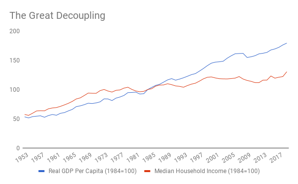
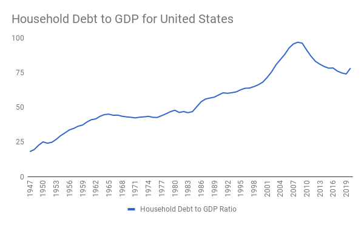

# Attention Trapped in Industrial Age Activities
# 注意力被困在工业时代的活动中 

While digital technology is being used to capture rapidly increasing amounts of our attention, we should also consider what the bulk of attention is dedicated to today. Not surprisingly, since we are just beginning to transition out of it, the vast bulk of human attention is focused on Industrial Age activities, in particular labor and consumption. For example, in the US many people spend 40 or more hours a week on the job, which amounts to 35 per cent of waking hours (assuming eight hours of sleep per night). People in the US now spend around 10 and a half hours a day consuming media (including traditional television and radio in addition to Facebook, YouTube, Netflix and similar services, podcasts, games, and more), which (setting aside simultaneous usage) amounts to over 60 per cent of waking time ("The Nielsen Total Audience Report," 2020). To understand why so much of our attention is spoken for, I present the concept of the “job loop.”

虽然数字技术被用来捕捉我们迅速增加的注意力，但我们也应该考虑今天大部分的注意力都用在什么地方。不足为奇的是，由于我们刚刚开始向工业时代过渡，人类的大部分注意力都集中在工业时代的活动上，尤其是劳动和消费。例如，在美国，许多人每周花 40 小时或更多的时间在工作上，这相当于清醒时间的 3 5%（ 假设每晚有 8 小时的睡眠）。美国人现在每天花大约 10 个半小时消费媒体（除了 Facebook、YouTube、Netflix 和类似服务、播客、游戏等，还包括传统的电视和广播），这（抛开同时使用的情况）相当于清醒时间的 60% 以上（《尼尔森总受众报告》，2020）。为了理解为什么我们有这么多的注意力被说出来，我提出了『劳务循环』的概念。

## The Job Loop
## 劳务循环

Thinking dispassionately about labor is hard, because over the last couple of centuries we have become convinced that employment is essential to both the economy and individual dignity. Let’s start from the perspective of production. If you want to make products or deliver a service, you require a series of inputs, including buildings and machines (capital), raw materials or parts (supplies), and human workers (labor). For much of history, capital and labor have been complementary: as the owner of a company, you couldn’t use your physical capital without having labor to operate it. That was true for manufacturing and even more so for services, which often use little capital and consist primarily of labor.

冷静地思考劳动问题是很难的，因为在过去的几个世纪里，我们已经确信，就业对经济和个人尊严都是至关重要的。让我们从生产的角度开始。如果你想制造产品或提供服务，你需要一系列的投入，包括建筑物和机器（资本），原材料或零件（用品），以及人类工人（劳动）。在历史上的大部分时间里，资本和劳动是互补的：作为一个公司的所有者，如果没有劳动力来操作，你就无法使用你的物质资本。制造业如此，服务行业更是如此，因为服务行业往往很少使用资本，主要由劳动力组成。

However, there is nothing in economics that says that all production processes should require labor. The opposite idea is an artifact of the production functions that were technologically available when economists developed the theory of production. If company owners are able to figure out how to do something cheaper or better by using less or no labor, that’s what they will choose to do. When it was acquired by Facebook for $19 billion, for example, WhatsApp had fewer than 50 employees. 

然而，经济学中没有任何内容说所有的生产过程都应该需要劳动。相反的想法是经济学家发展生产理论时技术上可用的生产函数的一个伪命题。如果公司老板能够想出如何通过使用更少或不使用劳动力来做更便宜或更好的事情，这就是他们会选择做的事情。例如，当它被 Facebook 以 190 亿美元收购时 ，WhatsApp 的员工不到 50 人。

Having no labor at all might make sense for a single company, but it does not for the economy as a whole as it is currently constructed. Who will buy goods and services produced by automated systems if people are unemployed and don’t have any money? Walter Reuther, head of the United Automobile Workers union in the 1950s, often told a story about an exchange he had with an official of the Ford motor company (who, as the story became famous in its own right, became Henry Ford II): 

完全没有劳动力可能对单个公司有意义，但对目前构建的整个经济来说是没有意义的。如果人们失业，没有钱，谁会购买自动化系统生产的商品和服务？沃尔特·卢瑟是二十世纪五十年代联合汽车工人工会的负责人，他经常讲一个故事，说他与福特汽车公司的一位官员（由于这个故事本身就很有名，他成为亨利·福特二世）进行了交流。

> Ford official: How are you going to collect union dues from these guys [robots]?
> Walter Reuther: How are you going to get them to buy Fords? (O'Toole, 2011)

> 福特官员：你打算如何向这些家伙（机器人）收取工会会费？
> 沃尔特·卢瑟。你打算如何让他们购买福特汽车？(O'Toole, 2011)

If we all had inherited wealth or sufficient income from capital, an economy without labor would not be a problem, and we could enjoy the benefits of cheaper products and services courtesy of robots and automation. 

如果我们都有继承的财富或足够的资本收入，没有劳动力的经济将不是一个问题，我们可以享受机器人和自动化带来的更便宜的产品和服务的好处。

The possibility of a slump in consumer demand due to less labor long seemed not just unlikely but impossible. There was a virtuous loop at the heart of economic growth: the ‘job loop.’ 

由于劳动力减少而导致消费需求下滑的可能性似乎不仅仅是不可能的，而且是不可能的。经济增长的核心是一个良性循环：『就业循环』。

In today’s economy, the majority of people sell their labor, producing goods and services and receiving wages in return. With their wages, they buy smartphones, books, tools, houses and cars. They also buy the professional assistance of attorneys, doctors, car mechanics, gardeners and hair stylists.

在今天的经济中，大多数人出售他们的劳动，生产商品和服务，并获得工资作为回报。他们用自己的工资购买智能手机、书籍、工具、房屋和汽车。他们还购买了律师、医生、汽车修理工、园艺师和发型师的专业协助。

Most of the people who sell these goods and services are in turn employed, meaning that they too sell their labor and buy goods and services from other people with what they are paid. And round and round it goes.

大多数出售这些商品和服务的人反过来也被雇用，这意味着他们也出售自己的劳动力，用他们得到的报酬向其他人购买商品和服务。就这样周而复始。

The job loop worked incredibly well in combination with competitive markets for goods and services and with a properly functioning financial system. Entrepreneurs either used debt or equity to start new businesses, and employed people at wages that were often higher than older businesses, increasing their employees’ purchasing power and thereby fueling further innovation and growth. As far as expanding economic production and solving problems for which markets are well-suited, it was a virtuous cycle that resulted in unprecedented prosperity and innovation.

在商品和服务的竞争性市场以及正常运作的金融系统的配合下，就业循环的效果令人难以置信。企业家们利用债务或股权开办新企业，并以通常高于老企业的工资雇用员工，增加员工的购买力，从而推动进一步的创新和增长。就扩大经济生产和解决市场很适合的问题而言，这是一个良性循环，带来了前所未有的繁荣和创新。

Some might point out that many people these days are self-employed, but that is irrelevant if they are selling their time. For instance, a graphic designer who works as an independent contractor is still paid for the labor they put into a project. It is only if they design something that is paid for over and over without them spending further time on it, such as a graphics template, that they have the opportunity to leave the job loop.

有些人可能会指出，现在很多人都是自营职业者，但如果他们是在出售自己的时间，这就不重要了。例如，作为独立承包商的平面设计师仍然要为他们在项目中投入的劳动付出代价。只有当他们设计的东西被反复支付，而他们没有在上面花费更多的时间时，例如图形模板，他们才有机会离开这个工作圈。

There are multiple problems with this virtuous cycle today. First, as we calculated at the outset of this section, it traps the vast majority of human attention. Second, when things contract, the effect of mutual reinforcement applies in the other direction. Take a small town, for example, in which local stores provide some of the employment. If a big superstore comes into town, total retail employment and wages will both fall. Fewer store employees have income, and those who do have less. If they start to spend less on haircuts and car repairs, the hair stylist and car mechanic earn less and can spend less themselves, and so on. Third, much of the consumption today is driven by vast sums of money spent on advertising, as well as by exposure to social media, inducing people into positional spending on wants (e.g., a bigger car than their neighbor). These higher expenditure levels, in turn, lock people into jobs which they hate but cannot afford to leave, which explains a great deal of the frustration among relatively highly-paid professionals, such as lawyers and bankers.

今天，这种良性循环存在着多种问题。首先，正如我们在本节开始时计算的那样，它困住了人类绝大部分的注意力。第二，当事物收缩时，相互强化的效果在另一个方向上适用。以一个小镇为例，当地的商店提供了一些就业机会。如果一家大型超级市场进入小镇，零售业的总就业人数和工资都会下降。更少的商店员工有收入，而那些有收入的人则更少。如果他们开始减少在理发和修车上的消费，那么发型师和修车工的收入就会减少，他们自己也可以减少消费，如此循环。第三，今天的大部分消费是由花在广告上的巨额资金以及对社会媒体的接触所驱动的，诱使人们对需求进行定位消费（例如，比邻居更大的汽车）。这些较高的支出水平反过来又将人们锁定在他们讨厌但又无力离开的工作中，这就解释了相对高薪的专业人士，如律师和银行家的大量挫败感。

Put differently, what was once a virtuous loop has become a vicious loop that holds much of human attention trapped. Much of The World After Capital is about breaking free of this vicious version of the job loop. That is an urgent problem as the job loop has been becoming more vicious for some time now due to a change in the relationship between labor and capital.

换句话说，曾经的良性循环已经变成了一个恶性循环，把人类的大部分注意力困住了。《资本之后的世界》的大部分内容是关于挣脱这种恶性的劳务循环。这是一个紧迫的问题，因为一段时间以来，由于劳动和资本之间关系的变化，劳务循环已经变得更加恶性。

## The Great Decoupling
## 大脱钩

To understand what is happening to the job loop, we need to look at a change in the economy that has become known as “the Great Decoupling” (Bernstein & Raman, 2015). In the decades after Worl War II, as the US economy grew, the share of Gross Domestic Product (GDP) going to labor grew at the same rate. However, starting in the mid-1970s, GDP continued to grow while household income remained flat (Economic Policy Institute, n.d.).

为了了解就业圈发生了什么，我们需要看看经济中的一个变化，这个变化被称为『大脱钩』（Bernstein & Raman, 2015）。在二战后的几十年里，随着美国经济的增长，国内生产总值（GDP）中用于劳动的份额也在同步增长。然而，从二十世纪七十年代中期开始，国内生产总值继续增长，而家庭收入保持平稳（经济政策研究所 ，n.d.）。

来源： Federal Reserve Bank of St. Louis, 2021a

Over this time of stagnant incomes, and particularly from the mid-1980s onward, US GDP growth was increasingly financed by consumers going into debt, until we reached the limit of how much debt households could support. The first event that really drove that point home was the collapse of the US housing bubble. There is some evidence that we are hitting another such point right now, as a result of the COVID-19 crisis, which has led to dramatic increases in unemployment.

在收入停滞的这段时间里，特别是从八十年代中期开始，美国的 GDP 增长越来越多地由消费者举债来支撑，直到我们达到了家庭能够支撑的债务的极限。真正使这一点成为现实的第一个事件是美国房地产泡沫的崩溃。有一些证据表明，我们现在正遇到另一个这样的点，由于 COVID-19 危机，这导致了失业率的大幅上升。

来源： Federal Reserve Bank of St. Louis, 2021b; Federal Reserve Bank of St. Louis, 2021c

Similar changes have occurred in other developed economies. This decoupling may be partly accounted for by changing demographics, but the primary driver appears to be technology. As technological innovation accelerates, there will be further pressure on the job loop. Particularly worrisome is the fact that jobs in developing countries are highly exposed to automation (The Economist, 2016). As a result, these countries may either skip the “golden age of the job loop” entirely or have a much diminished version.

其他发达经济体也发生了类似的变化。这种脱钩可能部分原因是人口结构的变化，但主要驱动力似乎是技术。随着技术革新的加速，就业圈将面临进一步的压力。特别令人担忧的是，发展中国家的工作高度暴露于自动化（The Economist，2016）。因此，这些国家可能会完全跳过『就业循环的黄金时代』，或者有一个大大减少的版本。

So, while we want to free up the attention trapped in the job loop, we need to figure out how to do so gradually, rather than through a rapid collapse. But is such a collapse even possible?

因此，虽然我们想释放被困在劳务循环中的注意力，但我们需要弄清楚如何逐步做到这一点，而不是通过快速崩溃。但这样的崩溃是否可能？

## Lump of Labor or Magic Employment Fallacy?

With the job loop still dominant, people have to sell their labor to earn a living. Until recently, most economists believed that when human labor is replaced by technology in one economic activity, it finds work in another part. These economists refer to a fear of technological unemployment or underemployment as the “lump of labor fallacy.”

在就业圈仍占主导地位的情况下，人们不得不出卖自己的劳动力来谋生。直到最近，大多数经济学家认为，当人类的劳动在一项经济活动中被技术取代后，就会在另一部分找到工作。这些经济学家把对技术性失业或就业不足的恐惧称为『劳动块谬论』。

The argument is that automating some part of the economy frees up labor to work on something else—entrepreneurs might use this newly available labor to deliver innovative new products and services, for example. There is no fixed “lump” of labor; rather there are potentially an infinite number of things to work on. After all, this is what has happened historically. Why should this time be different?

这种说法是，经济的某些部分实现了自动化，就可以释放出劳动力去从事其他工作 —— 例如，企业家可以利用这些新的可用劳动力来提供创新的新产品和服务。没有固定的『一揽子』劳动力；相反，有可能有无限多的事情可以做。毕竟，这就是历史上发生过的事情。为什么这次会不同呢？

To understand how things could be different, we might consider the role horses have played in the American economy. As recently as 1915, 25 million horses worked in agriculture and transportation; by 1960, that number had declined to 3 million, and then we stopped keeping track entirely as horses became irrelevant (Kilby, 2007). This decline happened because we figured out how to build tractors, cars and tanks. There were just no uses left for which horses were superior to a mechanical substitute. The economist Wassily Leontief (1952) pointed out that the same thing could happen to humans in his article “Machines and Man”. 

为了理解事情会有什么不同，我们可以考虑马匹在美国经济中所扮演的角色。最近在 1915 年，有 2500 万匹马在农业和运输业工作；到 1960 年，这个数字下降到 300 万，然后我们完全停止了记录，因为马匹变得无关紧要（Kilby，2007）。这种下降的发生是因为我们知道了如何制造拖拉机、汽车和坦克。马匹已经没有比机械替代品更好的用途了。经济学家 Wassily Leontief（1952）在他的文章《机器与人》中指出，同样的事情也会发生在人类身上。

Humans obviously have a broader range of skills than horses, which is why we have so far always found new employment. So what has changed? Basically, we’ve figured out how to have computers do lots of things that until recently we thought only humans could do, such as driving a car. Digital technology gives us universal computation at zero marginal cost. Suddenly, the idea that we hunans might have fewer uses doesn’t seem quite so inconceivable. 

人类显然比马有更广泛的技能，这就是为什么到目前为止，我们总是能找到新的就业机会。那么是什么改变了呢？基本上，我们已经想出了如何让计算机做很多直到最近我们还认为只有人类才能做的事情，比如说开车。数字技术以零边际成本为我们提供了通用计算。突然间，我们人类可能有更少的用途的想法似乎并不那么不可想象。

Those who claim that this is committing the lump of labor fallacy argue that we haven’t considered a new set of human activities that will employ people, but that line of thinking might also be flawed. Just because we have found new employment in the past doesn’t mean we will in the future. I call this belief the “magic employment fallacy.”

那些声称这是在犯劳动块状谬论的人认为，我们还没有考虑到一套新的人类活动会雇用人，但这种思路也可能有缺陷。我们在过去找到了新的就业机会，并不意味着我们在未来也会找到。我把这种信念称为『神奇的就业谬论』。

We can be incredibly creative when it comes to thinking of new things to spend our time on, but the operative question for people selling their labor is whether they can get paid enough to afford solutions to their needs, such as food, shelter and clothing. The only thing that matters for this question is whether a machine or another human is capable of doing whatever we think of more cheaply. 

当涉及到思考新的事情来花费我们的时间时，我们可以有令人难以置信的创造力，但对于出售劳动力的人来说，关键的问题是他们是否能得到足够的报酬来负担解决他们的需求，如食物、住所和衣服。对这个问题来说，唯一重要的是机器或另一个人是否有能力更便宜地做我们想到的任何事情。

This turns out to be the central problem with the magic employment fallacy. Nothing in economic theory says what the ‘market-clearing price’ for labor—the wage level at which there is neither unemployment nor a labor shortage—ought to be. It might be well below what people need to cover their needs, which could present a near-term existential threat to many people. 
We thus appear to face a dilemma. On the one hand, we want to free up human attention for uses that the job loop doesn’t provide for. On the other hand, we want to avoid a rapid collapse of the job loop. In order to understand how we can accomplish both, we need to consider the relationship between the cost of labor and innovation.

这就是神奇就业谬论的核心问题。经济理论中没有任何内容说明劳动力的 『市场清算价格』—— 既不存在失业也不存在劳动力短缺的工资水平 —— 应该是什么。它可能远远低于人们满足其需求的水平，这可能对许多人构成近期的生存威胁。因此，我们似乎面临着一个两难境地。一方面，我们想把人的注意力释放出来，用于劳务循环所不能提供的用途。另一方面，我们希望避免劳务循环的迅速崩溃。为了理解我们如何能够实现这两点，我们需要考虑劳动成本和创新之间的关系。

## Expensive Labor and Innovation
## 昂贵的劳动力和创新

Some people argue that unions made labor expensive, resulting in unaffordable products and services. But in reality, increased labor costs in fact propelled us to become more efficient: entrepreneurs overcame the challenge of more expensive labor by building better machines that required fewer humans. In countries such as India, the abundance of cheap labor meant that for a long time there was little incentive to invest in machines, since it was cheaper to have people do the work by hand.

有些人认为，工会使劳动力变得昂贵，导致产品和服务无法负担。但实际上，劳动力成本的增加实际上推动了我们变得更有效率：企业家们通过制造更好的机器来克服更昂贵的劳动力的挑战，这些机器需要更少的人力。在印度等国家，大量的廉价劳动力意味着在很长一段时间内，没有什么动力去投资机器，因为让人手工做工作更便宜。

Globally, we face the risk of being stuck in a low innovation trap precisely as a result of a fear that automation will make labor cheap. For example, we might end up with many more years of people driving trucks across the country, long after a machine could do the same job more safely (Wong, 2016). What is the incentive to automate a job if you can get someone to do it for minimum wage? 

在全球范围内，我们面临着陷入低创新陷阱的风险，这正是因为担心自动化会使劳动力变得廉价。例如，在机器可以更安全地完成同样的工作之后，我们可能还会有很多年的时间让人们驾驶卡车穿越全国（Wong，2016）。如果你可以用最低工资找人做某项工作，那么有什么动力让工作自动化呢？

Some people object to automation innovations on the grounds that work is an integral part of people’s identity. If you have been a truck driver for many years, for instance, who will you be if you lose your job? At first, this might sound like a completely legitimate question. But it is worth recalling that the idea that purpose primarily has to do with one’s profession, instead of belonging to a religion or to a community, is an Industrial Age phenomenon.

有些人反对自动化创新，理由是工作是人们身份的一个组成部分。例如，如果你已经做了多年的卡车司机，如果你失去了工作，你将成为谁？乍听之下，这可能是一个完全合理的问题。但值得回顾的是，目的主要与一个人的职业有关，而不是属于一个宗教或一个社区，这种想法是工业时代的现象。

If we want to free up attention via automation, we need to come up with new answers to these concerns. That will be the subject of Part Four, but before getting there we will first consider why capitalism by itself can’t solve these problems. 

如果我们想通过自动化释放注意力，我们需要对这些问题提出新的答案。这将是第四部分的主题，但在这之前，我们将首先考虑为什么资本主义本身不能解决这些问题。