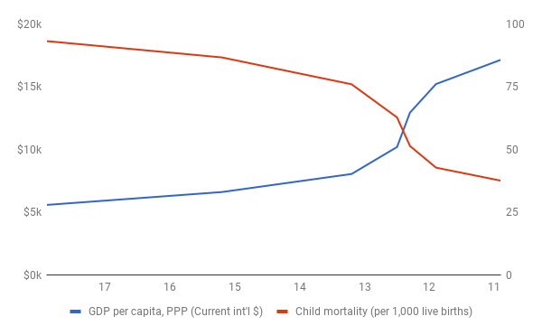

# Population
# 人口

In 1798, Thomas Malthus predicted widespread famine as the human population grew exponentially, outstripping increases in humanity’s ability to grow food (Malthus, 1798). His prediction was half-right: the global population did explode at the start of the nineteenth century.

1798 年，托马斯·马尔萨斯预言，随着人类人口的急剧增长，超过了人类种植食物能力的增长，饥荒将普遍发生（Malthus，1798）。他的预测对了一半：全球人口在十九世纪初确实爆发了。

Since then, the human population has grown from about 1 billion to nearly 8 billion people ("World Population Clock: 7.9 Billion People", 2021). However, Malthus’s dire warnings about the consequences of this population growth have proven wrong. There has been no global-scale starvation, and most people do not live in abject poverty. In fact, the number of people living in extreme poverty around the world has declined, even though population growth has been about twice as fast as Malthus’s predicted upper limit of 1 billion people added over 25 years (Roser & Ortiz-Ospina, 2013). 

从那时起，人类人口已从约 10 亿增长到近 80 亿（世界人口时钟：79 亿人，2021）。然而，马尔萨斯对这种人口增长的后果的可怕警告已被证明是错误的。没有出现全球规模的饥饿，大多数人也没有生活在赤贫中。事实上，尽管人口增长的速度是马尔萨斯预测的 25 年内增加 10 亿人口上限的两倍，但全世界生活在极端贫困中的人数已经下降了（Roser & Ortiz-Ospina, 2013）。

What Malthus got wrong was the rate of technological progress. First, he was pessimistic about our ability to improve agricultural productivity. Since his writing, there have been huge advances in agriculture: the percentage of the global workforce employed in the sector has declined from more than 80 per cent to 33 per cent, and is falling rapidly (in the US and other advanced economies, agriculture represents 2 per cent of employment or less). In the last 50 years alone, the land required to produce a given quantity of food has declined by 68 per cent (Ritchie & Roser , 2019). The total amount of land used to produce food has still continued to grow at least until recently, but much more slowly than the population (Ausubel et al., 2013; Ewers et al., 2009).

马尔萨斯弄错的是技术进步的速度。首先，他对我们提高农业生产力的能力持悲观态度。自他写作以来，农业已经有了巨大的进步：全球劳动力中受雇于农业部门的比例已经从 80% 以上下降到 33%，而且正在迅速下降（在美国和其他发达经济体，农业占就业的 2% 或更少）。仅在过去 50 年里，生产一定数量的食物所需的土地就减少了 68%（Ritchie & Roser , 2019）。至少到最近，用于生产粮食的土地总量仍在继续增长，但比人口增长速度要慢得多（Ausubel 等人，2013；Ewers 等人，2009）。

Second, Malthus could not foresee the scientific breakthroughs that enabled the Industrial Revolution. That revolution not only powered the increase in agricultural productivity, but also gave us dramatic advances in living standards, including increased life expectancy, faster transportation and cheaper communication.

第二，马尔萨斯无法预见到促成工业革命的科学突破。这场革命不仅推动了农业生产力的提高，还使我们的生活水平有了巨大的进步，包括预期寿命的延长、更快的交通和更便宜的通信。

来源： World Bank, 2020a; World Bank, 2020b; United Nations, 2019

This matters, because as it turns out, population growth responds to progress. In particular, there is a strong and well-documented relationship between levels of infant mortality, living standards, and birth rates. As better medical technology reduces infant mortality and better production technology increases living standards, birth rates decline. This is not a mechanistic relationship but involves complex social adjustments, such as women entering the workforce and other forms of empowerment for women (e.g., better access to education). Max Roser and the team at the “Our World In Data” project have produced some beautiful charts that show how this effect of progress on birth rates has occurred all around the world (Roser, 2017).

这很重要，因为事实证明，人口增长对进步有反应。特别是，在婴儿死亡率、生活水平和出生率之间存在着一种强有力的、有据可查的关系。随着更好的医疗技术降低婴儿死亡率，更好的生产技术提高生活水平，出生率就会下降。这不是一种机械的关系，而是涉及复杂的社会调整，如妇女进入劳动力市场和其他形式的妇女赋权（例如，更好的教育机会）。马克斯·罗瑟和『我们的数据世界』项目的团队制作了一些漂亮的图表，显示了进步对出生率的这种影响是如何发生在世界各地的（Roser，2017）。

So despite the extraordinary growth in global population over the last 200 years, simply assuming that it will continue into the future would be a mistake: there are strong signs that the world’s population is likely to peak. Some people claim that this debate is crucial because they don’t think the world can sustain, say, 11 billion people. However, this argument misses a key point. The world cannot sustain its current population of nearly 8 billion people either, unless we continue to make technological progress. The ways we have managed to supply 8 billion people so far have created all sorts of new problems, such as water and air pollution and, most pressingly, the climate crisis.

因此，尽管全球人口在过去 200 年里有了非凡的增长，但简单地假设它将持续到未来将是一个错误：有强烈的迹象表明，世界人口有可能达到峰值。有些人声称，这场辩论至关重要，因为他们认为世界无法维持，比如 110 亿人口。然而，这种说法忽略了一个关键点。除非我们继续取得技术进步，否则世界也无法维持其目前近 80 亿的人口。迄今为止，我们设法供应 80 亿人口的方式已经产生了各种新问题，如水和空气污染，以及最紧迫的气候危机。

In fact Malthus's predictions may yet catch up with us. For example, if we don’t rapidly address the climate crisis, we may experience large scale crop failure resulting in mass starvation. This would be an example of having insufficient technology for producing enough food, in contrast to many past examples of mass starvation, such as in India, that were the result of social and political breakdowns from internal strife or external interference disrupting food production or distribution. 

事实上，马尔萨斯的预言可能还会追上我们。例如，如果我们不迅速解决气候危机，我们可能会经历大规模的作物歉收，导致大规模的饥饿。这将是生产足够食物的技术不足的一个例子，与过去许多大规模饥饿的例子相比，例如在印度，是由于内部冲突或外部干扰破坏了食物生产或分配的社会和政治崩溃的结果。

Still, the key takeaway should be that needs will not continue to grow exponentially because A) population growth will slow down, and B) needs per person are limited. All the signs suggest that the global population curve is starting to decelerate, whereas the rate of technical progress is continuing to accelerate (Roser, 2019; Roser & Ritchie, 2013). Knowing these things, we can be optimistic about progress in relationship to population growth. In other words, Malthus will ultimately turn out to have been be wrong both about the rate of technological progress and the long-term rate of population growth.

不过，关键的启示应该是，需求不会继续呈指数级增长，因为 a) 人口增长将放缓 ，b) 每人的需求是有限的。所有迹象表明，全球人口曲线开始减速，而技术进步的速度在继续加快（Roser, 2019; Roser & Ritchie, 2013）。了解了这些情况，我们可以对与人口增长有关的进展持乐观态度。换句话说，马尔萨斯最终将被证明在技术进步率和人口增长的长期速度方面都是错误的。

I have already described why digital technology is so disruptive. We will see in more detail later how it is contributing to an acceleration of knowledge creation, and thus progress. 

我已经描述了为什么数字技术是如此具有颠覆性。我们将在后面更详细地看到它是如何促进知识创造的加速，从而促进进步的。