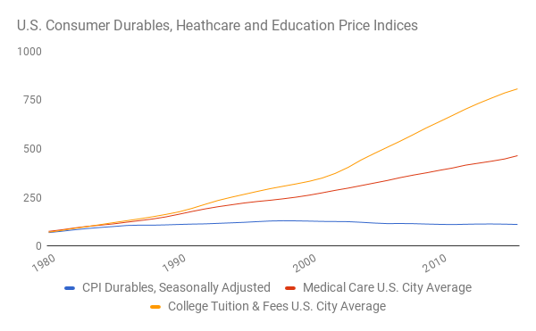
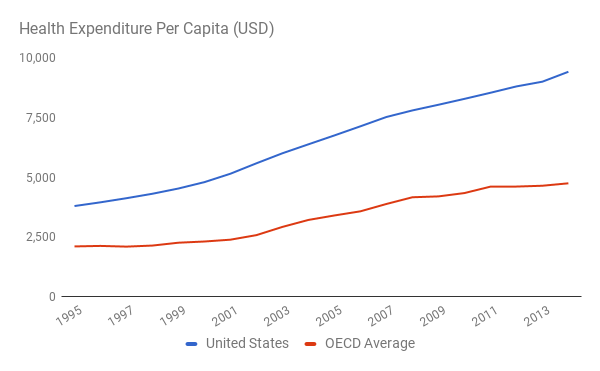

# Economic Freedom

If you were to quit your job right now, could you afford to take care of your basic needs? Could you pay for food, shelter, clothing, and so on? If you are retired, what if your company suddenly stopped paying your pension? If you are supported by a spouse or partner, what if you left that person?

If you would not be able to meet your basic needs, then you are not economically free. Your decisions on how much of your labor to sell, or to whom to sell it, or whether to stay with a partner are not free decisions so long as your ability to meet your basic needs hangs in the balance.

A recent survey in the U.S. asked respondents if they had enough money to pay for a $1,000 emergency. Over two-thirds said they did not {{"APNORC" | cite}}. Other studies have found that about 75% of Americans over 40 are behind on saving for retirement and 31% of all non-retired adults have no savings at all {{"GOBANK" | cite }} {{"FEDRES" | cite}}.

More people are finding themselves in these situations as the job loop is breaking down due to advances in automation (which are driven by digital technologies). If you cannot walk away from a bad job, or for that matter a bad partner or city, for fear of not being able to meet your basic needs, then you lack economic freedom.

Concerns about economic freedom are by no means new. When the American republic was in its infancy, economic freedom seemed well within everyone&apos;s reach. There was plenty of land to be had (so long, of course, as one was willing to take it by force from Native Americans). As a result, any family could make ends meet by living off the land. Even back then, though, observers such as Thomas Jefferson and Thomas Paine understood that land would some day run out. They raised the specter of a time when citizens might be forced to trade labor to others in order to provide for their basic needs&mdash;when they would be economically unfree {{"PAINE" | cite}}. 

Economic freedom is a cornerstone of the Knowledge Age. We need to make more people everywhere economically free&mdash;only then will they be able to participate fully in the knowledge loop. We want more people to be free to make music and create art. We want more people to have the time to learn new skills, from gardening to the latest 3D animation. We want more people to share their knowledge with the world for others to learn.

We want to embrace automation, not fight it.

## Universal Basic Income

Economic freedom is a reality today for some&mdash;those sufficiently wealthy, tenured professors, retirees with pensions and savings. How can we make it a reality for everyone? The answer is to have the government pay all citizens a guaranteed monthly income that suffices to cover basic needs, including housing, clothing, and food (see earlier chapter on Needs). This income would be unconditional, i.e. it would not depend on whether someone is married or single, employed or unemployed, rich or poor.

At first blush the idea of a Universal Basic Income may seem crazy or outrageous. Getting money from the government for having done nothing? Getting paid simply for being alive? Isn&apos;t that communism? Or socialism? And isn&apos;t the government broke to begin with? Won&apos;t people simply descend into utter laziness and drug addiction? We will look at each of these objections to Universal Basic Income in turn, but first let&apos;s develop a better understanding of how it would work and why it results in economic freedom.

Let&apos;s start with what may seem like a detour at first: air. One of our basic needs is the need for oxygen which we solve by breathing air. Most of us don&apos;t think much about breathing for two reasons: first, our bodies breathe all by themselves; and second, air is free. But we shouldn&apos;t take breathing entirely for granted. People who suffer from asthma (and there are many these days) or other medical conditions know how difficult it can be to get enough air. And people who live in cities like Beijing with serious air pollution problems know that while air may be free, clean air may prove elusive. It is estimated that 1.6 million people die in China every year from air pollution {{"BERK" | cite}}.

Why is air generally free? There are three reasons. First, the earth possesses a lot more air than humans require for their breathing. Air, in other words, is abundant relative to our needs. Second, air is equally distributed around the world, allowing everyone to access it right where they are. Third, air doesn&apos;t belong to anyone. Nobody owns the atmosphere and then sells it to you.

One or more of these conditions doesn&apos;t readily apply to the solutions our other basic needs, such as food, clothing and shelter. We don&apos;t automatically possess enough food, clothing, and shelter for everyone in the world&mdash;we need to create it. And food, clothing, and shelter are often created at some distance from the people using it, so these goods need to be distributed. Finally, when food, clothing, and shelter are created, they tend to belong to their creator— the farmer, the clothing company, the builder.

As I argued in the earlier chapter on Capital, as a species, we have developed our technologies enough so that we are now capable of meeting everyone&apos;s basic needs. Farming can generate enough food for everyone. We can easily make enough clothing for the world. We can even provide everyone with shelter. All of this has been made possible by knowledge, the knowledge that humanity has created over millennia. And our technological progress is accelerating while global population growth is slowing down. So from here on out it will only get easier.

The question is not whether we can meet everyone&apos;s basic needs, but whether we have created an economy and a society capable of accomplishing the necessary resource distribution and allocation. Industrial society presents us with two fundamentally different ways of distributing and allocating resources. One is to have individuals meet their own needs by participating in a market economy; the other is to have government (or charity) provide for people&apos;s needs directly. Those options are actually extreme ends of a spectrum with a variety of &ldquo;hybrid&rdquo; arrangements in the middle, such as government subsidized or rent-controlled housing for which people still need to pay some rent.

Why should we adopt a Universal Basic Income (UBI)? Because UBI enables the functioning of markets for basic needs such as food, clothing and shelter even at a time when people cannot earn any money from jobs. And it does so in a way that avoids reliance on an ever-expanding government sector. Put differently, UBI recognizes just how effective markets have been in the allocation of resources, and by contrast, how many distortions are introduced by government activity. UBI is the exact opposite of communism and socialism in that regard. It is all about reducing the size of government.

After World War II in the U.S., only about 5% of people were employed by government, which in turn comprised about 42% of the economy {{ "CENS1" | cite }} {{ "CENS2" | cite}} {{ "BEA" | cite}}. In the Soviet Union, by contrast, nearly 100% of people were employed by the state, and the state owned close to 100% of the economy. We now know quite well which system was more effective at allocating resources. Nevertheless, the size and scope of government employment and the government sector have gradually expanded here in the U.S. and in Europe. In many European economies, the government sector now accounts for a half or more of the economy.

I have only mentioned food, clothing and shelter when talking about basic needs, but what about education and healthcare? Can UBI cover those as well? That might seem wishful thinking given how quickly education and healthcare costs have risen, especially in the U.S. Yet UBI can cover these basic needs as well, and to understand how, we need to look at how technology is driving down the prices of almost everything. Technology can make education and healthcare far more affordable than they are today. In addition, the existence of a UBI would result in a positive feedback loop to accelerate the decline in prices even more.

## Technological Deflation

If you are currently struggling to pay for your basic needs, the world will seem like an expensive place to you. Yet the data shows that a lot of things have become cheaper, and that this trend has been gathering steam for some time now. In the U.S., as the following chart shows, the prices for consumer durables have been falling since the mid 1990s. Not only can we see the decline in the prices for consumer durables; we can also see the rise in the cost of education and healthcare.

<!-- <iframe src="https://ourworldindata.org/grapher/price-changes-in-consumer-goods-and-services-in-the-usa-1997-2017" style="width: 100%; height: 600px; border: 0px none;"></iframe> -->

What has produced the decline in prices for consumer durables? Well, it is the same technological progress that has been squeezing the labor market. While this progress hurts you if you are losing your job or your salary is remaining stagnant, it helps you if you have money to buy things, and that money goes farther and farther over time. With Universal Basic Income, you will have the money, and over time, it will buy you more and more.

Thanks to the decline in prices for consumer durables, clothing has become easily affordable. Technology also has been driving down the cost of smartphones, which we will be essential to making education and healthcare much more affordable. The price decline in this area will only accelerate as we further increase automation and use technology such as additive manufacturing (also known as &ldquo;3D Printing&rdquo;) to manufacture products only when they are needed and close to where they are needed {{ "ADD" | cite}}.

What about shelter? Technology is definitely making it cheaper to put up a building. In early 2017, the first house printed using mobile 3D printing technology was built in Russia in just 24 hours! {{"APIS" | cite}} It of course still costs a ton of money to live in certain places like Manhattan or San Francisco, where the demand for housing space exceeds the available supply. Here UBI functions quite differently from other solutions that make housing more affordable, such as government subsidies. With UBI, people can live in parts of the country (or the world) where housing is much more affordable.

The city of Detroit is currently giving away houses as an alternative to tearing them down {{"WAH" | cite}}. Or if you prefer a rural setting, you can buy or rent a home for as little as a couple hundred dollars per month {{ "GBR" | cite }}. Right now, many people can&apos;t take advantage of these opportunities, since they can&apos;t find a job in these locales and would be left with no income. By breaking the connection with a job, UBI makes geographic flexibility possible. People would no longer be geographically trapped by the challenge of providing for their basic needs.

Today, a large group of people is no longer constrained by the need for a job: Retirees. And sure enough, we observe that many retirees move away from expensive cities to places where real estate is much more affordable {{"NYT4" | cite}}. When considering the cost of shelter, it would be a mistake to analyze how much people need to live where they may be trapped today. Instead, we should look at the future cost in a world that has UBI. And that cost will be declining because of technology.

Another factor making housing more affordable is the more effective sharing of existing housing assets through services such as Airbnb and Couchsurfing.

As for food, here too technology has massive gains in store for us. While some argue that GMOs hold the key to affordably feeding the planet, other near-term breakthroughs don&apos;t carry some of the potential issues that GMOs pose. Indoor and vertical farming, for instance, allows for a precise delivery of nutrients and light to plants as well as huge increases in seeding and harvesting productivity. It also allows food to be grown much closer to its consumption, reducing the cost associated with transportation including spoilage. All this adds up to a dramatic reduction in the cost to feed a person.

Technology also promises to bring about a dramatic decline in the costs of education. At Union Square Ventures we became interested in education as an investment opportunity in 2009 when we held a one-day conference titled &ldquo;Hacking Education.&rdquo; Since then, the universe of online learning resources has grown rapidly. In addition to formal online courses such as edX or Khan Academy, millions of individual blog posts and even entire series of posts exist to explain a specific topic. And of course, YouTube is bursting with educational videos on subjects as broad as sailing and quantum computing.

Evidence exists that the exorbitant rises in tuition costs over the years in the U.S. are beginning to slow. When analyzing this data, we must remember that a huge amount of inertia exists in our educational system and job market. Many employers still believe they must hire from the best universities. This in turn drives up prices for higher education, with a ripple effect that extends all the way back to private nursery schools. It will be quite some time before most students will turn to free or extremely affordable online resources for all their learning needs. Still, the possibility now exists.

With healthcare, it&apos;s a similar story. Healthcare spending in the United States per capita far exceeds that of other countries, having risen for many years much faster than the rate of inflation&mdash;but that hasn&apos;t translated into better care. For instance, Cuba for years has had almost an identical life expectany to the U.S. despite spending less than a tenth on healthcare per capita {{"ATLANTIC" | cite}}.

Debate is now raging as to whether the Affordable Care Act has or will bring about lower healthcare costs or larger premiums (or possibly both). Regardless of how this works out, information technology will push healthcare costs lower for a number of reasons.

First, technology makes prices on medical procedures more transparent, enabling more competitive pressures to exist that can push prices down. Second, to the extent that people better track their own health data through technologies associated with the &ldquo;quantified self,&rdquo; we will live healthier lives and require less care, especially over the long term (in the shorter term, folks who already enjoy above average health will most readily employ this technology). And third, technology will make possible faster and better diagnosis and treatment. If you want to feel inspired, just read some of the stories about how Crowdmed has helped people whose conditions went undiagnosed or misdiagnosed for many years. USV portfolio company Human Dx is also working on a system to help with diagnosis, and Figure 1 lets doctors exchange images and other observations. Flatiron Health recently raised a massive investment round to pull together data on oncology patients. This says nothing of a whole group of companies that is bringing telemedicine into the app era, such as HealthTap, Doctor on Demand, Teladoc, and Nurx (another USV portfolio company). All promise to dramatically reduce the number of in person doctor visits and associated costs.

One might object that so much of healthcare cost doesn&apos;t result from doctors&apos; visits, but from pharmaceuticals. In fact, pharmaceuticals account for only about 10% of total spending {{ "CMS" | cite}}. Here too, we will likely see technology drive costs down. One successful pharma entrepreneur I spoke with described the potential for personalized treatment to dramatically improve the effectiveness for a wide range of conditions, including many cancers and even diseases such as ALS and Alzheimers. New technologies such as CRISPR are giving us unprecedented abilities to fix genetic defects {{"CRISPR" | cite}}.

## But Isn&apos;t Deflation a Bad Thing?

Now, you may find it confusing to hear me describe technological deflation as a good thing. Economists, after all, have painted deflation as an evil to be avoided at all cost. Economists are primarily concerned about growth as measured by GDP, which they argue makes us all better off. Their logic about deflation goes like this: If people anticipate that prices will drop thanks to deflation, they will be less likely to spend money today, which means that output will be lower than it could be. This in turn leads owners of capital to make fewer investments, which would result in less innovation and lower employment. That in turn makes people spend even less, thus causing the economy to contract further. Economists point to Japan as a country that has been experiencing both deflation and contracting output. To avoid this scenario, they argue for policies designed to achieve some amount of inflation, including the Fed&apos;s so-called quantitative easing (cheap money), which is intended to expand the supply of money.

In a world of technological deflation driven by digital technology this reasoning is flawed though. GDP is increasingly not a good measure of progress because it ignores positive and negative externalities. For instance, everything I&apos;ve said about making education and healthcare dramatically cheaper through free resources would serve to lower GDP while clearly making people much better off. We can also identify a second flaw in economists&apos; reasoning: It assumes that technological progress is tied to growth in production. But it is possible to achieve technological progress even as economic activity, as measured by GDP, appears stagnant. Increases in economic, informational and psychological freedom allow us to accelerate the Knowledge Loop which is the foundation of all progress. A great example here is open source software, which has driven a lot of technological progress outside of the traditional economic model.

Once you break out of the job loop with a UBI, then in fact technological deflation becomes desirable. For individuals it means that they can afford more with the payments they are receiving and for society as a whole it means that UBI is affordable.

## UBI is Affordable

So with all of this as background, your might wonder what a Universal Basic Income should pay. My working proposal for the United States is [$1,000/month] for everyone over age 18, [$400/month] for everyone over 12 years old, [$200/month] for every child. These numbers might seem extremely low, but keep in mind, the goal here isn&apos;t to make people well off; it&apos;s simply to let them take care of their basic needs. We have mistakenly come to embrace unlimited wants, and we can free ourselves from this by re-establishing a clear distinction between wants and needs. We should also remember that our basic needs will get cheaper over time, and we won&apos;t get UBI overnight. So my numbers are meant to work over time as other government programs are phased out and a UBI is phased in. Other policies I will discuss will also serve to help bring down the cost of education and healthcare.

Let&apos;s dig further into these numbers. The likely cost allocation for a typical adult would roughly break down as follows: [$300/month] for housing, [$300/month] for food, [$100/month] for transportation, [$50/month] for internet access and associated equipment ... [this needs more work and backup].

You might wonder why I am proposing a lower payment for children and teenagers. First, we can meet many of their basic needs even more cheaply than we can for adults (for instance, several kids in a family might share a room). Second, I propose a lower payment in recognition of historic evidence that the number of children people have is partially determined by economics. UBI should not give an incentive to adults to have more children so as to &ldquo;skim&rdquo; their income. That&apos;s especially important with regard to slowing down and eventually stopping population growth: We want the birth rate to decline globally, as it has started to do in most industrialized nations in conjunction with economic progress and the decline in infant mortality. This will allow us to achieve peak population and put to rest the Malthusian fears of overpopulation and scarcity.

When you calculate how much money is required to provide a UBI for everyone in the United States based on the 2015 population size, you wind up with about $3 trillion annually {{ "STAT2" | cite }} {{ "CENS3" | cite }}. While that&apos;s a huge number, it only represents about 17% of the size of the economy as measured by 2015 GDP, and only about 10% considered as a percentage of 2015 Gross Output (the latter measures not just final output but also intermediate steps) {{"TWB2" | cite}} {{ "STAT3" | cite}} {{ "FRED" | cite}} . 

Where will this money come from? There are two sources: government budgets (at the local, state and federal level) and money creation. I will examine each of these in turn.

In the U.S., in 2015 total government revenues from taxation and fees were about $6 trillion or about twice the UBI amount {{"DOT" | cite}}. So in theory the money for a UBI could come entirely from redirecting existing budgets. There would then be another $3 trillion of money for critical government activities, such as local law enforcement and national defense (the latter was $0.6 trillion in 2015 {{"NATPR" | cite}}). There is a long debate to be had about the political process by which such a reallocation can be accomplished but there is no fundamental impossibility, such as perpetually increasing government debt.

Having a UBI can also substantially increase government revenues. How so? At the moment there are many people who work but fall below the level for paying federal income tax. In fact this is true for nearly half of all earners (Mitt Romney's infamous 47 percent remark). Once people have a UBI, then every additional dollar earned should be taxed. For instance, if you are single and make $10,000 at present you do not even need to file a federal income tax return at all. With a UBI that could be taxed at a rate of say 25% generating $2,500 in new tax revenues. This effect could provide as much as [$0.3] trillion or about a 5% increase in total government revenues.   

Moreover, government revenues can be expanded in ways that accomplish other goals at the same time. For instance, we could and should be taxing pollution more than we are, in particular the emission of greenhouse gases into the atmosphere. Taxes are a well established way of dealing with negative externalities and we have made good use of that, for instance by aggressively taxing cigarette smoking. Another candidate for expanding government revenues are inheritance and wealth taxes. The goal of such taxes in addition to creating revenues would be to counteract the rising wealth imbalance driven by the effects of zero marginal cost digital technologies. 

Redistributing and expanding government budgets is one mechanism for making the money for UBI available. The other is to change the way money is created in the economy, by moving away from fractional reserve banking and issuing money directly to people instead. In today&apos;s fractional reserve banking system, commercial banks extend more credit than they have deposits. This carries with it the potential of a bank run and the Federal Reserve Bank (Fed) acts as the so-called &ldquo;lender of last resort.&rdquo; For instance, in the 2008 financial crisis the Fed stepped in aggressively by buying up potentially bad bank assets to give banks liquidity. Europe has had a policy of &ldquo;quantitative easing&rdquo; (QE) where the central bank makes it progressively easier for commercial banks to extend loans beyond their existing deposits.

Generally the idea is that as banks extend loans this will help grow the economy as the banks will lend to businesses that need to finance capital good or working capital. While banks have done that to some degree, they have also been lending to people who are already wealthy for acquiring second and third homes or for engaging in financial speculation. Conversely, bank lending to small businesses has actually been going down as banks have consolidated and have focused on larger customers. The net result of all of this has been that quantitative easing has amplified wealth and income inequality.

An alternative system would be to remove banks from money creation by forcing them to hold all of their deposits at the Fed. This is known as &ldquo;full reserve banking&rdquo; and eliminates all risk from the commercial banks. Credit extension could instead happen via marketplace lending as enabled by companies such as Lending Club, for individuals, and Funding Circle, for businesses (the former an exited USV portfolio company and the latter a current one). This would allow money creation to happen by simply giving new money to people as part of their UBI payments, which is sometimes referred to as &ldquo;QE for the people.&rdquo;

What magnitudes are we talking about here? Let's look at household debt alone for a moment. U.S. households have about $8 trillion in mortgage debt {{"ZERO" |  cite}}, over $1 trillion in auto loans {{"QZ2" | cite}}, over $1 trillion in student loans {{"FORBES3" | cite}} and nearly $1 trillion in credit card debt {{"MW" | cite}}. Total household debt can go up as much as $1 trillion in a single year. U.S. business debt is a total of $25 trillion, of which about $15 trillion is in the financial sector and $10 trillion in non-financial businesses. These too have grown by as much as $1 trillion in a year. As a first approximation the amount of annual money creation is in the same ball park as UBI.  

Historically, the idea of the government &ldquo;printing&rdquo; money is associated with fears of runaway inflation, such as occurred in the Weimar Republic. There are several reasons why this would not be the case with a proper UBI scheme. First, the amount of new money creation would be fixed and known in advance. Second, as we saw earlier, technology is a strong deflationary force. Third, the amount of net money creation can be reduced by removing money from it. This could be accomplished through negative interest rates on bank deposits above a certain amount where the payment is collected by the central bank (and not by the commercial bank). This is known as &ldquo;demurrage&rdquo; and would be easy to implement in a full reserve banking system.          

I expect that the path to UBI will involve both changes to government budgets and changes to the monetary system. The point of all the back of the envelope math above is to show that UBI is in fact affordable. Economic freedom is possible, if we want it.

## Impact of UBI on Incomes and the Labor Market

One of the many attractive features of a UBI is that it doesn&apos;t do away with people&apos;s ability to sell their labor. Suppose someone offers you $5/hour to watch her dog. Under a UBI system you are completely free to accept or reject that proposal. There is no distortion from a minimum wage. The reason we need a minimum wage in the current system is to guard against exploitation. But why does the opportunity for exploitation exist in the first place? Because people do not have an option to walk away from potential employment. With a UBI in place, they will.

The $5 per hour dog sitting example shows why a minimum wage is a crude instrument that results in all sorts of distortions. You might like dogs. You might be able to watch several dogs at once. You might be able to do it while writing a blog post or watching YouTube. Clearly government should have no role in interfering with such a transaction. The same is true, though, for working in a fast food restaurant. If people have a walk away option, then the labor market will naturally find the right clearing price for how much it takes to get someone to work in say a McDonalds. That could turn out to be $15/hour, or it could turn out to be $5/hour, or it could turn out to be $30/hour.

We might fear that with this new set of clearing prices in the labor market nobody will want to do the dirty work. Well, it turns out that this is a good thing. We will either need to pay people a lot more to do the work, or we&apos;ll need to invest more heavily in automation. In all likelihood, the answer will be a combination of both. But we should not fear that there is such a thing as an excessive price for labor. Because of the pressures created by technological deflation, we will not return to labor-price induced inflation.

UBI has two other, hugely important impacts on the Labor Market. The first has to do with volunteering. Today there are not enough people cleaning up the environment. Not enough people taking care of the sick and elderly. Not enough teachers. Labor is under-supplied in these sectors because there often is insufficient money behind the demand. For instance, the environment itself has no money and so the demand for clean up relies entirely on donations. As for the elderly, many of them do not have enough savings to afford personal care.

When you have to work pretty much every free hour just to meet your basic needs and/or have no control over your schedule, you cannot effectively volunteer. Providing people with UBI has the potential to vastly increase the number of volunteers. It won&apos;t do this all by itself; we will also require changes in attitude, but historically people have thought differently about volunteering.

UBI&apos;s second big impact on the Labor Market is its potentially dramatic expansion of the reach and importance of various types of crowdfunding. If your basic needs are taken care of, you will be much more likely to want to start an activity that has the potential to attract some crowdfunding, such as recording music videos and putting them up on YouTube. Also, if your basic needs are taken care of, you will be much more likely to use a fraction of any income you make to participate in crowdfunding.

## UBI as a Moral Imperative

Before proceeding to examine Informational Freedom, we should remind ourselves why individuals deserve to have their basic needs taken care of. Why should they have this right by virtue of being born, just as they do the right to breathe air?

None of us did anything to make the air. It was just here. We inherited it from the planet. And none of us alive today did anything to invent electricity. It had already been invented, and we have inherited its benefits. Everyone in the world did. Not just you who can currently afford access to a refrigerator.

Human knowledge is our collective inheritance, and using it to take care of everyone&apos;s basic needs is our moral imperative. The beauty is that contributing to further grow knowledge can provide a purpose, addressing another common objection to UBI&mdash;that by obviating the need for a job, it will snatch away what for many is a source of purpose in life. There is a virtuous cycle in which UBI accelerates the very knowledge loop that gave us this inheritance in the first place.
