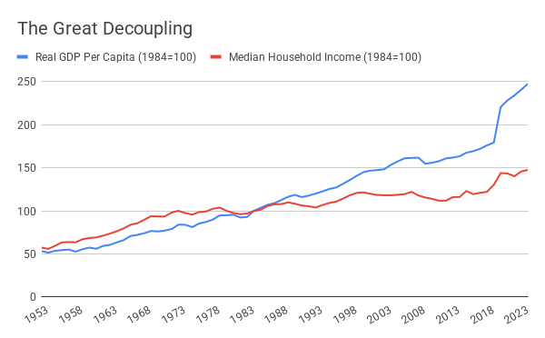
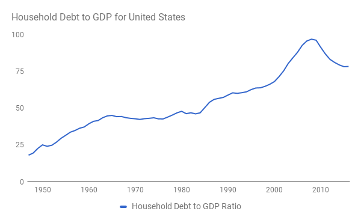

# Attention Trapped in Industrial Age Activities
 
While digital technology is being used to capture rapidly increasing amounts of our attention, we should also consider what the bulk of attention is dedicated to today. Not surprisingly, since we are just beginning to transition out of it, the vast bulk of human attention is focused on Industrial Age activities, in particular labor and consumption. For example, in the US many people spend 40 or more hours a week on the job, which amounts to 35 per cent of waking hours (assuming eight hours of sleep per night). People in the US now spend around 10 and a half hours a day consuming media (including traditional television and radio in addition to Facebook, YouTube, Netflix and similar services, podcasts, games, and more), which (setting aside simultaneous usage) amounts to over 60 per cent of waking time ("The Nielsen Total Audience Report," 2020). To understand why so much of our attention is spoken for, I present the concept of the “job loop.”

## The Job Loop

Thinking dispassionately about labor is hard, because over the last couple of centuries we have become convinced that employment is essential to both the economy and individual dignity. Let’s start from the perspective of production. If you want to make products or deliver a service, you require a series of inputs, including buildings and machines (capital), raw materials or parts (supplies), and human workers (labor). For much of history, capital and labor have been complementary: as the owner of a company, you couldn’t use your physical capital without having labor to operate it. That was true for manufacturing and even more so for services, which often use little capital and consist primarily of labor.
 
However, there is nothing in economics that says that all production processes should require labor. The opposite idea is an artifact of the production functions that were technologically available when economists developed the theory of production. If company owners are able to figure out how to do something cheaper or better by using less or no labor, that’s what they will choose to do. When it was acquired by Facebook for $19 billion, for example, WhatsApp had fewer than 50 employees. 

Having no labor at all might make sense for a single company, but it does not for the economy as a whole as it is currently constructed. Who will buy goods and services produced by automated systems if people are unemployed and don’t have any money? Walter Reuther, head of the United Automobile Workers union in the 1950s, often told a story about an exchange he had with an official of the Ford motor company (who, as the story became famous in its own right, became Henry Ford II): 

> Ford official: How are you going to collect union dues from these guys [robots]?
> Walter Reuther: How are you going to get them to buy Fords? (O'Toole, 2011)

If we all had inherited wealth or sufficient income from capital, an economy without labor would not be a problem, and we could enjoy the benefits of cheaper products and services courtesy of robots and automation. 

The possibility of a slump in consumer demand due to less labor long seemed not just unlikely but impossible. There was a virtuous loop at the heart of economic growth: the ‘job loop.’ 

In today’s economy, the majority of people sell their labor, producing goods and services and receiving wages in return. With their wages, they buy smartphones, books, tools, houses and cars. They also buy the professional assistance of attorneys, doctors, car mechanics, gardeners and hair stylists.

Most of the people who sell these goods and services are in turn employed, meaning that they too sell their labor and buy goods and services from other people with what they are paid. And round and round it goes.

The job loop worked incredibly well in combination with competitive markets for goods and services and with a properly functioning financial system. Entrepreneurs either used debt or equity to start new businesses, and employed people at wages that were often higher than older businesses, increasing their employees’ purchasing power and thereby fueling further innovation and growth. As far as expanding economic production and solving problems for which markets are well-suited, it was a virtuous cycle that resulted in unprecedented prosperity and innovation.
 
Some might point out that many people these days are self-employed, but that is irrelevant if they are selling their time. For instance, a graphic designer who works as an independent contractor is still paid for the labor they put into a project. It is only if they design something that is paid for over and over without them spending further time on it, such as a graphics template, that they have the opportunity to leave the job loop.

There are multiple problems with this virtuous cycle today. First, as we calculated at the outset of this section, it traps the vast majority of human attention. Second, when things contract, the effect of mutual reinforcement applies in the other direction. Take a small town, for example, in which local stores provide some of the employment. If a big superstore comes into town, total retail employment and wages will both fall. Fewer store employees have income, and those who do have less. If they start to spend less on haircuts and car repairs, the hair stylist and car mechanic earn less and can spend less themselves, and so on. Third, much of the consumption today is driven by vast sums of money spent on advertising, as well as by exposure to social media, inducing people into positional spending on wants (e.g., a bigger car than their neighbor). These higher expenditure levels, in turn, lock people into jobs which they hate but cannot afford to leave, which explains a great deal of the frustration among relatively highly-paid professionals, such as lawyers and bankers.

Put differently, what was once a virtuous loop has become a vicious loop that holds much of human attention trapped. Much of The World After Capital is about breaking  free of this vicious version of the job loop. That is an urgent problem as the job loop has been becoming more vicious for some time now due to a change in the relationship between labor and capital.

## The Great Decoupling

To understand what is happening to the job loop, we need to look at a change in the economy that has become known as “the Great Decoupling” (Bernstein & Raman, 2015). In the decades after Worl War II, as the US economy grew, the share of Gross Domestic Product (GDP) going to labor grew at the same rate. However, starting in the mid-1970s, GDP continued to grow while household income remained flat (Economic Policy Institute, n.d.).

Source: Federal Reserve Bank of St. Louis, 2021a

Over this time of stagnant incomes, and particularly from the mid-1980s onward, US GDP growth was increasingly financed by consumers going into debt, until we reached the limit of how much debt households could support. The first event that really drove that point home was the collapse of the US housing bubble. There is some evidence that we are hitting another such point right now, as a result of the COVID-19 crisis, which has led to dramatic increases in unemployment.

Source: Federal Reserve Bank of St. Louis, 2021b; Federal Reserve Bank of St. Louis, 2021c

Similar changes have occurred in other developed economies. This decoupling may be partly accounted for by changing demographics, but the primary driver appears to be technology. As technological innovation accelerates, there will be further pressure on the job loop. Particularly worrisome is the fact that jobs in developing countries are highly exposed to automation (The Economist, 2016). As a result, these countries may either skip the “golden age of the job loop” entirely or have a much diminished version.

So, while we want to free up the attention trapped in the job loop, we need to figure out how to do so gradually, rather than through a rapid collapse. But is such a collapse even possible?

## Lump of Labor or Magic Employment Fallacy?

With the job loop still dominant, people have to sell their labor to earn a living. Until recently, most economists believed that when human labor is replaced by technology in one economic activity, it finds work in another part. These economists refer to a fear of technological unemployment or underemployment as the “lump of labor fallacy.“
 
The argument is that automating some part of the economy frees up labor to work on something else—entrepreneurs might use this newly available labor to deliver innovative new products and services, for example. There is no fixed “lump” of labor; rather there are potentially an infinite number of things to work on. After all, this is what has happened historically. Why should this time be different?
 
To understand how things could be different, we might consider the role horses have played in the American economy. As recently as 1915, 25 million horses worked in agriculture and transportation; by 1960, that number had declined to 3 million, and then we stopped keeping track entirely as horses became irrelevant (Kilby, 2007). This decline happened because we figured out how to build tractors, cars and tanks. There were just no uses left for which horses were superior to a mechanical substitute. The economist Wassily Leontief (1952) pointed out that the same thing could happen to humans in his article “Machines and Man”. 

Humans obviously have a broader range of skills than horses, which is why we have so far always found new employment. So what has changed? Basically, we’ve figured out how to have computers do lots of things that until recently we thought only humans could do, such as driving a car. Digital technology gives us universal computation at zero marginal cost. Suddenly, the idea that we hunans might have fewer uses doesn’t seem quite so inconceivable. 

Those who claim that this is committing the lump of labor fallacy argue that we haven’t considered a new set of human activities that will employ people, but that line of thinking might also be flawed. Just because we have found new employment in the past doesn’t mean we will in the future. I call this belief the “magic employment fallacy.”

We can be incredibly creative when it comes to thinking of new things to spend our time on, but the operative question for people selling their labor is whether they can get paid enough to afford solutions to their needs, such as food, shelter and clothing. The only thing that matters for this question is whether a machine or another human is capable of doing whatever we think of more cheaply. 

This turns out to be the central problem with the magic employment fallacy. Nothing in economic theory says what the ‘market-clearing price’ for labor—the wage level at which there is neither unemployment nor a labor shortage—ought to be. It might be well below what people need to cover their needs, which could present a near-term existential threat to many people. 
We thus appear to face a dilemma. On the one hand, we want to free up human attention for uses that the job loop doesn’t provide for. On the other hand, we want to avoid a rapid collapse of the job loop. In order to understand how we can accomplish both, we need to consider the relationship between the cost of labor and innovation.

## Expensive Labor and Innovation

Some people argue that unions made labor expensive, resulting in unaffordable products and services. But in reality, increased labor costs in fact propelled us to become more efficient: entrepreneurs overcame the challenge of more expensive labor by building better machines that required fewer humans. In countries such as India, the abundance of cheap labor meant that for a long time there was little incentive to invest in machines, since it was cheaper to have people do the work by hand.

Globally, we face the risk of being stuck in a low innovation trap precisely as a result of a fear that automation will make labor cheap. For example, we might end up with many more years of people driving trucks across the country, long after a machine could do the same job more safely (Wong, 2016). What is the incentive to automate a job if you can get someone to do it for minimum wage? 

Some people object to automation innovations on the grounds that work is an integral part of people’s identity. If you have been a truck driver for many years, for instance, who will you be if you lose your job? At first, this might sound like a completely legitimate question. But it is worth recalling that the idea that purpose primarily has to do with one’s profession, instead of belonging to a religion or to a community, is an Industrial Age phenomenon.

If we want to free up attention via automation, we need to come up with new answers to these concerns. That will be the subject of Part Four, but before getting there we will first consider why capitalism by itself can’t solve these problems. 
