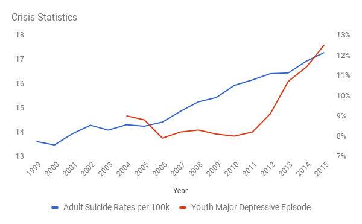

# Attention

There is a limited amount of human attention in the world. We have 24 hours in the day and we need to spend some of that time eating and sleeping. For many people in the world much of their waking time is occupied with work. So that leaves relatively little time for attention that we can freely allocate. This hard limit also exists in the aggregate, since&mdash;as I have argued earlier&mdash;we are headed for peak population.

At the same time that our attention is limited, we are using the Internet to dramatically increase the amount of available content. The increase in content is well documented to be exponential, which means that most of the content that has ever been produced by humanity has been produced in the last few years {{"FORBES2" | cite}}. For example, YouTube alone is adding 100 hours of new video content every minute {{ "TNW" | cite}}.

As a result, it is easy today to be completely overwhelmed by content. Our limited attention can readily be absorbed by ever refreshing content. Humans are maladapted to the information environment we now live in. It is analogous to having an obsession for sweets in an environment that is now sugar rich. Checking email, Twitter, Instagram, watching yet another YouTube clip or Snapchat story, or episode of one&apos;s favorite show on a streaming service&mdash;these all provide quick &ldquo;information hits&rdquo; that trigger parts of our brain attuned to novelty. As of 2017, the average person spends roughly two hours on social media every day {{"SMT" |cite}}. 

The limited availability of attention has become the key new source of economic rents. Companies such as Google, Facebook and Twitter are valued in no small part on the amount of attention they have been able to aggregate, some of which they then resell in the form of advertising. As a result they invest heavily in algorithms designed to present ever more appealing information to their end users in order to capture more attention. Sites like Buzzfeed and Huffington Post that are nominally news sites do the same.

But is any of that really a problem? Is attention scarce in the precise meaning of scarcity that I defined earlier? That would require for us to not have enough attention to meet humanity&apos;s basic needs. Is that really the case?

## Individual Attention Scarcity

Let&apos;s first consider attention at the individual level. All over the world people have constructed their identities around work and around firmly held core beliefs, whether religious or wordly. Both of these are undermined by digital technologies. We saw earlier how digital technology is putting pressure on labor. It is also putting pressure though on firmly held beliefs. Content is no longer easily contained in geographic boundaries and people are being exposed, many for the first time, to opinions and behaviors that diverge from their core beliefs.  

In combination, this pressure is leading to a large scale crisis of individual identity and rising aggression both online and offline. This crisis takes many different forms, including increased teenage depression, growing adult suicide rates&mdash;particularly among middle-aged white males, and drug overdose deaths. These have increased almost 60 percent, 20 percent and 40 percent, repectively, between 2006 and 2015 {{"CDC" | cite}} {{"SAMHSA" | cite}}: 

This is not dissimilar from the beginning of the Industrial Age, when people had to leave the countryside and move to big cities. They were forced to give up identities that had been constructed around land and a historical set of professions. They were confronted with people from other regions who held different beliefs. 

And so it should not be at all surprising that there is a rise in populist leaders with simplistic messages, such as Donald Trump in the United States and Marine Le Pen in France. A recent study found that throughout Europe, populist parties are receiving more than double their average share of the vote in national and parliamentary elections compared with the 1960s {{"HARV2" |cite}}. People whose identity is shaken want to be reassured. They want to hear that things will be OK and that the way of getting there is simple. &ldquo;Make America Great Again&rdquo; is an example of that. So is ISIS. In both cases the message is retrograde. Instead of a new identity that has to be built, requiring time and effort, these backward movements promise an easy return to a glorious identity of the past.  

Our attention to our most basic need, the existential need to make sense of the world as an individual by finding a purpose that makes our life meaningful, is scarce. Instead we let our attention be occupied by yet another video or worse by propaganda. 

## Collective Attention Scarcity

At the same time our collective attention is also scarce.  How so? We are not spending nearly enough time moving knowledge forward in areas of long tail risk and opportunity. 

On the risk side, for example, not enough attention is spent on how to recapture CO2 from the atmosphere. Or on monitoring asteroids that could strike earth, and coming up with ways of deflecting them. Or take the outbreak of a pandemic: we should have a lot more collective attention dedicated to discovering an outbreak and coming up with vaccines or treatments. The recent spread of the Zika virus is yet another reminder of this danger. 

On the opportunity side, far too little human attention is spent on nuclear fusion, on new antibiotics, on space exploration or for that matter on much simpler things such as spending time with and taking care of friends and family. Or learning a new skill or instrument or making music or going hiking. Or reading a great book. Or writing a new song. 

Much of our collective attention is instead absorbed by having to earn a living, with our leisure time increasingly consumed by watching cat videos on the internet. We are not investing enough in knowledge. And if we don&apos;t have enough knowledge, we may not be able to solve some of the problems we are currently facing, such as climate change. This has happened many times here on Earth before to civilizations, such as the Rapa Nui or the Mayans. Now, however, we are facing problems on a truly global scale.  

I am proposing this as a (possibly new) explanation for the Fermi Paradox, which famously asks why we have not yet detected any signs of intelligent life elsewhere in our rather large universe. We now even know that there are plenty of goldilocks planets available that could harbor life forms similar to those on earth. Maybe what happens is that all civilizations get far enough to where they generate huge amounts of information, but then they get done in by attention scarcity. They collectively take their eye off the ball of progress and are not prepared when something really bad happens such as a global pandemic.

[Note: I am planning to expand this section on attention scarcity by providing more concrete numbers, such as how many people are currently working globally on Asteroid detection and deflection.]
