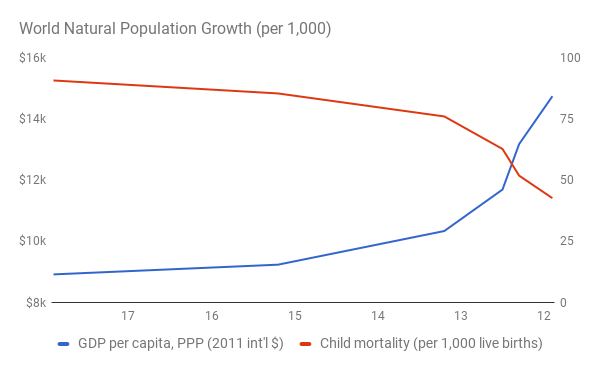

# Population

In 1798, Thomas Malthus predicted widespread famine as the human population grew exponentially, outstripping increases in humanity’s ability to grow food (Malthus, 1798). His prediction was half-right: the global population did explode at the start of the nineteenth century.
 
Since then, the human population has grown from about 1 billion to nearly 8 billion people ("World Population Clock: 7.9 Billion People", 2021). However, Malthus’s dire warnings about the consequences of this population growth have proven wrong. There has been no global-scale starvation, and most people do not live in abject poverty. In fact, the number of people living in extreme poverty around the world has declined, even though population growth has been about twice as fast as Malthus’s predicted upper limit of 1 billion people added over 25 years (Roser & Ortiz-Ospina, 2013). 

What Malthus got wrong was the rate of technological progress. First, he was pessimistic about our ability to improve agricultural productivity. Since his writing, there have been huge advances in agriculture: the percentage of the global workforce employed in the sector has declined from more than 80 per cent to 33 per cent, and is falling rapidly (in the US and other advanced economies, agriculture represents 2 per cent of employment or less). In the last 50 years alone, the land required to produce a given quantity of food has declined by 68 per cent (Ritchie & Roser , 2019). The total amount of land used to produce food has still continued to grow at least until recently, but much more slowly than the population (Ausubel et al., 2013; Ewers et al., 2009).

Second, Malthus could not foresee the scientific breakthroughs that enabled the Industrial Revolution. That revolution not only powered the increase in agricultural productivity, but also gave us dramatic advances in living standards, including increased life expectancy, faster transportation and cheaper communication.

Source: World Bank, 2020a; World Bank, 2020b; United Nations, 2019

This matters, because as it turns out, population growth responds to progress. In particular, there is a strong and well-documented relationship between levels of infant mortality, living standards, and birth rates. As better medical technology reduces infant mortality and better production technology increases living standards, birth rates decline. This is not a mechanistic relationship but involves complex social adjustments, such as women entering the workforce and other forms of empowerment for women (e.g., better access to education). Max Roser and the team at the “Our World In Data” project have produced some beautiful charts that show how this effect of progress on birth rates has occurred all around the world (Roser, 2017).
 
So despite the extraordinary growth in global population over the last 200 years, simply assuming that it will continue into the future would be a mistake: there are strong signs that the world’s population is likely to peak. Some people claim that this debate is crucial because they don’t think the world can sustain, say, 11 billion people. However, this argument misses a key point. The world cannot sustain its current population of nearly 8 billion people either, unless we continue to make technological progress. The ways we have managed to supply 8 billion people so far have created all sorts of new problems, such as water and air pollution and, most pressingly, the climate crisis.

In fact Malthus's predictions may yet catch up with us. For example, if we don’t rapidly address the climate crisis, we may experience large scale crop failure resulting in mass starvation. This would be an example of having insufficient technology for producing enough food, in contrast to many past examples of mass starvation, such as in India, that were the result of social and political breakdowns from internal strife or external interference disrupting food production or distribution. 

Still, the key takeaway should be that needs will not continue to grow exponentially because A) population growth will slow down, and B) needs per person are limited. All the signs suggest that the global population curve is starting to decelerate, whereas the rate of technical progress is continuing to accelerate (Roser, 2019; Roser & Ritchie, 2013). Knowing these things, we can be optimistic about progress in relationship to population growth. In other words, Malthus will ultimately turn out to have been be wrong both about the rate of technological progress and the long-term rate of population growth.

I have already described why digital technology is so disruptive. We will see in more detail later how it is contributing to an acceleration of knowledge creation, and thus progress. 
