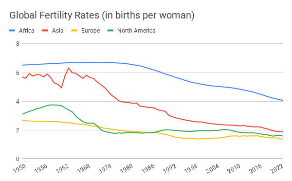

# POPULATION

When Thomas Malthus predicted that exponential population growth would outpace humanity’s ability to grow food and lead to widespread famine, he was half-right: The global population did explode at the start of the nineteenth century.

Since then, the human population has grown from about 1 billion to nearly 8 billion people (“World Population Clock: 7.9 Billion People”, 2021). However, Malthus’s dire warnings about the consequences of this population growth have proven wrong. There has been no global-scale starvation, and most people do not live in abject poverty. In fact, the number of people living in extreme poverty around the world has declined, even though population growth has been about twice as fast as Malthus’s predicted upper limit of 1 billion people added over 25 years (Roser & Ortiz-Ospina, 2013).

What Malthus got wrong was the rate of technological progress. First, he was pessimistic about our ability to improve agricultural productivity. Since his writing, there have been huge advances in agriculture: the percentage of the global workforce employed in the sector has declined from more than 80 percent to 33 percent, and is falling rapidly (in the US and other advanced economies, agriculture represents 2 percent of employment or less). In the last 50 years alone, the land required to produce a given quantity of food has declined by 68 percent (Ritchie & Roser, 2019). The total amount of land used to produce food has still continued to grow at least until recently, but much more slowly than the population (Ausubel et al., 2013; Ewers et al., 2009).

Second, Malthus could not have foreseen the scientific breakthroughs that enabled the Industrial Revolution. That revolution not only powered the increase in agricultural productivity, but also gave us dramatic advances in living standards, including increased life expectancy, faster transportation, and cheaper communication.

This matters because, as it turns out, population growth responds to progress. In particular, there is a strong and well-documented relationship between levels of infant mortality, living standards, and birth rates. As better medical technology reduces infant mortality and better production technology increases living standards, birth rates decline. This is not a mechanistic relationship, but involves complex social adjustments, such as women entering the workforce and other forms of empowerment for women (e.g., better access to education). Max Roser and the team at the “Our World In Data” project have produced some beautiful charts that show how this effect of progress on birth rates has occurred all around the world (Roser, 2019a; Roser & Ritchie, 2013).

Source: United Nations, 2024

So despite the extraordinary growth in global population over the last 200 years, simply assuming that it will continue into the future would be a mistake: There are strong signs that the world’s population is likely to peak. Some people claim that this debate is crucial because they don’t think the world can sustain, say, eleven billion people. However, this argument misses a key point. The world cannot sustain its current population of nearly eight billion people either, unless we continue to make technological progress. The ways we have managed to supply eight billion people so far have created all sorts of new problems, such as water and air pollution and, most pressingly, the climate crisis.

In fact, Malthus’s predictions may yet catch up with us. For example, if we don’t rapidly address the climate crisis, we may experience large-scale crop failure resulting in mass starvation. This would be an example of having insufficient technology for producing enough food, in contrast to many past examples of mass starvation, such as in India, that were the result of social and political breakdowns from internal strife or external interference disrupting food production or distribution.

Still, the key takeaway should be that needs will not continue to grow exponentially because A) population growth will slow down, and B) needs per person are limited. All the signs suggest that the global population curve is starting to decelerate, whereas the rate of technical progress is continuing to accelerate (Roser, 2019a; Roser & Ritchie, 2013). On this basis we can be optimistic about progress in relation to population growth. In other words, Malthus will ultimately turn out to have been wrong both about the rate of technological progress and the long-term rate of population growth.

Recently it has become popular among some groups to worry about the opposite problem: a collapse in population due to a decline in birth rates below the level needed to keep replacing the existing population. Some of the rhetoric is thinly veiled racism, but there are also legitimate concerns. For example, in South Korea, the birth rate has dropped to 0.72 in 2023, a long way below the rate of roughly 2 needed to maintain a steady population (Yeung et al., 2024). In the relatively near term this could pose an economic problem for some countries that may struggle economically and socially to support an aging population. Since we are still a ways away from a global population decline, immigration is one way to address this challenge today. Over time population decline may also level off in response to both policies (e.g. the child tax credit in the US) and to endogenous factors (e.g. real estate becoming cheaper as demand drops making it more affordable to have a larger family). Longer term there is the potential for much extended lifespans, for dramatically increased automation, and eventually even for other ways of reproduction.
